# Local UITI_VANO Interpreter

Small local repo for notebook-first analysis of `UITI_VANO` in the CHEC wide dataset.

## Página del proyecto

La página pública del proyecto se puede abrir desde GitHub Pages:

https://amalvarezme.github.io/chec-local-uiti-vano-interpreter/

La versión publicada corresponde a la rama:
`main`

The workflow covers only steps 1 to 3: select circuits/date window, detect critical
points from structured data, and build a semantic preliminary diagnosis context. It
does not use Databricks, Dash, FastAPI, RAG, vector stores, predictive models, masks,
simulations, or final evidence reports.

## Install

```bash
python -m venv .venv
source .venv/bin/activate
pip install -r requirements.txt
```

## Configure

```bash
cp .env.example .env
```

Place a CSV, Parquet, or Excel dataset under `data/`, or set `DATA_PATH`. The notebook
default is `data/Indicadores_vano_v3.csv` resolved from the project root.

Required columns:

- `CIRCUITO`
- `FECHA`
- `UITI_VANO`

Optional columns are used when available and recorded as unavailable when absent.

## Run

```bash
jupyter notebook notebooks/core/01_local_uiti_vano_interpretability.ipynb
```

Notebook groups:

- `notebooks/core/`: local UITI_VANO interpreter notebooks.
- `notebooks/inference/`: MGCECDL training, evaluation, and inference notebooks.
- `notebooks/web/`: notebooks that generate web page graph assets.

Set notebook parameters in the first section:

- `DATA_PATH`
- `SELECTED_CIRCUITOS`
- `START_DATE`
- `END_DATE`
- `MAX_CRITICAL_POINTS`
- `OUTPUT_DIR`
- `CALL_LLM`
- `LLM_MODEL`
- `LLM_PROVIDER`

`CALL_LLM` is disabled by default. Without an API key, the notebook still saves the
structured context and final prompt.

### Tabla base de discusiones desde PDFs

El cuaderno `notebooks/core/01_pdf_discussion_table_from_pdfs.ipynb` genera la tabla
base de discusiones tecnicas verificables a partir de reportes expertos en PDF. La
skill del agente extractor vive en `.claude/skills/pdf-discussion-extraction/prompt/`. Por
defecto lee PDFs desde `reports/analysis-documents/` y guarda alli el Excel final.
Debe ejecutarse cada vez que se agreguen, eliminen o cambien PDFs en esa carpeta.

Esta version no usa embeddings, FAISS, Chroma ni bases vectoriales. Extrae texto de
los PDFs, segmenta fragmentos candidatos y usa un LLM como skill/agente extractor para
decidir si una discusion debe convertirse en fila. Solo se agregan discusiones con
circuito, fecha o intervalo valido, analisis tecnico breve y evidencia textual
verificable. Si no hay fecha o evidencia suficiente, no se agrega la fila.

El Excel resultante contiene exactamente estas columnas y queda como insumo para
analisis posteriores:

- `Circuito`
- `Fecha inicio`
- `Fecha fin`
- `Análisis`
- `Evidencia`

### Flujo de tres agentes LLM

El notebook principal integra tres agentes, en orden:

1. Agente base/histórico: explica el comportamiento descriptivo de `UITI_VANO` con
   contexto histórico, variables y puntos críticos.
2. Agente de inferencia/modelo/SHAP: resume los resultados MGCECDL, SHAP y grafos
   estimados permitidos para el flujo de inferencia.
3. Agente de comparación con reportes expertos: compara LLM1 y LLM2 contra el Excel
   previamente generado desde PDFs expertos.

El tercer agente no lee PDFs, no extrae texto de PDFs y no usa embeddings, FAISS,
Chroma ni RAG. Su insumo experto es únicamente el Excel ya generado por el cuaderno de
discusión desde PDFs. Primero reduce las filas candidatas por coincidencia temporal
con las fechas del informe y luego compara el contenido técnico para identificar
coincidencias, diferencias y variables que merecen más atención. Si el Excel no está
disponible, está vacío o no produce coincidencias temporales comparables, el flujo
guarda un artefacto de omisión y el HTML continúa con un mensaje de no disponibilidad.

El reporte HTML generado por el notebook usa pestañas:

- `Informe`: conserva el reporte principal del agente base y el agente de inferencia.
- `Comparación con reportes expertos`: muestra el resultado validado del tercer
  agente cuando está disponible. Esta pestaña no vuelve a leer PDFs, no modifica el
  Excel y no muestra JSON crudo.

## Flujo del proyecto

Diagrama de flujo end-to-end vigente, desde la ingesta de datos hasta la publicación en
GitHub Pages. A diferencia de `docs/project-workflow-analysis.md` (snapshot histórico
fechado 2026-07-08, congelado como artefacto de análisis), este diagrama refleja el
estado actual: la migración de `llm/` a `.claude/skills/` + `.claude/agents/`, y la
introducción del skill `/reporte` (`report_pipeline.py`) como punto de entrada principal
para el flujo `historical` → `inference` → `expert-alignment` → render, que hoy convive
con el cuaderno interactivo `core/02_local_uiti_vano_interpretability_v3.ipynb`
(deprecado en el lugar para sus fases 1-8, pero aún activo para el simulador automático
mínimo/máximo y la exportación web). Fuente Mermaid: `docs/project-workflow.mmd`.

```mermaid
%% Project workflow — current state
%% Regenerate/verify against: notebooks/, src/chec_local_interpreter/, src/chec_impacto/,
%% .claude/skills/, .claude/agents/ (see README.md "Flujo del proyecto" for context).
flowchart TD
    START([Start]) --> LANE1

    %% ===== Lane: Data ingestion =====
    subgraph LANE1[Data ingestion]
        PDF[(Expert PDFs<br/>reports/analysis-documents)] --> P0[Extract discussion table<br/>core/01_pdf_discussion_table_from_pdfs.ipynb<br/>skill: pdf-discussion-extraction]
        P0 --> XLSX[(tabla_pdfs_intervalo.xlsx)]
        CSV[(Indicadores_vano CSV<br/>data/Indicadores_vano_v3.csv)]
        MET[Open-Meteo API] --> P1[Climate enrichment<br/>inference/01_climate.ipynb]
        CSV --> P1
    end

    %% ===== Lane: ML modeling (chec_impacto) =====
    subgraph LANE2[ML modeling — M-GCECDL]
        P1 --> P2[Optuna hyperparameter search<br/>inference/02_mgcecdl_optuna_classification_search.ipynb]
        VARS[(variables.json /<br/>Variables_seleccion.xlsx)] --> P7[Expert graph build<br/>web/graph_preserved_connections_uiti_vano.ipynb]
        P7 --> ADJ[(adjacency matrix + edges)]
        P2 --> P3[Training on Colab GPU<br/>inference/03_mgcecdl_training.ipynb]
        ADJ --> P3
        P3 --> MODEL[(mgcecdl_classifier_best.zip)]
        MODEL --> P4[Performance evaluation<br/>inference/04_mgcecdl_performance.ipynb]
        MODEL --> P5[Per-circuit SHAP analysis<br/>inference/05_mgcecdl_circuit_analysis.ipynb]
        MODEL --> P6[Document replication<br/>inference/06_mgcecdl_document_replication.ipynb]
    end

    %% ===== Lane: Local interpretation / agents =====
    subgraph LANE3[Local interpretation — agents]
        CSV --> D1[Critical point detection<br/>critical_points.py]
        D1 --> D2[Structured context builder<br/>context_builder.py]

        subgraph REPORTE["/reporte skill — current primary entry point<br/>report_pipeline.py"]
            direction TB
            D2 --> RP0[prepare&#40;&#41;<br/>critical points + context +<br/>MGCECDL/SHAP scenario simulator]
            MODEL --> RP0
            RP0 --> A1[Agent: historical<br/>.claude/skills/historical]
            RP0 --> A2[Agent: inference<br/>.claude/skills/inference]
            A1 --> G1{Schema + provenance<br/>valid?}
            A2 --> G1
            G1 -- "no, retries left<br/>(max 2)" --> RET[Revise response]
            RET --> G1
            G1 -- "no, retries exhausted" --> STOP1([Stop this circuit's run])
            G1 -- yes --> RP1[prepare_expert_alignment&#40;&#41;]
            XLSX --> RP1
            RP1 --> A3[Agent: expert-alignment<br/>.claude/skills/expert-alignment]
            A3 --> G2{Schema + provenance<br/>valid?}
            G2 -- "no, retries left<br/>(max 2)" --> RET2[Revise response]
            RET2 --> G2
            G2 -- "no, retries exhausted" --> STOP2([Stop this circuit's run])
            G2 -- yes --> RP2[render&#40;&#41;<br/>plotting.render_llm_analysis<br/>no auto-simulator tab]
        end
        RP2 --> HTML1[(HTML report<br/>run_dir, no 2nd tab)]

        subgraph NB02["Legacy interactive notebook &#40;deprecated in place&#41;<br/>core/02_local_uiti_vano_interpretability_v3.ipynb"]
            direction TB
            NOTE1["Phases 1-8: superseded by /reporte,<br/>kept unmodified, not deleted"]
            NB_AUTO[Phase 9-11: still-active only here<br/>10.2 Simulador automático mínimo/máximo]
        end
        MODEL --> SIMDATA[simulate_automatic_minmax_sensitivity&#40;&#41;<br/>simulator.py, pure numeric]
        SIMDATA --> SAVE1[save_auto_minmax_results&#40;&#41;]
        SAVE1 --> NB_AUTO
        NB_AUTO --> A4[Agent: auto-simulator<br/>.claude/skills/auto-simulator<br/>invoked inline via call_llm&#40;&#41;]
        A4 --> G3{"_validate_auto_simulator_response&#40;&#41;<br/>required keys/list-shape valid?"}
        G3 -- no --> RET3[Retry call_llm]
        RET3 --> G3
        G3 -- "exhausted" --> STOP3([RuntimeError: last validation error])
        G3 -- yes --> NB_RENDER[render_llm_analysis&#40;&#41;<br/>with automatic_simulation_table<br/>= 2nd tab discussion]
        NB_RENDER --> HTML2[(HTML report<br/>reports/interpretability/html,<br/>includes 2nd tab)]

        MODEL --> SIM4[What-if simulator&#40;interactive, no LLM&#41;<br/>core/04_simulador.ipynb<br/>simulate_feature_values&#40;&#41; /<br/>simulate_feature_class_transitions&#40;&#41;]
    end

    %% ===== Lane: Publication =====
    subgraph LANE4[Publication]
        HTML2 --> WE[Web export<br/>web_export.py<br/>export_latest_interpretability_report]
        P4 --> WE
        WE --> SITE[(src/assets/site/results +<br/>Astro pages src/pages)]
        SITE --> CI[GitHub Actions<br/>.github/workflows/deploy-pages.yml]
        CI --> PAGES([GitHub Pages site])
    end

    HTML1 -.->|"not yet wired to web_export<br/>&#40;current gap&#41;"| WE
    PAGES --> END([End])
```



Versión renderizada para lectores sin soporte Mermaid: [`docs/project-workflow.svg`](docs/project-workflow.svg).

## Outputs

Structured outputs from the local interpreter are saved under
`reports/interpretability/artifacts/`:

- `structured_context_<timestamp>.json`
- `llm_prompt_<timestamp>.md`
- `critical_points_<timestamp>.csv`
- `uiti_vano_timeseries_<timestamp>.png`
- optional `llm_analysis_<timestamp>.json`
- optional `inference_llm_analysis_<timestamp>.json`
- optional `expert_alignment_context_<timestamp>.json`
- optional `expert_alignment_analysis_<timestamp>.json`
- optional `expert_alignment_pdf_matches_<timestamp>.xlsx`

HTML reports generated by notebook 02 are saved under
`reports/interpretability/html/`.

Invalid LLM outputs are saved separately with validation errors and are not presented
as final analysis.

## Tests

```bash
pytest -q
python evals/run_llm_eval.py
```
