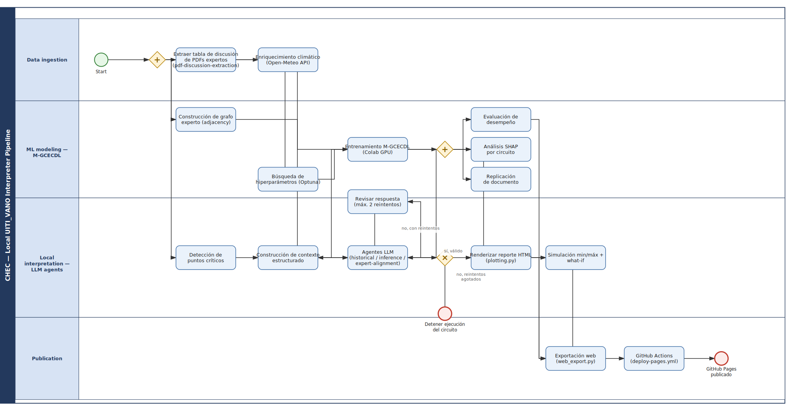

# Intérprete local de UITI_VANO

Intérprete local, nativo para agentes, de `UITI_VANO` sobre el dataset amplio de CHEC.

Este proyecto carga un dataset estructurado ancho, filtra por circuitos y fechas, detecta puntos relevantes en la serie diaria de `UITI_VANO`, construye un paquete de contexto estructurado y usa roles LLM nativos del runtime para explicar el comportamiento en español y compararlo contra reportes PDF expertos.

**Restricción clave:** **no existe ninguna llamada a APIs externas de LLM desde Python**. El razonamiento lo hace el runtime del agente invocador, Claude Code o Pi / el Gentleman. Python se mantiene determinista, local y controlado.

## Ruta rápida

1. Crear el entorno.
2. Colocar el dataset en `data/` o configurar `DATA_PATH`.
3. Ejecutar el comando nativo del runtime que estés usando.
4. Revisar el HTML local generado en `reports/interpretability/html/`.
5. Publicar por separado solo si querés llevar el resultado a GitHub Pages.

## Qué hace este proyecto

El repositorio cubre el flujo completo de interpretabilidad local para el análisis de circuitos CHEC:

- resolución determinista de circuito y ventana de fechas;
- detección determinista de puntos críticos sobre `UITI_VANO`;
- construcción de contexto estructurado para razonamiento nativo de agentes;
- diagnóstico descriptivo histórico (`historical`);
- interpretación del modelo predictivo con MGCECDL + SHAP (`inference`);
- discusión automática de sensibilidad mínimo/máximo (`auto-simulator`);
- alineación contra reportes PDF expertos (`expert-alignment`);
- extracción de tabla base de discusiones desde PDFs (`pdf-discussion-extraction`);
- render del reporte HTML local completo;
- exportación manual opcional al sitio estático.

## Alcance y no objetivos

### En alcance

- procesamiento determinista y funciones puras en `src/chec_local_interpreter`;
- generación local de reportes;
- razonamiento nativo de agentes mediante adaptadores por runtime;
- contratos compartidos y validadores del flujo;
- publicación del sitio como paso explícito e independiente.

### Explícitamente fuera de alcance

- Databricks
- Dash
- FastAPI
- RAG
- bases vectoriales
- llamadas Python a Gemini, OpenAI u otros proveedores LLM hospedados
- publicación automática como efecto colateral de generar un reporte

## Estructura del repositorio

| Área | Propósito |
|---|---|
| `src/chec_local_interpreter/` | Pipeline determinista del reporte, contratos, validadores, render, context builders |
| `src/chec_impacto/` | Código de modelado relacionado con MGCECDL y lógica de soporte |
| `.claude/skills/` | Contratos canónicos de workflow y skills |
| `.claude/agents/` | Definiciones canónicas de roles para Claude |
| `.pi/skills/` | Wrappers de skills para Pi sobre los skills canónicos de Claude |
| `.pi/agents/` | Mirrors de roles para Pi sobre los roles canónicos de Claude |
| `docs/` | Arquitectura, workflow, contrato de runtime, BPMN y documentación de soporte |
| `reports/` | Artefactos locales de ejecución, reportes generados, insumos PDF |
| `tests/` | Tests automatizados de contratos, pipelines y render |
| `notebooks/` | Notebooks de soporte para modelado, exploración y simulaciones |

## Instalación

```bash
python -m venv .venv
source .venv/bin/activate
pip install -r requirements.txt
```

## Configuración

```bash
cp .env.example .env
```

Colocá un dataset CSV, Parquet o Excel bajo `data/`, o configurá `DATA_PATH`.
El valor por defecto es `data/Indicadores_vano_v3.csv`, resuelto desde la raíz del proyecto.

### Columnas requeridas

- `CIRCUITO`
- `FECHA`
- `UITI_VANO`

Las columnas opcionales se usan cuando existen y se registran como no disponibles cuando faltan.

## Equivalencia de comandos por runtime

El proyecto usa **puntos de entrada nativos del runtime** sobre contratos locales compartidos.
La lógica de negocio **no** vive en los adaptadores. Vive en los contratos Python y en los skills canónicos de Claude.

### Punto de entrada principal del reporte

| Runtime | Comando |
|---|---|
| Claude Code | `/report <circuito> [fecha_inicio fecha_fin]` |
| Pi / el Gentleman | `/skill:report <circuito> [fecha_inicio fecha_fin]` |

Ejemplos:

```text
/report C1
/skill:report C1 2026-01-01 2026-02-01
```

### Equivalencia de capacidades compatibles

| Capacidad | Claude Code | Pi / el Gentleman |
|---|---|---|
| Reporte completo | `/report <circuito> [fecha_inicio fecha_fin]` | `/skill:report <circuito> [fecha_inicio fecha_fin]` |
| Solo agrupamiento de circuitos | `/agrupamiento-circuitos [fecha_inicio fecha_fin]` | `/skill:agrupamiento-circuitos [fecha_inicio fecha_fin]` |
| Análisis histórico | flujo canónico `historical` de Claude | `/skill:historical` + `.pi/agents/historical.md` |
| Análisis de inferencia | flujo canónico `inference` de Claude | `/skill:inference` + `.pi/agents/inference.md` |
| Alineación experta | flujo canónico `expert-alignment` de Claude | `/skill:expert-alignment` + `.pi/agents/expert-alignment.md` |
| Simulador automático | flujo canónico `auto-simulator` de Claude | `/skill:auto-simulator` + `.pi/agents/auto-simulator.md` |
| Extracción de discusiones PDF | flujo canónico `pdf-discussion-extraction` de Claude | `/skill:pdf-discussion-extraction` + `.pi/agents/pdf-discussion-extraction.md` |
| Reporte por lote | `/reporte-lote <grupo> [fecha_inicio fecha_fin]` | `/skill:reporte-lote <grupo> [fecha_inicio fecha_fin]` |
| Informe gerencial | `/informe-gerencial <grupo> [fecha_inicio fecha_fin]` | `/skill:informe-gerencial <grupo> [fecha_inicio fecha_fin]` |

### Modelo de compatibilidad en Pi

La compatibilidad en Pi es deliberadamente delgada:

- los wrappers `.pi/skills/*/SKILL.md` apuntan al skill canónico de Claude mediante `metadata.canonical_skill`;
- los mirrors `.pi/agents/*.md` apuntan al rol canónico de Claude más su skill asociado para el contrato completo;
- Pi **no** redefine lógica de dominio;
- la fuente de verdad sigue siendo:
  - `.claude/skills/*`
  - `.claude/agents/*`
  - `src/chec_local_interpreter/*`

## Reglas de argumentos para comandos tipo reporte

Para la familia de comandos de reporte, `report`, `reporte-lote`, `informe-gerencial` y clustering cuando aplique:

- `circuito` o `grupo` es obligatorio, según el comando;
- `fecha_inicio` y `fecha_fin` son opcionales **como par**;
- si omitís ambas, el workflow usa su resolvedor por defecto;
- si enviás exactamente una fecha, eso es un error de uso;
- el runtime debe resolver primero la ventana, mostrarla una vez y pedir confirmación antes de continuar.

## Arquitectura end-to-end

La arquitectura está separada entre Python determinista y razonamiento nativo del runtime.

### 1. Pipeline local determinista

Lo controlan módulos Python como:

- `src/chec_local_interpreter/report_pipeline.py`
- `src/chec_local_interpreter/report_contract.py`
- `src/chec_local_interpreter/circuit_clustering_contract.py`
- `src/chec_local_interpreter/batch_report_contract.py`
- `src/chec_local_interpreter/informe_gerencial_contract.py`

Esta capa:

- resuelve solicitudes;
- valida entradas;
- detecta puntos críticos;
- construye envelopes de contexto;
- ejecuta simulaciones locales;
- valida respuestas de agentes;
- renderiza el HTML final.

### 2. Contratos canónicos de agentes

Los controlan los artefactos nativos de Claude:

- `.claude/skills/*`
- `.claude/agents/*`

Estos archivos definen:

- la persona del rol;
- los límites de herramientas permitidas;
- el loop de validación;
- el contrato de salida;
- la semántica de orquestación del runtime.

### 3. Adaptadores por runtime

Los controlan wrappers y mirrors específicos del runtime:

- `.pi/skills/*`
- `.pi/agents/*`

Estos adaptadores traducen la sintaxis del runtime al contrato local compartido sin duplicar comportamiento de negocio.

## Los cinco roles principales nativos de agente

1. **`pdf-discussion-extraction`**
   - Proceso por lotes sobre PDFs expertos.
   - Decide qué secciones candidatas se convierten en filas estructuradas de discusión.

2. **`historical`**
   - Produce el diagnóstico descriptivo/base del comportamiento de `UITI_VANO`.

3. **`inference`**
   - Interpreta con cautela las señales predictivas de MGCECDL/SHAP.

4. **`auto-simulator`**
   - Interpreta escenarios automáticos de sensibilidad mínimo/máximo.
   - Es la única etapa que puede degradarse y omitirse sin romper el reporte completo.

5. **`expert-alignment`**
   - Compara los resultados de histórico + inferencia contra la evidencia de discusión de PDFs expertos.

## Resumen del workflow del reporte

`/report` y sus equivalentes por runtime siguen la misma secuencia conceptual:

1. Resolver argumentos y preflight.
2. Confirmar una sola vez la ventana final circuito/fechas.
3. Ejecutar `prepare()`.
4. Despachar `historical`, `inference` y `auto-simulator`.
5. Validar salidas.
6. Ejecutar `prepare_expert_alignment()`.
7. Ejecutar `expert-alignment`.
8. Renderizar un único reporte HTML local.
9. Exportar o publicar después, solo como acción explícita y separada.

### Detalle del workflow del reporte

- `historical`, `inference` y `auto-simulator` son independientes.
- cuando el runtime lo soporta, esas tres etapas deben correr en paralelo;
- `expert-alignment` depende de salidas validadas de `historical` e `inference`;
- `render()` fusiona todas las salidas validadas en un único artefacto HTML;
- la generación del reporte es local por diseño;
- la publicación siempre es explícita y separada.

## Diagramas del workflow

### Diagrama Mermaid

Diagrama actual end-to-end:

```mermaid
%% Workflow actual del proyecto
flowchart TD
    START([Inicio]) --> LANE1

    subgraph LANE1[Ingesta de datos]
        PDF[(PDFs expertos<br/>reports/analysis-documents)] --> P0[Runbook batch de discusión PDF<br/>pdf_discussion_pipeline.py<br/>skill: pdf-discussion-extraction]
        P0 --> XLSX[(tabla_pdfs_intervalo_*.xlsx)]
        CSV[(CSV Indicadores_vano<br/>data/Indicadores_vano_v3.csv)]
        MET[API Open-Meteo] --> P1[Enriquecimiento climático<br/>project_flow/01_climate.ipynb]
        CSV --> P1
    end

    subgraph LANE2[Modelado ML, M-GCECDL]
        P1 --> P2[Búsqueda de hiperparámetros con Optuna<br/>project_flow/02_mgcecdl_optuna_classification_search.ipynb]
        VARS[(variables.json /<br/>Variables_seleccion.xlsx)] --> P7[Construcción de grafo experto<br/>project_flow/07_graph_preserved_connections_uiti_vano.ipynb]
        P7 --> ADJ[(matriz de adyacencia + edges)]
        P2 --> P3[Entrenamiento en Colab GPU<br/>project_flow/03_mgcecdl_training.ipynb]
        ADJ --> P3
        P3 --> MODEL[(mgcecdl_classifier_best.zip)]
        MODEL --> P4[Evaluación de desempeño<br/>project_flow/04_mgcecdl_performance.ipynb]
        MODEL --> P5[Análisis SHAP por circuito<br/>project_flow/05_mgcecdl_circuit_analysis.ipynb]
        MODEL --> P6[Replicación documental<br/>project_flow/06_mgcecdl_document_replication.ipynb]
    end

    subgraph LANE3[Interpretación local, agentes]
        CSV --> D1[Detección de puntos críticos<br/>critical_points.py]
        D1 --> D2[Constructor de contexto estructurado<br/>context_builder.py]
        D2 --> CHK{"Resolver circuito + ventana de fechas<br/>alerta+y detener si es inválido<br/>una sola confirmación con el usuario"}
        CHK -- "no encontrado / cero eventos" --> STOP0([Alerta y detener, sin crear run_dir])

        subgraph REPORTE["Skill /report, punto de entrada principal<br/>report_pipeline.py"]
            direction TB
            CHK -- "confirmado una vez" --> RP0["prepare()<br/>puntos críticos + contexto +<br/>simulador de escenarios MGCECDL/SHAP +<br/>simulador automático mínimo/máximo"]
            MODEL --> RP0
            RP0 --> FORK{{"fork, despacho paralelo obligatorio<br/>historical / inference / auto-simulator"}}
            FORK --> A1[Agente: historical]
            FORK --> A2[Agente: inference]
            FORK --> A4[Agente: auto-simulator<br/>omitido si falta bc.json]
            A1 --> G1{"¿Schema + provenance válidos?"}
            A2 --> G1
            G1 -- "no, reintentos agotados" --> STOP1([Detener la ejecución de este circuito])
            A4 --> G3{"¿validate() OK?"}
            G3 -- "no, agotado" --> SKIP3[Omitir auto-simulator]
            G1 -- sí --> JOIN{{join}}
            G3 -- sí --> JOIN
            SKIP3 --> JOIN
            JOIN --> RP1[prepare_expert_alignment()]
            XLSX --> RP1
            RP1 --> A3[Agente: expert-alignment]
            A3 --> G2{"¿Schema + provenance válidos?"}
            G2 -- "no, reintentos agotados" --> STOP2([Detener la ejecución de este circuito])
            G2 -- sí --> RP2[render()]
        end
        RP2 --> HTML1[(Reporte HTML)]
    end

    subgraph LANE4[Publicación]
        PAGESRC[Reporte local generado] --> WE[Exportación manual<br/>web_export.py]
        WE --> SITE[(site/assets/site/results)]
        SITE --> CI[GitHub Actions<br/>.github/workflows/deploy-pages.yml]
        CI --> PAGES([GitHub Pages])
    end

    HTML1 -.-> PAGESRC
```

Artefactos de referencia:

- fuente Mermaid: `docs/project-workflow.mmd`
- SVG renderizado: `docs/project-workflow.svg`
- SVG alternativo: `docs/project-workflow-diagram.svg`

### Diagrama tipo BPMN

Vista de proceso de negocio del mismo flujo:



Fuentes BPMN:

- `docs/project-workflow.bpmn`
- `docs/project-workflow-bpmn.svg`

## GitHub y modelo de publicación

### Repositorio y ramas

- repositorio público: `amalvarezme/chec-local-uiti-vano-interpreter`
- sitio público: https://amalvarezme.github.io/chec-local-uiti-vano-interpreter/
- rama publicada para el sitio: `main`
- rama activa de desarrollo para este trabajo de compatibilidad Claude/Pi: `sdd-claude-agents`

### Comportamiento de GitHub Pages

- generar un reporte local **no** publica automáticamente;
- `/report` y sus equivalentes solo generan artefactos HTML locales;
- publicar al sitio es un paso separado y deliberado mediante el flujo de exportación web;
- el despliegue del sitio lo hace GitHub Actions después de actualizar el contenido publicable.

### Estado de GitHub Actions

Actualmente este repositorio usa GitHub Actions principalmente para el despliegue de Pages:

- workflow: `.github/workflows/deploy-pages.yml`

Eso implica que:

- el deploy de Pages se automatiza una vez que el contenido del sitio está listo;
- `pytest -q` y `python evals/run_llm_eval.py` siguen siendo validaciones locales requeridas antes de considerar un cambio como completo.

## Workflow de la tabla de discusiones PDF

La tabla base de discusiones expertas se genera mediante el runbook batch nativo para agentes:

- pipeline Python determinista: `chec_local_interpreter.pdf_discussion_pipeline`
- skill/rol agente: `pdf-discussion-extraction`

Carpeta de entrada por defecto:

- `reports/analysis-documents/`

Salida esperada:

- `tabla_pdfs_intervalo_*.xlsx`

Debe regenerarse cada vez que se agreguen, eliminen o modifiquen PDFs en esa carpeta.

El Excel resultante contiene exactamente:

- `Circuito`
- `Fecha inicio`
- `Fecha fin`
- `Análisis`
- `Evidencia`

## Salidas del sistema

Las salidas estructuradas del intérprete local se guardan en:

- `reports/interpretability/artifacts/`

Artefactos típicos:

- `structured_context_<timestamp>.json`
- `llm_prompt_<timestamp>.md`
- `critical_points_<timestamp>.csv`
- `uiti_vano_timeseries_<timestamp>.png`
- `llm_analysis_<timestamp>.json` opcional
- `inference_llm_analysis_<timestamp>.json` opcional
- `expert_alignment_context_<timestamp>.json` opcional
- `expert_alignment_analysis_<timestamp>.json` opcional
- `expert_alignment_pdf_matches_<timestamp>.xlsx` opcional

Los reportes HTML generados por `render()` se guardan en:

- `reports/interpretability/html/`

Las salidas LLM inválidas se guardan por separado con sus errores de validación y nunca se presentan como análisis final.

## Notebooks

Estos notebooks soportan exploración, modelado o replicación. **No** son el punto de entrada canónico del flujo de reporte:

- `notebooks/project_flow/08_geo_network_exploration.ipynb`
- `notebooks/project_flow/09_simulador.ipynb`
- `notebooks/02_project_flow/01_climate.ipynb`
- `notebooks/02_project_flow/02_mgcecdl_optuna_classification_search.ipynb`
- `notebooks/02_project_flow/03_mgcecdl_training.ipynb`
- `notebooks/02_project_flow/04_mgcecdl_performance.ipynb`
- `notebooks/02_project_flow/05_mgcecdl_circuit_analysis.ipynb`
- `notebooks/02_project_flow/06_mgcecdl_document_replication.ipynb`
- `notebooks/03_project_flow/07_graph_preserved_connections_uiti_vano.ipynb`

## Pruebas

Ejecutá ambas antes de considerar el trabajo completo:

```bash
pytest -q
python evals/run_llm_eval.py
```

## Referencias clave

- `AGENTS.md`
- `docs/agents-guide.md`
- `docs/report-runtime-contract.md`
- `.claude/skills/report/SKILL.md`
- `src/chec_local_interpreter/report_pipeline.py`
- `src/chec_local_interpreter/report_contract.py`
