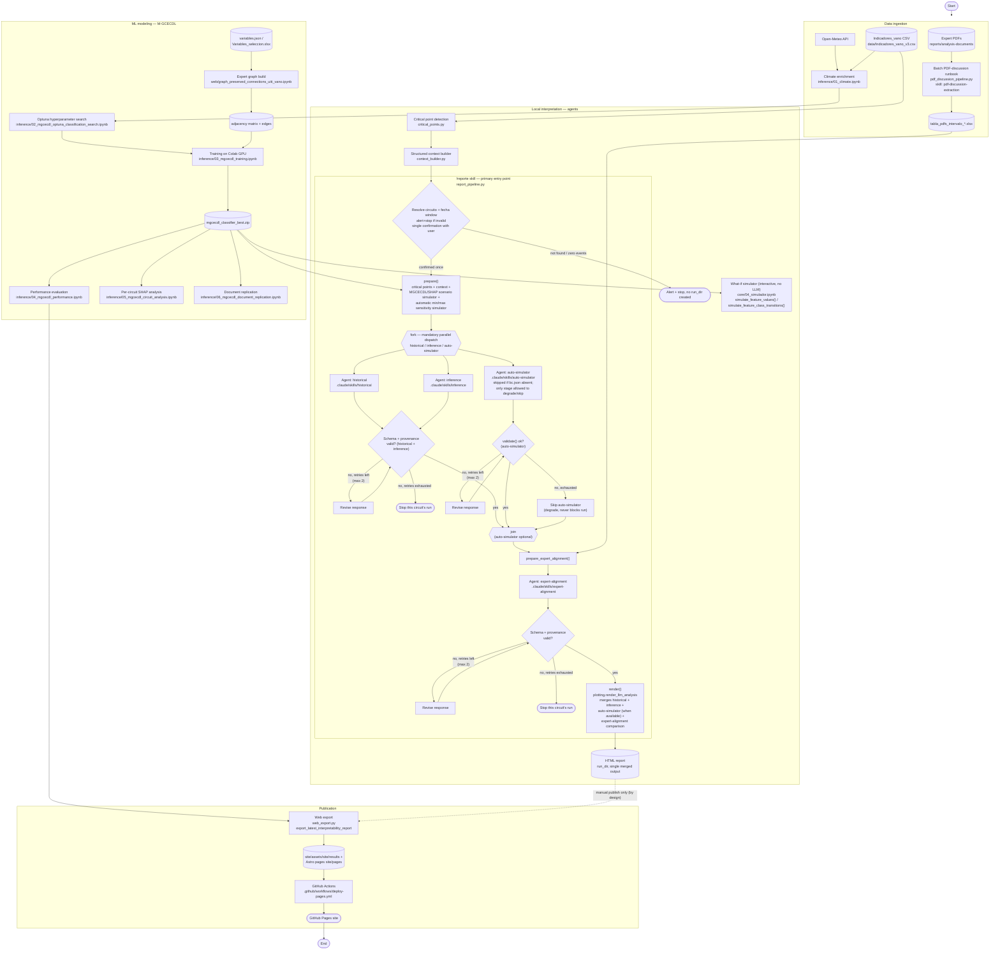

# Local UITI_VANO Interpreter

Agent-native local interpreter for `UITI_VANO` in the CHEC wide dataset. It loads one wide
structured dataset, filters by circuits and dates, detects relevant points in the daily
`UITI_VANO` series, builds a structured context package, and has five coding-agent-native LLM
roles explain the behavior in Spanish and compare it against expert PDF reports — all with
**zero external LLM API key**: the invoking coding agent (Claude Code or OpenCode) does the
reasoning itself, never a Python call to Gemini/OpenAI. `/reporte <circuito>` is the primary
end-to-end entry point. See `AGENTS.md` and `docs/agents-guide.md` for the full architecture.

## Página del proyecto

La página pública del proyecto se puede abrir desde GitHub Pages:

https://amalvarezme.github.io/chec-local-uiti-vano-interpreter/

La versión publicada corresponde a la rama:
`main`

## Scope

Circuit/vano selection, deterministic critical-point detection, and semantic diagnosis
(`historical`), MGCECDL/SHAP predictive interpretation (`inference`), expert-PDF alignment
(`expert-alignment`), automatic min/max sensitivity discussion (`auto-simulator`), and
PDF-discussion-table extraction (`pdf-discussion-extraction`) are all in scope and implemented.
Does not use Databricks, Dash, FastAPI, RAG, or vector stores. The workflow stays local and
lightweight.

## Install

```bash
python -m venv .venv
source .venv/bin/activate
pip install -r requirements.txt
```

## Configure

```bash
cp .env.example .env
```

Place a CSV, Parquet, or Excel dataset under `data/`, or set `DATA_PATH`. The default is
`data/Indicadores_vano_v3.csv` resolved from the project root.

Required columns:

- `CIRCUITO`
- `FECHA`
- `UITI_VANO`

Optional columns are used when available and recorded as unavailable when absent.

## Run

`/reporte <circuito> [fecha_inicio fecha_fin]` is the primary end-to-end entry point. It is
**not** a Python CLI you run directly — it is a Claude Code / OpenCode slash-command Skill
(`.claude/skills/reporte/SKILL.md`), orchestrated by
`src/chec_local_interpreter/report_pipeline.py`. Invoke it from Claude Code or OpenCode:

```
/reporte <circuito>
/reporte <circuito> <fecha_inicio> <fecha_fin>
```

- `circuito` is required and must exist in the dataset.
- `fecha_inicio`/`fecha_fin` are optional **as a pair**: both omitted default to the circuit's
  full available date range; both given are used as-is; giving exactly one is a usage error.

The Skill validates the circuit and date window, confirms once with the user, runs deterministic
critical-point detection plus the MGCECDL/SHAP and automatic min/max simulators, dispatches the
`historical`/`inference`/`auto-simulator` agents in parallel, runs `expert-alignment`, and renders
a single local HTML report. See `.claude/skills/reporte/SKILL.md` for the full contract
(arguments, run sequence, error handling).

Notebook groups (support/exploration, not part of the `/reporte` flow):

- `notebooks/core/`: `03_geo_network_exploration.ipynb` (GEO layer exploration and per-circuit
  mapping) and `04_simulador.ipynb` (interactive what-if simulator, no LLM involved —
  `simulate_feature_values`/`simulate_feature_class_transitions`).
- `notebooks/inference/`: MGCECDL training, evaluation, SHAP, and document-replication notebooks
  (`01` through `06`).
- `notebooks/web/`: `graph_preserved_connections_uiti_vano.ipynb`, expert graph build for the web
  page.

### Tabla base de discusiones desde PDFs

La tabla base de discusiones técnicas verificables se genera con el runbook agente-nativo por
lotes: `chec_local_interpreter.pdf_discussion_pipeline` (Python determinista: conversión de PDF a
Markdown, selección de secciones candidatas, ensamblado del Excel final) junto con el Skill/agente
`pdf-discussion-extraction` (`.claude/skills/pdf-discussion-extraction/`), que clasifica, en un
único turno por PDF, qué secciones candidatas se convierten en fila. Por defecto lee PDFs desde
`reports/analysis-documents/` y guarda allí el Excel final (`tabla_pdfs_intervalo_*.xlsx`). Debe
ejecutarse cada vez que se agreguen, eliminen o cambien PDFs en esa carpeta.

Esta versión no usa embeddings, FAISS, Chroma ni bases vectoriales. Extrae texto de los PDFs,
segmenta secciones candidatas y usa un LLM como skill/agente extractor para decidir si una
discusión debe convertirse en fila. Solo se agregan discusiones con circuito, fecha o intervalo
válido, análisis técnico breve y evidencia textual verificable. Si no hay fecha o evidencia
suficiente, no se agrega la fila.

El Excel resultante contiene exactamente estas columnas y queda como insumo para análisis
posteriores:

- `Circuito`
- `Fecha inicio`
- `Fecha fin`
- `Análisis`
- `Evidencia`

### Flujo de cinco agentes LLM

`/reporte <circuito>` integra cinco roles agente-nativos, cada uno un Skill de Claude Code /
agente de OpenCode con su propio CLI determinista `build-context`/`validate` (nunca una llamada
Python a un proveedor LLM externo):

1. **`pdf-discussion-extraction`**: decide, PDF por PDF, qué secciones candidatas de los reportes
   técnicos expertos se convierten en filas de la tabla de discusión (circuito, fecha/intervalo,
   análisis, evidencia). Corre por separado, antes de `/reporte`, cuando se agregan o cambian PDFs
   en `reports/analysis-documents/` — ver la sección anterior.
2. **`historical`**: diagnóstico base/descriptivo del comportamiento de `UITI_VANO` a partir del
   contexto estructurado y los puntos críticos detectados.
3. **`inference`**: interpreta las señales predictivas MGCECDL/SHAP (importancia de variables y
   modos por escenario, coherencia del grafo estimado, hipótesis predictivas cautelosas).
4. **`auto-simulator`**: interpreta la tabla automática de sensibilidad mínimo/máximo (escenarios
   base vs. mínimo/máximo observado por variable) que `prepare()` calcula como efecto colateral;
   es la única etapa que puede degradarse y omitirse sin detener la ejecución.
5. **`expert-alignment`**: compara los hallazgos de `historical` + `inference` contra la tabla de
   discusión ya extraída de los PDFs expertos, citando coincidencias, diferencias y variables que
   merecen más atención.

`historical`, `inference` y `auto-simulator` se despachan en paralelo cuando el runtime lo
permite (obligatorio en Claude Code); `expert-alignment` corre después, una vez que `historical` e
`inference` terminaron. El reporte HTML final (`render()`) fusiona los cuatro roles anteriores en
un único archivo: el diagnóstico base y de inferencia con sus figuras/grafos, la discusión
automática mínimo/máximo (cuando el simulador tuvo modelo entrenado y eventos suficientes), y la
comparación con reportes expertos. Ver `.claude/skills/reporte/SKILL.md` para la secuencia
completa paso a paso.

## Flujo del proyecto

Diagrama de flujo end-to-end vigente, desde la ingesta de datos hasta la publicación en GitHub
Pages. A diferencia de `docs/project-workflow-analysis.md` (snapshot histórico fechado
2026-07-08, congelado como artefacto de análisis), este diagrama refleja el estado actual: el
skill `/reporte` (`report_pipeline.py`) es el punto de entrada principal ya establecido — no una
introducción reciente — para el flujo checkpoint único de usuario → `prepare()` (contexto +
simuladores MGCECDL/SHAP y mínimo/máximo) → `historical`/`inference`/`auto-simulator` en paralelo
→ `expert-alignment` → `render()`, que produce un único reporte HTML local. El cuaderno
interactivo `core/02_local_uiti_vano_interpretability_v3.ipynb` fue eliminado una vez que este
flujo cubrió por completo sus responsabilidades, incluida su antigua discusión automática
mínimo/máximo de las fases 9-11 (hoy la etapa `auto-simulator`). Fuente Mermaid:
`docs/project-workflow.mmd`.



Versión renderizada para lectores sin soporte Mermaid: [`docs/project-workflow.svg`](docs/project-workflow.svg).

### Diagrama BPMN

Vista de proceso de negocio (BPMN 2.0) del mismo flujo, con carriles por responsable (ingesta de
datos, modelado M-GCECDL, agentes LLM, publicación). Es una vista de nivel de fase — para el
detalle técnico módulo por módulo, usar el diagrama Mermaid anterior.


Fuente BPMN 2.0 XML (abrible en [bpmn.io](https://bpmn.io) o Camunda Modeler):
[`docs/project-workflow.bpmn`](docs/project-workflow.bpmn).

## Outputs

Structured outputs from the local interpreter are saved under
`reports/interpretability/artifacts/`:

- `structured_context_<timestamp>.json`
- `llm_prompt_<timestamp>.md`
- `critical_points_<timestamp>.csv`
- `uiti_vano_timeseries_<timestamp>.png`
- optional `llm_analysis_<timestamp>.json`
- optional `inference_llm_analysis_<timestamp>.json`
- optional `expert_alignment_context_<timestamp>.json`
- optional `expert_alignment_analysis_<timestamp>.json`
- optional `expert_alignment_pdf_matches_<timestamp>.xlsx`

HTML reports generated by `/reporte`'s `render()` step are saved under
`reports/interpretability/html/`.

Invalid LLM outputs are saved separately with validation errors and are not presented as final
analysis.

## Tests

```bash
pytest -q
python evals/run_llm_eval.py
```
