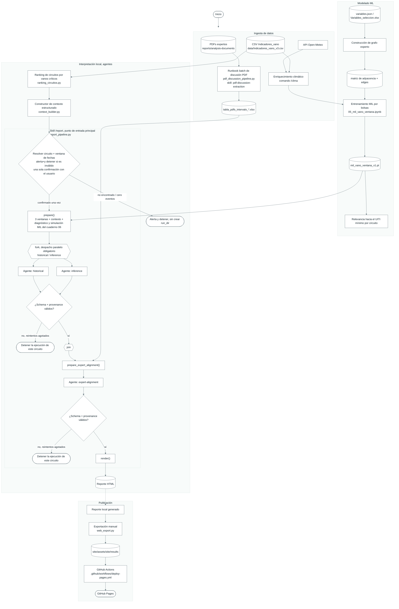
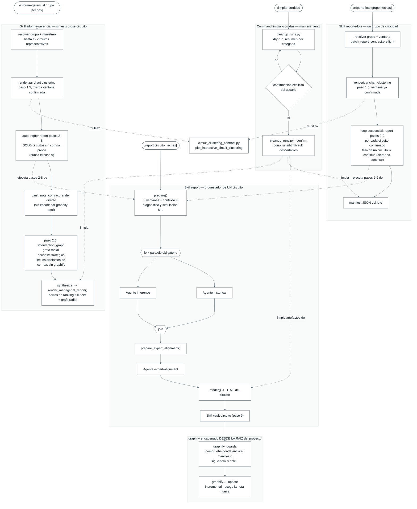

# Intérprete local de UITI_VANO

Intérprete local, nativo para agentes, de `UITI_VANO` sobre el dataset amplio de CHEC.

Este proyecto carga un dataset estructurado ancho, filtra por circuitos y fechas, detecta puntos relevantes en la serie diaria de `UITI_VANO`, construye un paquete de contexto estructurado y usa roles LLM nativos del runtime para explicar el comportamiento en español y compararlo contra reportes PDF expertos.

**Restricción clave:** **no existe ninguna llamada a APIs externas de LLM desde Python**. El razonamiento lo hace el runtime del agente invocador: Claude Code, OpenCode o VS Code Copilot. Python se mantiene determinista, local y controlado.

## Ruta rápida

1. `git lfs install` y clonar el repositorio; después, `git lfs pull`.
2. Abrir el agente de código de tu preferencia —Claude Code, OpenCode o VS Code
   Copilot— en la carpeta del clon.
3. `/instalar-local`: diagnostica la máquina e instala sólo lo que falte.
4. Comprobar que abre de verdad: `/app-local-criticidadCHEC`, y en el simulador
   marcar un vano y pulsar *Simular*.
5. `/report <CIRCUITO>` para un informe; el HTML queda en
   `reports/reportescircuitos/html/`.
6. `/subir-a-databricks` si hay que llevarlo al workspace. Pregunta una sola cosa: la
   URL del workspace destino.

El detalle de cada paso está en [Instalación](#instalación).

## Qué hace este proyecto

La solución integra **cinco aplicaciones locales**, un **modelo predictivo entrenado**, un
**simulador contrafactual** y un **conjunto de agentes** para la generación de informes.
Todos los componentes se ejecutan localmente en `127.0.0.1`, sin exponer servicios a la red,
y pueden desplegarse en Databricks con `/subir-a-databricks`.

Se organiza en tres partes.

### El modelo: M-GCECDL

**M-GCECDL** —*Multimodal-Graph Connectivity Enhanced and Conditioned Deep Learning*— es
el modelo de inteligencia artificial predictiva para la estimación de criticidad,
regularizado por restricciones físicas y por un autoencoder del vector de características,
construido desde el análisis temporal de eventos sobre vanos mediante una representación
por bolsas y múltiples instancias.

Se implementa como MIL por bolsas vano × ventana en el cuaderno
`05_mil_vano_ventana.ipynb`, y su artefacto entrenado es
`data/models/mil_vano_ventana_v1.pt`.

### 1. Tableros de visualización

Cuatro visores y un menú, cada uno con su propio entorno y su puerto fijo. Los cuatro
visores se publican como HTML estático y se cargan en menos de un segundo.

| Tablero | Puerto | Qué muestra |
|---|---|---|
| CriticidadCHEC | `8800` | El menú de control: inicia, supervisa y detiene los demás |
| Nube por vano y clima | `8801` | El UITI diario por vano sobre el mapa, con la variable climática elegida superpuesta |
| Agrupamiento de vanos | `8802` | `k-means` sobre el par (UITI acumulado, número de eventos) y la clasificación de los 208 circuitos |
| Trayectorias de circuitos | `8803` | Cada circuito a lo largo de las 11 ventanas, coloreado por el grupo de cada momento |
| Trayectorias de vanos | `8804` | Lo mismo a nivel de vano, con el perfil del circuito y la evolución por vano |

De aquí sale la **etiqueta de criticidad**: no es un umbral definido manualmente, sino el
resultado de agrupar los vanos por su comportamiento observado y ordenar después los
circuitos por el número de vanos críticos que acumulan. Esa etiqueta es la que el modelo
predictivo aprende a anticipar.

### 2. Simulador «¿Qué pasa si…?» con el modelo de IA predictiva

El único tablero que mantiene un proceso de Python en ejecución (puerto `8866`, Voilà con
kernel), porque cada simulación requiere una nueva inferencia del modelo.

Se selecciona un circuito y una ventana, se marcan vanos, se genera un diagnóstico de
intervención, se modifican las variables seleccionadas y se compara la criticidad observada
con la simulada, junto con el costo asociado a la intervención. El catálogo contractual de
142 actividades aporta el costo unitario; el tablero calcula el costo individual y
acumulado, sin inferir qué actividad corresponde a cada modificación.

Las variables se separan en tres clases, y la separación determina qué pregunta se responde:
**intervención** (11 variables modificables mediante una obra), **escenario** (7 variables de
contexto no controlables) y **no modificables** (8 atributos de identidad y topología).

### 3. Informes automáticos con agentes

El simulador proporciona la exploración interactiva; los agentes generan la documentación
técnica de los resultados. Ambos usan el mismo motor analítico: el diagnóstico que el
simulador muestra en pantalla es exactamente el que recibe y redacta el agente `inference`.

| Comando | Salida generada |
|---|---|
| `/report` | Informe HTML de un circuito, con figuras y trazabilidad por afirmación |
| `/reporte-lote` | Encadena `/report` sobre todos los circuitos de una banda de riesgo |
| `/informe-gerencial` | Síntesis por banda, con barras del conjunto completo de circuitos y grafo radial |

Los agentes complementan la salida del tablero con el contexto que no cabe en un tablero:
la serie histórica (`historical`), la lectura del modelo (`inference`) y la comparación
contra la discusión experta de los informes en PDF (`expert-alignment`).

Como en el resto del proyecto, el razonamiento lo hace el runtime del agente invocador:
Python no llama a ninguna API de LLM.

## Alcance

- procesamiento determinista y funciones puras en `src/chec_local_interpreter`;
- generación local de reportes;
- razonamiento nativo de agentes mediante adaptadores por runtime;
- contratos compartidos y validadores del flujo;
- publicación del sitio como paso explícito e independiente.

**Despliegue a Databricks.** La migración de los activos locales hacia un workspace
Databricks es manual y bajo demanda, mediante `/subir-a-databricks`, el único comando que
habla con Databricks: sus tres etapas —datos, aplicaciones y cuaderno— viven dentro de él y
cada una verifica antes de subir. Se apoya en
[`_contrato-despliegue-databricks.md`](.claude/commands/_contrato-despliegue-databricks.md).
Es un árbol de comandos aislado que nunca modifica `report_pipeline.py` ni los roles de
agente. Solo viajan los datos que consumen el cuaderno y el comando `/report`: **no se crea
ninguna tabla Delta, vista ni dashboard**. Detalle completo en
[`docs/flujo-detallado.md`](docs/flujo-detallado.md#6-la-subida-a-databricks).

## Estructura del repositorio

| Área | Propósito |
|---|---|
| `src/chec_local_interpreter/` | Pipeline determinista del reporte, contratos, validadores, render, context builders |
| `src/chec_impacto/` | El modelo MIL vano × ventana: bolsas, grafo experto, pérdida, asignación de clase y persistencia |
| `src/chec_tableros/` | Los cinco tableros, como **módulos que se importan**: los cuatro estáticos y las dos mitades del simulador |
| `.claude/skills/` | Contratos canónicos de workflow y skills |
| `.claude/agents/` | Definiciones canónicas de roles para Claude |
| `.claude/commands/` | Comandos que no son de la familia de reporte: `/instalar-local`, `/actualizar`, `/subir-a-databricks`, `/app-local-criticidadCHEC`, `/limpiar-corridas` |
| `.opencode/` | Espejos generados de comandos y roles para OpenCode |
| `.github/prompts/`, `.github/agents/` | Espejos generados de comandos y roles para VS Code Copilot |
| `.github/workflows/` | `deploy-pages.yml` (el sitio) y `windows.yml` (lo que solo se rompe en Windows) |
| `scripts/` | Herramientas de línea de ordenes: el diagnóstico local, el estado de actualización y el catálogo de simulación, el generador del cuaderno 05, el empacador de las apps de Databricks, la portabilidad de agentes |
| `docs/` | Arquitectura, workflow, contrato de runtime, requisitos medidos y documentación de soporte |
| `reports/` | Artefactos locales de ejecución, reportes generados, insumos PDF, notas de `reports/vault/` |
| `tests/` | Tests automatizados de contratos, pipelines y render |
| `notebooks/` | `05_mil_vano_ventana.ipynb`, el **único** cuaderno del proyecto |
| `aplicaciones/` | Las cinco aplicaciones locales de escritorio (macOS/Windows), construidas desde `src/chec_tableros/`, más `CriticidadCHEC`, el menú que las gobierna; y `aplicaciones/databricks/`, que es lo que corre en el servidor y no aquí |

> **Para abrir las aplicaciones de escritorio:** entra en
> `aplicaciones/00_criticidad_chec/` y haz doble clic en **`Iniciar.app`** (macOS) o en
> **`iniciar.bat`** (Windows; la primera vez, `instalar.bat`). Eso levanta el menú
> CriticidadCHEC, desde donde se abren y se cierran los cinco tableros. El detalle está
> en [`aplicaciones/README.md`](aplicaciones/README.md).

### Árbol de carpetas

El árbol omite los archivos generados y las dependencias; muestra dónde está el código
que se lee y se modifica. Donde aparece un conteo, es el número de archivos versionados
de esa carpeta.

```text
chec-local-uiti-vano-interpreter/
├── src/                                                    # el código que ejecutan todos los flujos
│   ├── chec_local_interpreter/                             # motor del análisis y de los informes · 55 archivos
│   │   ├── agent_tools/                                    # lo que los agentes pueden invocar
│   │   ├── llm/ · prompt_assets/                           # contratos y plantillas de los agentes
│   │   ├── clima_engine.py                                 # motor de /clima: validaciones y Open-Meteo
│   │   ├── ventanas_015.py                                 # celdas vano × ventana
│   │   ├── mil_inferencia.py · mil_figuras.py              # lectura del artefacto MIL y sus figuras
│   │   ├── ranking_circuitos.py                            # las cuatro bandas de riesgo del circuito
│   │   ├── plotting.py                                     # mapas y gráficas del informe
│   │   └── report_contract.py · batch_report_contract.py   # contratos de /report y /reporte-lote
│   ├── chec_tableros/                                      # los cinco tableros
│   │   ├── clima.py                                        # nube por vano y clima · 8801
│   │   ├── agrupamiento.py                                 # agrupamiento de vanos · 8802
│   │   ├── trayectorias_circuitos.py                       # trayectorias de circuitos · 8803
│   │   ├── trayectorias_vanos.py                           # trayectorias de vanos · 8804
│   │   └── simulador/                                      # «¿Qué pasa si…?» · 8866, con kernel de Python
│   └── chec_impacto/                                       # modelos, entrenamiento e interpretabilidad · 18 archivos
├── aplicaciones/                                           # empaquetado de escritorio para mac y Windows · 92 archivos
│   ├── _comun/                                             # menú, servidor, huellas de insumos y empaquetado
│   ├── 00_criticidad_chec/                                 # el menú CriticidadCHEC · 8800
│   ├── 01_clima/ … 04_trayectorias_vanos/                  # un ejecutable por tablero estático
│   ├── 06_simulador/                                       # el único que arranca un intérprete de Python
│   └── databricks/                                         # el mismo empaquetado, para Databricks Apps
├── notebooks/
│   └── 05_mil_vano_ventana.ipynb                           # entrena el MIL; se genera desde scripts/
├── .claude/                                                # el contrato de los agentes · 43 archivos
│   ├── skills/                                             # /report · /reporte-lote · /informe-gerencial · /clima
│   ├── agents/                                             # historical · inference · expert-alignment
│   └── commands/                                           # /subir-a-databricks · /actualizar · /instalar-local
├── .opencode/ · .github/                                   # los mismos comandos, portados a otros entornos
├── data/                                                   # insumos: Indicadores_vano_v3.csv, GEO/, models/
├── reports/                                                # salidas: informes, bóveda, paneles y bitácoras
├── tests/                                                  # la suite del proyecto · 182 archivos
├── scripts/                                                # generadores, diagnóstico y empaquetado
├── docs/                                                   # guías de flujo, requisitos y portabilidad
├── site/                                                   # la página pública · Astro
└── requirements.txt · package.json · astro.config.mjs
```

`data/` entra y `reports/` sale. Esa separación es la que permite que cada aplicación
calcule una huella de sus insumos y se reconstruya sola cuando alguno cambia.

## Instalación

### 1. Clonar el repositorio

Con **`git lfs` instalado antes de clonar**: la base de eventos son 566 MB y la caché de
bolsas 199 MB, y las dos viajan por Git LFS.

```bash
git lfs install
git clone https://github.com/amalvarezme/chec-local-uiti-vano-interpreter.git
cd chec-local-uiti-vano-interpreter
git lfs pull
```

`git lfs pull` no es opcional ni se puede posponer. Sin él esos dos archivos llegan como
**punteros de 134 bytes** que *existen* —así que un `ls` los da por buenos— y revientan
mucho más abajo, con un error de parseo que no apunta hasta aquí. El diagnóstico del paso
3 los comprueba por contenido, no por presencia.

En Windows, además, **el clon tiene que caber en 61 caracteres de ruta**. Lo que desborda
`MAX_PATH` es `len(raíz) + 187`, y esos 187 no se pueden tocar; si ya clonaste en una ruta
larga, `mover-a-ruta-corta.bat` en la raíz lo resuelve con doble clic y sin pedirle
permisos a nadie.

### 2. Abrir el agente de código

Todo lo que sigue se hace desde un agente. El proyecto trae sus **15 comandos publicados
para los tres**, y se teclean igual en cualquiera de ellos:

| Agente | Dónde lee los comandos |
|---|---|
| **Claude Code** | `.claude/commands/` y `.claude/skills/` — la **fuente del contrato** |
| **OpenCode** | `.opencode/command/` |
| **VS Code Copilot** | `.github/prompts/` |

Abre el de tu preferencia **en la carpeta del clon**. Los dos últimos son espejos
generados desde el primero por `scripts/portabilidad_agentes.py`, así que ninguno se
queda atrás: `/instalar-local` es la misma línea en los tres.

### 3. `/instalar-local` — deja la máquina lista

```
/instalar-local
```

Empieza **diagnosticando**, antes de tocar nada: corre con el Python del sistema y sólo
la biblioteca estándar —tiene que funcionar en un clon recién hecho, donde todavía no
existe ningún entorno— y devuelve dieciséis comprobaciones con el comando exacto para
arreglar cada una **en el sistema en el que estés**.

Después pregunta **una sola cosa, y espera**: para cuál de los tres destinos hay que
dejar la máquina lista —el cuaderno `mil_vano`, las aplicaciones locales, o subir a
Databricks—. Por defecto, los tres. Y sólo entonces instala, en el orden en que las cosas
dependen unas de otras: los datos de LFS, el entorno de la raíz, los seis entornos de las
aplicaciones y la CLI de Databricks. **Lo que ya está no se toca.**

Los seis entornos de `aplicaciones/` son deliberadamente independientes: el menú
CriticidadCHEC se mantiene en ~15 MB porque no carga las dependencias de sus cinco
tableros. Sin esa separación haría falta `torch` sólo para abrir un menú.

Hay cinco cosas que el agente **no puede** instalar por ti, y las pide con el prefijo `!`
para que corran en tu sesión: Python por debajo del piso, `databricks auth login` —abre el
navegador—, un puerto reservado por el sistema, y en Windows el runtime de Visual C++ y
`LongPathsEnabled`, que piden elevación. El comando te dice cuál depende de ti y cuál de
quien administre la máquina.

**Sin agente**, el mismo diagnóstico se corre a mano y no instala nada:

```bash
python3 scripts/diagnostico_local.py     # macOS
py -3 scripts/diagnostico_local.py       # Windows
```

Requiere **Python 3.11 o superior**, y es un piso real: `pandas>=3.0`, `numpy>=2.4` y
`scikit-learn>=1.9` no publican rueda por debajo.

### 4. Comprobar que los tableros y el simulador abren de verdad

Que el diagnóstico salga en verde **no es lo mismo que haber abierto un tablero**, y la
comprobación cuesta segundos. Doble clic en `aplicaciones/00_criticidad_chec/` —
`Iniciar.app` en macOS, `iniciar.bat` en Windows —, o desde el agente:

```
/app-local-criticidadCHEC
```

El menú abre en `http://127.0.0.1:8800/` y desde su página se lanzan los cinco tableros,
cada uno en su puerto:

| Tablero | Puerto | Qué comprobar |
|---|---|---|
| `01_clima` | 8801 | el mapa dibuja y la nube por vano responde |
| `02_agrupamiento_vanos` | 8802 | los grupos se pintan |
| `03_trayectorias_circuitos` | 8803 | la trayectoria del circuito se ve |
| `04_trayectorias_vanos` | 8804 | la evolución por vano se ve |
| `06_simulador` | 8866 | **marcar un vano y pulsar *Simular*** |

El simulador es la prueba que de verdad importa, porque es el único que necesita un
**kernel de Python vivo**: los otros cuatro son HTML estático. Que *Simular* conteste en
unos segundos y llene el mapa de la derecha prueba, de una vez, que el entorno está
completo, que el modelo carga y que el navegador habla con el kernel. La primera apertura
construye el paquete y tarda; las siguientes son inmediatas.

### 5. Si además vas a subir a Databricks

`/instalar-local` ya deja puesto lo que hace falta cuando eliges ese destino: la **CLI de
Databricks** y una **sesión abierta**. No se conforma con que la CLI exista —comprueba que
`databricks apps create --help` acepte `--compute-size`, porque una CLI vieja llega hasta
la etapa 4 del despliegue y muere ahí con un error de argumentos—.

La sesión la abres tú, con el prefijo `!`, porque abre el navegador:

```
databricks auth login --host <URL de tu workspace>
```

> En Windows, `winget` deja la CLI en el PATH de **usuario** y la consola actual no lo
> relee: hay que abrir una consola nueva o el diagnóstico reporta como ausente lo que
> acabas de instalar.

`/instalar-local` **no habla con Databricks**. Deja la CLI y la sesión; subir es otro
comando.

### 6. `/subir-a-databricks` — el único que habla con el workspace

```
/subir-a-databricks
```

**Te pregunta una sola cosa: la URL del workspace destino**, del estilo
`https://adb-xxxxxxxxxxxx.0.azuredatabricks.net`. La pregunta **en cada corrida**, y eso
es a propósito: no la toma del perfil que tenga sesión viva ni de la bitácora de la
corrida anterior, porque eso es evidencia de a dónde fue antes y no un valor por defecto
de a dónde va ahora. Equivocarse de workspace es invisible hasta que alguien abre el que
no era.

De esa URL **deriva el perfil solo**, y confirma la identidad con una llamada real antes
de mover un byte. Si el token está vencido, para y te pide que corras
`databricks auth login --profile <perfil>` con el prefijo `!` — es una de las tres únicas
cosas que detienen la corrida.

No te pregunta nada más: ni nombres de app, ni tamaño de compute, ni si crear lo que
falta. Crear lo que falta **es su trabajo**.

Después recorre tres etapas, y cada una **verifica antes de subir** —lo que ya está no se
vuelve a subir—:

1. **Los datos en el Volume** de Unity Catalog. Compara el *sello* de procedencia, no
   sólo los nombres: un modelo reentrenado se llama igual y pesa casi lo mismo.
2. **Las dos aplicaciones** en compute — el visor de tableros y el simulador con Voila.
3. **El cuaderno `mil_vano`** en el Workspace.

Y **sigue hasta el final aunque tope con un muro**: si le falta un permiso, lo anota y
continúa, de modo que el informe acaba listando todas las paredes y no sólo la primera.
Deja una **bitácora en Markdown** con lo que logró cada etapa, los permisos que le
faltaron y los errores exactos.

Al terminar te da las URLs de las dos aplicaciones y te pide que las abras: hay cosas que
sólo se comprueban con la pantalla delante —que el panel dibuje, que hacer clic en un vano
del mapa marque su casilla, y que *Simular* y *Guardar* respondan—.

### Cuando cambian los datos base

Un segundo diagnóstico contesta la otra pregunta, la que ninguna huella ve: *¿los
artefactos derivados salieron de las fuentes que hay hoy?*

```bash
python3 scripts/estado_actualizacion.py
```

Compara por contenido la base de eventos, el diccionario de variables, el grafo experto
y el catálogo de simulación contra `data/models/procedencia.json`, y devuelve el plan
ordenado de lo que falta rehacer. Desde un agente, `/actualizar` lo corre y lo ejecuta.

Distingue lo que obliga a reentrenar de lo que no: editar `data/Variables_simular.xlsx`
sólo cambia qué ofrece el panel del simulador —y eso se revisa con
`python3 scripts/catalogo_simulacion.py`, que dice qué control le toca a cada variable—,
mientras que editar el grafo experto no cambia **nada** hasta que se reentrena, porque
la adyacencia viaja congelada dentro del `.pt`.

### Instalar a mano, sin agente

El entorno de la raíz —el que corre el cuaderno 05 y el que construye los paneles que
suben a Databricks— es:

```bash
# macOS
python3 -m venv .venv && .venv/bin/pip install -r requirements.txt

# Windows
py -3 -m venv .venv && .venv\Scripts\pip install -r requirements.txt
```

Los seis entornos de `aplicaciones/` son aparte y se instalan con el lanzador de cada
una (`instalar-en-terminal.command` en macOS, `instalar.bat` en Windows).

Qué máquina hace falta —RAM, CPU, disco y las diferencias entre macOS y Windows,
desglosado por aplicaciones, reentrenamiento del cuaderno `mil_vano` y generación de
informes— está medido en [`docs/REQUISITOS-MINIMOS.md`](docs/REQUISITOS-MINIMOS.md).

### Librerías requeridas

Las dependencias viven en **cuatro listas separadas**, y el aislamiento es deliberado: el
menú CriticidadCHEC mantiene un entorno mínimo de ~15 MB porque no carga las dependencias
de sus cinco tableros. Sin esa separación haría falta `torch` sólo para abrir un menú.

| Componente | Lista | Dependencias principales |
|---|---|---|
| **Los cuatro tableros estáticos**<br>puertos 8801 a 8804 | `aplicaciones/<app>/requirements.txt`<br>una por tablero | `pandas` · `numpy` · `pyarrow` · `plotly` · `geopandas` · `ipython` |
| **El simulador**<br>puerto 8866, el único con un intérprete de Python en ejecución | `aplicaciones/06_simulador/requirements.txt` | incluye las anteriores y, además, `torch` · `voila` · `jupyter-server` · `ipykernel` · `ipywidgets` · `anywidget` · `scipy` · `scikit-learn` · `matplotlib` · `joblib` · `cloudpickle` · `openpyxl` · `pyogrio` · `shapely` |
| **El cuaderno `mil_vano` en local**<br>entrenar y reentrenar | `requirements.txt`<br>archivo raíz | `torch` · `networkx` · `jupyter` · `ipykernel` · `papermill` · `nbformat` · `pyproj` · `folium`, además de las dependencias numéricas y geoespaciales del proyecto |
| **Los informes**<br>`/report`, `/reporte-lote`, `/informe-gerencial` | `requirements.txt`<br>el mismo archivo raíz | incluye las del cuaderno y, además, `pdfplumber` · `jsonschema` · `xlsxwriter` · `graphifyy` · `openmeteo-requests` · `requests-cache` · `retry-requests` |

El paquete de `graphify` se instala como **`graphifyy`**, con dos íes; `pip install graphify`
no existe. Las versiones exactas están fijadas en cada `requirements.txt`, que es la fuente:
esta tabla nombra los paquetes, no los pines.

**La generación de informes depende de la cuota del modelo, no de la máquina.** Es el único
componente que necesita un servicio externo no incluido en la instalación local: un entorno
de agente con cuota de modelo y salida a la red. Un informe por circuito consume del orden
de **318.760 tokens**. Todo lo demás se ejecuta sin conexión una vez instalado y con los
insumos disponibles.

### Los 15 comandos en los tres editores

Se teclean **igual** en los tres. Lo que cambia es dónde busca cada editor el archivo, no
cómo se invoca: `/report DON23L14` es la misma línea en Claude Code, en VS Code Copilot y
en OpenCode. La columna de Claude Code es la **fuente del contrato**; las otras dos son
espejos generados por `scripts/portabilidad_agentes.py`.

| Comando | Qué hace | Claude Code (fuente)<br>`.claude/` | VS Code Copilot<br>`.github/prompts/` | OpenCode<br>`.opencode/command/` |
|---|---|---|---|---|
| `/actualizar` | Reconstruye lo afectado cuando cambian los insumos | `commands/actualizar.md` | `actualizar.prompt.md` | `actualizar.md` |
| `/app-local-criticidadCHEC` | Abre el menú CriticidadCHEC y sus cinco tableros | `commands/app-local-criticidadCHEC.md` | `app-local-criticidadCHEC.prompt.md` | `app-local-criticidadCHEC.md` |
| `/clima` | Enriquece los datos con Open-Meteo | `skills/clima/SKILL.md` | `clima.prompt.md` | `clima.md` |
| `/expert-alignment` | Rol de agente: cotejo contra la discusión experta | `skills/expert-alignment/SKILL.md` | `expert-alignment.prompt.md` | `expert-alignment.md` |
| `/historical` | Rol de agente: diagnóstico descriptivo de la serie | `skills/historical/SKILL.md` | `historical.prompt.md` | `historical.md` |
| `/inference` | Rol de agente: lectura del modelo MIL | `skills/inference/SKILL.md` | `inference.prompt.md` | `inference.md` |
| `/informe-gerencial` | Síntesis por banda, con barras y grafo radial | `skills/informe-gerencial/SKILL.md` | `informe-gerencial.prompt.md` | `informe-gerencial.md` |
| `/instalar-local` | Diagnostica la máquina e instala lo que falta | `commands/instalar-local.md` | `instalar-local.prompt.md` | `instalar-local.md` |
| `/limpiar-corridas` | Mantenimiento de artefactos de corrida | `commands/limpiar-corridas.md` | `limpiar-corridas.prompt.md` | `limpiar-corridas.md` |
| `/pdf-discussion-extraction` | Rol de agente: tabla de discusiones desde PDFs | `skills/pdf-discussion-extraction/SKILL.md` | `pdf-discussion-extraction.prompt.md` | `pdf-discussion-extraction.md` |
| `/redaccion-es` | Revisión de tildes y redacción de la prosa generada | `skills/redaccion-es/SKILL.md` | `redaccion-es.prompt.md` | `redaccion-es.md` |
| `/report` | Informe HTML de un circuito | `skills/report/SKILL.md` | `report.prompt.md` | `report.md` |
| `/reporte-lote` | Encadena `/report` sobre una banda de riesgo | `skills/reporte-lote/SKILL.md` | `reporte-lote.prompt.md` | `reporte-lote.md` |
| `/subir-a-databricks` | Despliegue a Databricks, en tres etapas | `commands/subir-a-databricks.md` | `subir-a-databricks.prompt.md` | `subir-a-databricks.md` |
| `/vault-circuito` | Proyecta el circuito a `reports/vault/` y encadena `graphify` | `skills/vault-circuito/SKILL.md` | `vault-circuito.prompt.md` | `vault-circuito.md` |

Los cuatro últimos son los **roles de agente**, que además de invocarse por su nombre los
usa `/report` internamente. Sus definiciones canónicas viven en `.claude/agents/<rol>.md`,
con espejo en `.github/agents/<rol>.agent.md` y `.opencode/agent/<rol>.md`.

### En Windows, dos cosas del sistema que no son paquetes de pip

Las dos piden permisos de administrador, las dos se disfrazan de un problema de pip, y
por eso las mira el diagnóstico y no el ojo. Si te toca pedirlas prestadas, pídelas al
empezar: llegan tarde más veces que rápido, y mientras tanto el resto sí avanza.

**El runtime de Visual C++.** `torch` lo carga al importar. Sin él, `import torch` muere
con `WinError 126` sobre `c10.dll` en un entorno donde `pip check` sale limpio y los
paquetes están **todos**. Reinstalar `requirements.txt` ahí son 1,9 GB que dejan la
máquina exactamente igual:

```powershell
winget install Microsoft.VCRedist.2015+.x64 --accept-package-agreements
```

**`LongPathsEnabled`.** Windows no deja *crear* un directorio que pase de `MAX_PATH` − 12
= 248 caracteres. La instalación de `06_simulador` —la única de las seis que trae
`torch`— llega a `len(raíz) + 187`, donde los 187 son las licencias de terceros de
`kineto` que `torch` anida nueve niveles. Si no cabe, aborta con `WinError 206` y deja el
`.venv` **creado y a medias**, que es justo el estado que un diagnóstico perezoso da por
bueno:

```powershell
# como administrador; después, reiniciar la sesión
Set-ItemProperty -Path 'HKLM:\SYSTEM\CurrentControlSet\Control\FileSystem' -Name LongPathsEnabled -Value 1 -Type DWord
```

Esta segunda depende de **dónde clonaste**: la raíz tiene que caber en 61 caracteres.
`C:\CHEC\chec-local-uiti-vano-interpreter` deja 21 de holgura y no necesita el registro;
`C:\Users\<usuario>\Desktop\CHEC\chec-local-uiti-vano-interpreter` se pasa por cuatro.
Clonar más arriba es la alternativa si no hay administrador a mano. El diagnóstico da la
cuenta, no sólo el veredicto.

> **Recién clonado en Windows, antes de instalar nada: doble clic en
> `mover-a-ruta-corta.bat`**, en la raíz del clon. Mide dónde quedó y, si cabe —que es lo
> normal—, no toca nada y te lo dice. Si no cabe, propone `C:\CHEC\<carpeta>` y mueve el
> clon después de que escribas `SI`.
>
> Es la salida que **no depende de que haya administrador**: acortar la ruta consigue
> contra `MAX_PATH` lo mismo que `LongPathsEnabled`, y no pide permisos a nadie.
>
> Hacerlo **antes** de instalar no es un detalle de orden. Los entornos virtuales llevan
> su ruta absoluta dentro —`pip.exe` empieza por `#!C:\...\.venv\Scripts\python.exe`,
> `activate.bat` fija `VIRTUAL_ENV=`—, así que mover un clon ya instalado los deja
> apuntando a un intérprete que no está ahí. El script lo comprueba y se frena; rehacerlos
> son ~6 GB de descarga que se ahorran moviendo primero.

## Configuración

```bash
cp .env.example .env
```

Colocá un dataset CSV, Parquet o Excel bajo `data/`, o configurá `DATA_PATH`.
El valor por defecto es `data/Indicadores_vano_v3.csv`, resuelto desde la raíz del proyecto.

### Columnas requeridas

- `CIRCUITO`
- `FECHA`
- `UITI_VANO`

Las columnas opcionales se usan cuando existen y se registran como no disponibles cuando faltan.

## Equivalencia de comandos por runtime

El proyecto usa **puntos de entrada nativos del runtime** sobre contratos locales compartidos.
La lógica de negocio **no** vive en los adaptadores. Vive en los contratos Python y en los skills canónicos de Claude.

### Catálogo de comandos

Los 15 comandos se teclean igual en los tres editores. Lo que cambia es dónde busca cada
uno su archivo, no cómo se invoca.

| Comando | Qué hace |
|---|---|
| `/report <circuito> [ini fin]` | Informe HTML de un circuito, con figuras y trazabilidad por afirmación |
| `/reporte-lote <grupo> [ini fin]` | Encadena `/report` sobre todos los circuitos de una banda de riesgo |
| `/informe-gerencial <grupo> [ini fin]` | Síntesis por banda, con barras del conjunto completo de circuitos y grafo radial |
| `/clima` | Enriquece los datos con Open-Meteo; tres validaciones bloqueantes antes de consumir cuota |
| `/limpiar-corridas` | Mantenimiento de artefactos de corrida; `dry-run` y confirmación explícita |
| `/redaccion-es` | Revisión de tildes, mayúsculas y redacción sobre la prosa generada |
| `/instalar-local` | Diagnostica la máquina e instala sólo lo que falta, para los tres destinos locales |
| `/actualizar` | Detecta cambios en los insumos del modelo y reconstruye en orden lo afectado |
| `/app-local-criticidadCHEC` | Abre el menú CriticidadCHEC, desde el que se lanzan y se cierran los cinco tableros |
| `/subir-a-databricks` | Único comando de despliegue; tres etapas que verifican antes de subir |
| `/vault-circuito` | Proyecta los JSON validados del circuito a `reports/vault/` y encadena `graphify` |
| `/expert-alignment`, `/historical`, `/inference`, `/pdf-discussion-extraction` | Los cuatro roles de agente, invocables también por su nombre |

### Punto de entrada principal del reporte

| Runtime | Comando |
|---|---|
| Claude Code | `/report <circuito> [fecha_inicio fecha_fin]` |
| OpenCode | `/report <circuito> [fecha_inicio fecha_fin]` |
| VS Code Copilot | `/report <circuito> [fecha_inicio fecha_fin]` |

Ejemplos:

```text
/report C1
/report C1 2026-01-01 2026-02-01
```

### Equivalencia de capacidades compatibles

Se teclean igual en los tres editores. Lo que cambia es dónde busca cada uno el archivo,
no cómo se invoca:

| Capacidad | Invocación | Claude Code | OpenCode | VS Code Copilot |
|---|---|---|---|---|
| Reporte completo | `/report <circuito> [fecha_inicio fecha_fin]` | `.claude/skills/report/SKILL.md` | `.opencode/command/report.md` | `.github/prompts/report.prompt.md` |
| Reporte por lote | `/reporte-lote <grupo> [fecha_inicio fecha_fin]` | `.claude/skills/reporte-lote/SKILL.md` | `.opencode/command/reporte-lote.md` | `.github/prompts/reporte-lote.prompt.md` |
| Informe gerencial | `/informe-gerencial <grupo> [fecha_inicio fecha_fin]` | `.claude/skills/informe-gerencial/SKILL.md` | `.opencode/command/informe-gerencial.md` | `.github/prompts/informe-gerencial.prompt.md` |
| Análisis histórico | rol `historical` | `.claude/agents/historical.md` | `.opencode/agent/historical.md` | `.github/agents/historical.agent.md` |
| Análisis de inferencia | rol `inference` | `.claude/agents/inference.md` | `.opencode/agent/inference.md` | `.github/agents/inference.agent.md` |
| Alineación experta | rol `expert-alignment` | `.claude/agents/expert-alignment.md` | `.opencode/agent/expert-alignment.md` | `.github/agents/expert-alignment.agent.md` |
| Extracción de discusiones PDF | rol `pdf-discussion-extraction` | `.claude/agents/pdf-discussion-extraction.md` | `.opencode/agent/pdf-discussion-extraction.md` | `.github/agents/pdf-discussion-extraction.agent.md` |
| Mantenimiento de runs locales | `/limpiar-corridas` | `.claude/commands/limpiar-corridas.md` | `.opencode/command/limpiar-corridas.md` | `.github/prompts/limpiar-corridas.prompt.md` |

Los comandos `/clima`, `/redaccion-es`, `/instalar-local`, `/actualizar`,
`/subir-a-databricks` y `/app-local-criticidadCHEC` tienen espejo en los tres editores
por el mismo mecanismo.

### Comandos de despliegue a Databricks

**La CLI de Databricks es la estrategia de migración, no un detalle de configuración.** Es
lo que permite que un agente de código conduzca el despliegue completo desde la terminal,
sin pasar por la interfaz web del espacio de trabajo (*workspace*). `/subir-a-databricks`
se comunica con Databricks **exclusivamente** a través de la CLI —51 invocaciones de
`databricks`—: `auth login` abre la sesión OAuth, `catalogs list` y `volumes list`
descubren el destino, `fs cp` y `workspace import` suben los artefactos, y `apps create`
y `apps deploy` publican las aplicaciones. De ahí que el usuario sólo aporte la URL del
workspace: el perfil se deriva de esa URL y todo lo demás se resuelve en tiempo de
ejecución.

La CLI se instala una sola vez, y tiene que estar **al día**: una versión vieja completa
las etapas iniciales y falla en el despliegue, cuando `databricks apps create` no reconoce
las opciones requeridas. `/instalar-local` comprueba las dos cosas —que exista y que
sirva— y deja la sesión autenticada.

```bash
brew tap databricks/tap && brew install databricks   # macOS
winget install Databricks.DatabricksCLI              # Windows
```

Es **un solo comando**, `/subir-a-databricks`, con tres etapas. Cada etapa le pregunta primero
a Databricks qué hay ya, y solo sube lo que falta:

| Etapa | Qué verifica | Qué sube si falta |
|---|---|---|
| 3 | El Volume, el CSV con su tamaño real y el juego completo de shapefiles | `data/` entero + `site/data/variables.json` |
| 4 | Que las dos apps existan, estén `ACTIVE`/`RUNNING`/`SUCCEEDED` y sirvan contenido al día | `criticidad-chec` (4 tableros en 4 rutas) y `simulador-vano` (Voila, kernel vivo) |
| 5 | Que el cuaderno esté en el Workspace y corresponda a su generador —regenerando y comparando **contenido**, nunca fechas, que en un clon son todas la del clon— | `notebooks/05_mil_vano_ventana.ipynb` más `src/chec_impacto`, como cuaderno y sin app |


Cada corrida deja una bitácora en `reports/despliegues/` con los pasos, los errores y las
restricciones encontradas; una restricción de permisos no aborta la corrida, se registra y
el comando sigue para que el reporte quede completo.

Ver [`docs/flujo-detallado.md`](docs/flujo-detallado.md#6-la-subida-a-databricks) para el flujo completo, objetos de datos y limitaciones conocidas.

### Modelo de portabilidad

**La instalación no está atada a un proveedor de modelo ni a un editor.** Los comandos son
contratos en texto —persona, invariantes, secuencia de ejecución y forma de la salida—, así
que pueden ejecutarse con distintos modelos de lenguaje según la cuota y la política de
datos de la organización. Python se mantiene determinista y no llama a ninguna API de LLM.

El repositorio publica los mismos 15 comandos y los 4 roles para **tres entornos de
agente**. La fuente única es `.claude/`; los espejos se generan:

| | Claude Code | OpenCode | VS Code Copilot |
|---|---|---|---|
| Papel | fuente del contrato | espejo generado | espejo generado |
| Comandos | `.claude/skills/*/SKILL.md`, `.claude/commands/*.md` | `.opencode/command/*.md` · 15 | `.github/prompts/*.prompt.md` · 15 |
| Roles | `.claude/agents/*.md` | `.opencode/agent/*.md` · 4 | `.github/agents/*.agent.md` · 4 |
| Reglas del proyecto | `.claude/agents/rules/invariants.md` | `AGENTS.md` + `opencode.json` | `.github/copilot-instructions.md` + `AGENTS.md` |
| Invocación | `/report DON23L14` | `/report DON23L14` | `/report DON23L14` |

Los tres usos que el portado habilita son los mismos en cualquiera de los tres editores:

- **captura de datos de clima** con `/clima`, que consulta Open-Meteo con sus tres
  validaciones de cuota y deja la tabla enriquecida en `data/`;
- **generación de informes automáticos** con `/report`, `/reporte-lote` e
  `/informe-gerencial`;
- **conexión con Databricks** con `/subir-a-databricks`, que conduce el despliegue por la
  CLI sin depender del editor desde el que se invoque.

La compatibilidad con los otros dos editores es deliberadamente delgada:

- los espejos de `.opencode/` y `.github/` los **genera** `scripts/portabilidad_agentes.py`
  a partir del frontmatter canónico; cada uno dice cómo se teclea, qué archivo canónico hay
  que leer y qué límites no se cruzan;
- ningún espejo redefine lógica de dominio;
- `tests/test_portabilidad_agentes.py` falla cuando un espejo falta, quedó viejo o sobró,
  así que un skill nuevo sin espejo pone la suite en rojo;
- la fuente de verdad sigue siendo:
  - `.claude/skills/*`
  - `.claude/agents/*`
  - `.claude/commands/*`
  - `src/chec_local_interpreter/*`

Se regenera y se verifica con:

```bash
PYTHONPATH=src .venv/bin/python scripts/portabilidad_agentes.py generar
PYTHONPATH=src .venv/bin/python scripts/portabilidad_agentes.py verificar
```

Ver [`docs/portabilidad-agentes.md`](docs/portabilidad-agentes.md) para el detalle, incluido
por qué los espejos escritos a mano se mueren sin que nadie lo note.

## Reglas de argumentos para comandos tipo reporte

Para la familia de comandos de reporte, `report`, `reporte-lote`, `informe-gerencial` y clustering cuando aplique:

- `circuito` o `grupo` es obligatorio, según el comando;
- `fecha_inicio` y `fecha_fin` son opcionales **como par**;
- si omitís ambas, el workflow usa su resolvedor por defecto;
- si enviás exactamente una fecha, eso es un error de uso;
- el runtime debe resolver primero la ventana, mostrarla una vez y pedir confirmación antes de continuar.

## Arquitectura end-to-end

La arquitectura está separada entre Python determinista y razonamiento nativo del runtime.

### 1. Pipeline local determinista

Lo controlan módulos Python como:

- `src/chec_local_interpreter/report_pipeline.py`
- `src/chec_local_interpreter/report_contract.py`
- `src/chec_local_interpreter/circuit_clustering_contract.py`
- `src/chec_local_interpreter/batch_report_contract.py`
- `src/chec_local_interpreter/informe_gerencial_contract.py`

Esta capa:

- resuelve solicitudes;
- valida entradas;
- selecciona las ventanas del estudio;
- construye envelopes de contexto;
- ejecuta simulaciones locales;
- valida respuestas de agentes;
- renderiza el HTML final.

### 2. Contratos canónicos de agentes

Los controlan los artefactos nativos de Claude:

- `.claude/skills/*`
- `.claude/agents/*`

Estos archivos definen:

- la persona del rol;
- los límites de herramientas permitidas;
- el loop de validación;
- el contrato de salida;
- la semántica de orquestación del runtime.

### 3. Adaptadores por runtime

Los controlan espejos específicos del runtime, todos generados:

- `.opencode/command/*`, `.opencode/agent/*`
- `.github/prompts/*.prompt.md`, `.github/agents/*.agent.md`

Estos adaptadores traducen la sintaxis del runtime al contrato local compartido sin duplicar comportamiento de negocio.

## Los cinco roles principales nativos de agente

1. **`pdf-discussion-extraction`**
   - Proceso por lotes sobre PDFs expertos.
   - Decide qué secciones candidatas se convierten en filas estructuradas de discusión.

2. **`historical`**
   - Produce el diagnóstico descriptivo/base del comportamiento de `UITI_VANO`.

3. **`inference`**
   - Interpreta con cautela el modelo MIL por bolsas del cuaderno 05: la relevancia hacia
     UITI mínimo de cada ventana, separada en variables de intervención y de escenario, el
     diagnóstico de hasta 15 vanos y la simulación de intervención con su grafo diferencia.

4. **`expert-alignment`**
   - Compara los resultados de histórico + inferencia contra la evidencia de discusión de PDFs expertos.

## Resumen del workflow del reporte

`/report` y sus equivalentes por runtime siguen la misma secuencia conceptual:

1. Resolver argumentos y preflight.
2. Confirmar una sola vez la ventana final circuito/fechas.
3. Ejecutar `prepare()`.
4. Despachar `historical` e `inference`.
5. Validar salidas.
6. Ejecutar `prepare_expert_alignment()`.
7. Ejecutar `expert-alignment`.
8. Renderizar un único reporte HTML local.
9. Exportar o publicar después, solo como acción explícita y separada.

### Detalle del workflow del reporte

- `historical` e `inference` son independientes.
- cuando el runtime lo soporta, esas dos etapas deben correr en paralelo;
- `expert-alignment` depende de salidas validadas de `historical` e `inference`;
- `render()` fusiona todas las salidas validadas en un único artefacto HTML;
- la generación del reporte es local por diseño;
- la publicación siempre es explícita y separada.

## Diagramas del workflow

### Guías de flujo (punto de entrada recomendado)

Antes de los diagramas fuente de abajo, dos documentos narrativos que cubren el pipeline
local de reportes **y** el despliegue a Databricks:

- **[`docs/flujo-detallado.md`](docs/flujo-detallado.md)** (o su versión HTML,
  [`docs/flujo-detallado.html`](docs/flujo-detallado.html)) — flujo técnico completo: el modelo MIL,
  los agentes, la familia `/report`, las seis aplicaciones locales, la subida a Databricks con sus
  restricciones conocidas y los cuadernos.
- **[`docs/flujo-resumen.md`](docs/flujo-resumen.md)** (o su versión visual,
  [`docs/flujo-resumen.html`](docs/flujo-resumen.html)) — misma historia sin jerga técnica, para
  perfiles no técnicos.

### Diagrama Mermaid

Diagrama actual end-to-end:


```mermaid
%%{init: {"theme":"base","themeVariables":{"background":"#ffffff","primaryColor":"#ffffff","primaryTextColor":"#102129","primaryBorderColor":"#5f6f77","secondaryColor":"#f3f8f6","tertiaryColor":"#ffffff","lineColor":"#5f6f77","textColor":"#102129","mainBkg":"#ffffff","nodeBorder":"#5f6f77","clusterBkg":"#f8fbfa","clusterBorder":"#dce7e4","edgeLabelBackground":"#ffffff","titleColor":"#102129"}}}%%
%% Workflow actual del proyecto
flowchart TD
    START([Inicio]) --> LANE1

    subgraph LANE1[Ingesta de datos]
        PDF[(PDFs expertos<br/>reports/analysis-documents)] --> P0[Runbook batch de discusión PDF<br/>pdf_discussion_pipeline.py<br/>skill: pdf-discussion-extraction]
        P0 --> XLSX[(tabla_pdfs_intervalo_*.xlsx)]
        CSV[(CSV Indicadores_vano<br/>data/Indicadores_vano_v3.csv)]
        MET[API Open-Meteo] --> P1[Enriquecimiento climático<br/>comando /clima]
        CSV --> P1
    end

    subgraph LANE2["Modelado ML"]
        VARS[(variables.json /<br/>Variables_seleccion.xlsx)] --> P7[Construcción de grafo experto]
        P7 --> ADJ[(matriz de adyacencia + edges)]
        P1 --> P3["Entrenamiento MIL por bolsas<br/>05_mil_vano_ventana.ipynb"]
        ADJ --> P3
        P3 --> MODEL[(mil_vano_ventana_v1.pt)]
        MODEL --> P5[Relevancia hacia el UITI mínimo por circuito]
    end

    subgraph LANE3[Interpretación local, agentes]
        CSV --> D1[Ranking de circuitos por vanos críticos<br/>ranking_circuitos.py]
        D1 --> D2[Constructor de contexto estructurado<br/>context_builder.py]
        D2 --> CHK{"Resolver circuito + ventana de fechas<br/>alerta+y detener si es inválido<br/>una sola confirmación con el usuario"}
        CHK -- "no encontrado / cero eventos" --> STOP0([Alerta y detener, sin crear run_dir])

        subgraph REPORTE["Skill /report, punto de entrada principal<br/>report_pipeline.py"]
            direction TB
            CHK -- "confirmado una vez" --> RP0["prepare()<br/>3 ventanas + contexto +<br/>diagnóstico y simulación MIL del cuaderno 06"]
            MODEL --> RP0
            RP0 --> FORK{{"fork, despacho paralelo obligatorio<br/>historical / inference"}}
            FORK --> A1[Agente: historical]
            FORK --> A2[Agente: inference]
            A1 --> G1{"¿Schema + provenance válidos?"}
            A2 --> G1
            G1 -- "no, reintentos agotados" --> STOP1([Detener la ejecución de este circuito])
            G1 -- sí --> JOIN{{join}}
            JOIN --> RP1["prepare_expert_alignment()"]
            XLSX --> RP1
            RP1 --> A3[Agente: expert-alignment]
            A3 --> G2{"¿Schema + provenance válidos?"}
            G2 -- "no, reintentos agotados" --> STOP2([Detener la ejecución de este circuito])
            G2 -- sí --> RP2["render()"]
        end
        RP2 --> HTML1[(Reporte HTML)]
    end

    subgraph LANE4[Publicación]
        PAGESRC[Reporte local generado] --> WE[Exportación manual<br/>web_export.py]
        WE --> SITE[(site/assets/site/results)]
        SITE --> CI[GitHub Actions<br/>.github/workflows/deploy-pages.yml]
        CI --> PAGES([GitHub Pages])
    end

    HTML1 -.-> PAGESRC
```

El diagrama vive acá, en el README, y no en un `.mmd` y un `.svg` aparte: las copias
sueltas de `docs/` se quedaban atrás del flujo cada vez que este cambiaba, y un diagrama
desactualizado engaña más que la ausencia de diagrama.

**La calle de publicación es presentación, no flujo del proyecto.** El sitio de Astro
(`astro.config.mjs` con `srcDir: ./site`, publicado por `.github/workflows/deploy-pages.yml`
en GitHub Pages) muestra hacia afuera reportes que ya existen; no produce ninguno, y nada
del pipeline lo lee de vuelta. Por eso su flecha entra punteada. Si el sitio no se despliega
nunca, el proyecto funciona igual: se pierde la vitrina, no un paso. La única excepción es
`site/data/variables.json`, que sí es un insumo — temático y opcional — del cuaderno 05, y
que vive bajo `site/` por historia, no porque el sitio lo produzca.

### Diagrama de la familia de comandos de reporte

Los cuatro comandos que operan sobre el pipeline de reportes — `/report`, `/reporte-lote`,
`/informe-gerencial` y `/limpiar-corridas` — se reparten el trabajo así:
`report` es el único orquestador de un circuito; `reporte-lote` e `informe-gerencial` lo invocan
**por referencia** (nunca copian su lógica) y además llaman directamente al contrato de
clustering; `limpiar-corridas` es el único que no
invoca ningún agente ni skill — solo hace mantenimiento sobre los artefactos que los otros producen.

| Comando | Tipo | Invoca | Contrato L1 |
|---|---|---|---|
| `/report` | Skill orquestador | Agentes `historical`, `inference`, `expert-alignment`; skill `vault-circuito` (paso 9) → `graphify` incremental | `report_pipeline.py` |
| `/reporte-lote` | Skill de lote | `report` (pasos 2-9 completos, por circuito); `circuit_clustering_contract` (paso 1.5) | `batch_report_contract.py` |
| `/informe-gerencial` | Skill de síntesis | `report` (solo pasos 2-8, circuitos faltantes); `circuit_clustering_contract`; `vault_note_contract` directo (sin encadenar `graphify`) | `informe_gerencial_contract.py`, `intervention_graph.py` |
| `/limpiar-corridas` | Command de mantenimiento | Ninguno — dry-run + confirmación explícita antes de borrar | `cleanup_runs.py` |


```mermaid
%%{init: {"theme":"base","themeVariables":{"background":"#ffffff","primaryColor":"#ffffff","primaryTextColor":"#102129","primaryBorderColor":"#5f6f77","secondaryColor":"#f3f8f6","tertiaryColor":"#ffffff","lineColor":"#5f6f77","textColor":"#102129","mainBkg":"#ffffff","nodeBorder":"#5f6f77","clusterBkg":"#f8fbfa","clusterBorder":"#dce7e4","edgeLabelBackground":"#ffffff","titleColor":"#102129"}}}%%
%% Familia de comandos de reporte — agentes, skills e interacciones
%% Verificado contra .claude/skills/*/SKILL.md y .claude/commands/limpiar-corridas.md (2026-07-22)
flowchart TB
    CMD_REPORT(["/report circuito [fechas]"])
    CMD_LOTE(["/reporte-lote grupo [fechas]"])
    CMD_GER(["/informe-gerencial grupo [fechas]"])
    CMD_LIMPIAR(["/limpiar-corridas"])

    CCC["circuit_clustering_contract.py<br/>plot_interactive_circuit_clustering"]

    subgraph REPORT["Skill report — orquestador de UN circuito"]
        direction TB
        RP_PREPARE["prepare()<br/>3 ventanas + contexto +<br/>diagnostico y simulacion MIL"]
        RP_FORK{{"fork paralelo obligatorio"}}
        AG_HIST["Agente historical"]
        AG_INF["Agente inference"]
        RP_JOIN{{join}}
        RP_PEA["prepare_expert_alignment()"]
        AG_EXP["Agente expert-alignment"]
        RP_RENDER["render() -> HTML del circuito"]
        VAULT["Skill vault-circuito (paso 9)"]
        RP_PREPARE --> RP_FORK
        RP_FORK --> AG_HIST --> RP_JOIN
        RP_FORK --> AG_INF --> RP_JOIN
        RP_JOIN --> RP_PEA --> AG_EXP --> RP_RENDER --> VAULT
    end
    CMD_REPORT --> RP_PREPARE

    subgraph GRAPHV["graphify encadenado DESDE LA RAIZ del proyecto"]
        GV_GUARDA["graphify_guarda<br/>comprueba donde ancla el manifiesto<br/>sigue solo si sale 0"]
        GV_INC["graphify . --update<br/>incremental, recoge la nota nueva"]
        GV_GUARDA --> GV_INC
    end
    VAULT --> GV_GUARDA

    subgraph LOTE["Skill reporte-lote — un grupo de criticidad"]
        direction TB
        LOTE_RESOLVE["resolver grupo + ventana<br/>batch_report_contract.preflight"]
        LOTE_CHART["renderizar chart clustering<br/>paso 1.5, ventana ya confirmada"]
        LOTE_LOOP["loop secuencial: report pasos 2-9<br/>por cada circuito confirmado<br/>fallo de un circuito -> continua (alert-and-continue)"]
        LOTE_MANIFEST["manifest JSON del lote"]
        LOTE_RESOLVE --> LOTE_CHART --> LOTE_LOOP --> LOTE_MANIFEST
    end
    CMD_LOTE --> LOTE_RESOLVE
    LOTE_CHART -.reutiliza.-> CCC
    LOTE_LOOP -.ejecuta pasos 2-9 de.-> RP_PREPARE

    subgraph GER["Skill informe-gerencial — sintesis cross-circuito"]
        direction TB
        GER_RESOLVE["resolver grupo + muestreo<br/>hasta 12 circuitos representativos"]
        GER_CHART["renderizar chart clustering<br/>paso 1.5, misma ventana confirmada"]
        GER_MISSING["auto-trigger report pasos 2-8<br/>SOLO circuitos sin corrida previa<br/>(nunca el paso 9)"]
        GER_VAULT2["vault_note_contract.render directo<br/>(sin encadenar graphify aqui)"]
        GER_GRAPH["paso 2.6: intervention_graph<br/>grafo radial causas/estrategias<br/>lee los artefactos de corrida, sin graphify"]
        GER_SYNTH["synthesize() + render_managerial_report()<br/>barras de ranking full-fleet + grafo radial"]
        GER_RESOLVE --> GER_CHART --> GER_MISSING --> GER_VAULT2 --> GER_GRAPH --> GER_SYNTH
    end
    CMD_GER --> GER_RESOLVE
    GER_CHART -.reutiliza.-> CCC
    GER_MISSING -.ejecuta pasos 2-8 de.-> RP_PREPARE

    subgraph LIMPIAR["Command limpiar-corridas — mantenimiento"]
        direction TB
        LIMPIAR_DRY["cleanup_runs.py<br/>dry-run, resumen por categoria"]
        LIMPIAR_CONFIRM{"confirmacion explicita<br/>del usuario"}
        LIMPIAR_DELETE["cleanup_runs.py --confirm<br/>borra runs/html/vault descartables"]
        LIMPIAR_DRY --> LIMPIAR_CONFIRM
        LIMPIAR_CONFIRM -- si --> LIMPIAR_DELETE
        LIMPIAR_CONFIRM -- no --> LIMPIAR_DRY
    end
    CMD_LIMPIAR --> LIMPIAR_DRY
    LIMPIAR_DELETE -.limpia artefactos de.-> RP_RENDER
    LIMPIAR_DELETE -.limpia.-> LOTE_MANIFEST
    LIMPIAR_DELETE -.limpia.-> GER_SYNTH
```

## GitHub y modelo de publicación

### Repositorio y ramas

- repositorio público: `amalvarezme/chec-local-uiti-vano-interpreter`
- sitio público: https://amalvarezme.github.io/chec-local-uiti-vano-interpreter/
- `main` es la única rama del proyecto: rama por defecto, publicada para el sitio y de desarrollo activo

### Comportamiento de GitHub Pages

- generar un reporte local **no** publica automáticamente;
- `/report` y sus equivalentes solo generan artefactos HTML locales;
- publicar al sitio es un paso separado y deliberado mediante el flujo de exportación web;
- el despliegue del sitio lo hace GitHub Actions después de actualizar el contenido publicable.

### Estado de GitHub Actions

Este repositorio tiene **dos** workflows:

| Workflow | Qué hace |
|---|---|
| `.github/workflows/deploy-pages.yml` | publica el sitio, una vez que su contenido está listo |
| `.github/workflows/windows.yml` | corre en `windows-latest` lo que **solo se rompe en Windows** |

El de Windows existe porque hay tres diferencias del sistema que **no se ven leyendo el
código en un Mac**: `signal.SIGKILL`, que allí no existe; `SO_REUSEADDR`, que allí significa
lo contrario; y los finales de línea de los `.bat`. En macOS las pruebas que las fijan solo
pueden comprobar el TEXTO de la rama que Windows tomaría. Va sin `git lfs pull`: no lee un
solo dato.

Eso implica que:

- el deploy de Pages se automatiza una vez que el contenido del sitio está listo;
- la mitad de Windows se comprueba en Windows y no por lectura;
- `pytest -q` y `python evals/run_llm_eval.py` siguen siendo validaciones locales requeridas antes de considerar un cambio como completo.

## Workflow de la tabla de discusiones PDF

La tabla base de discusiones expertas se genera mediante el runbook batch nativo para agentes:

- pipeline Python determinista: `chec_local_interpreter.pdf_discussion_pipeline`
- skill/rol agente: `pdf-discussion-extraction`

Carpeta de entrada por defecto:

- `reports/analysis-documents/`

Salida esperada:

- `tabla_pdfs_intervalo_*.xlsx`

Debe regenerarse cada vez que se agreguen, eliminen o modifiquen PDFs en esa carpeta.

El Excel resultante contiene exactamente:

- `Circuito`
- `Fecha inicio`
- `Fecha fin`
- `Análisis`
- `Evidencia`

## Salidas del sistema

Las salidas estructuradas del intérprete local se guardan en:

- `reports/reportescircuitos/artifacts/`

Artefactos típicos:

- `structured_context_<timestamp>.json`
- `llm_prompt_<timestamp>.md`
- `uiti_vano_timeseries_<timestamp>.png`
- `llm_analysis_<timestamp>.json` opcional
- `inference_llm_analysis_<timestamp>.json` opcional
- `expert_alignment_context_<timestamp>.json` opcional
- `expert_alignment_analysis_<timestamp>.json` opcional
- `expert_alignment_pdf_matches_<timestamp>.xlsx` opcional

Los reportes HTML generados por `render()` se guardan en:

- `reports/reportescircuitos/html/`

Las salidas LLM inválidas se guardan por separado con sus errores de validación y nunca se presentan como análisis final.

## Notebooks

El cuaderno no es el punto de entrada del flujo de reporte: ese es `/report`.

**En `notebooks/`** — lo que se ejecuta como cuaderno:

| Cuaderno | Qué hace |
|---|---|
| `05_mil_vano_ventana.ipynb` | Aprendizaje de instancias múltiples sobre bolsas vano × ventana |

**En `src/chec_tableros/`** — los cinco tableros de las aplicaciones de escritorio, como
módulos que se **importan**. `notebooks/05_mil_vano_ventana.ipynb` es el único cuaderno del
proyecto, y se ejecuta **como cuaderno**: entrena el modelo MIL.

| Módulo | Qué hace | Lo consume |
|---|---|---|
| `chec_tableros.clima` | Panel climático: violines por variable y nube de rezagos horarios, 208 circuitos | `aplicaciones/01_clima` |
| `chec_tableros.agrupamiento` | Agrupamiento de circuitos y de vanos por UITI acumulado y número de eventos | `aplicaciones/02_agrupamiento_vanos` |
| `chec_tableros.trayectorias_circuitos` | Trayectorias de circuito por ventanas deslizantes, con mapa geográfico | `aplicaciones/03_trayectorias_circuitos` |
| `chec_tableros.trayectorias_vanos` | Lo mismo a nivel de vano; ajusta la misma geometría KMeans que 05 y 06 usan | `aplicaciones/04_trayectorias_vanos` |
| `chec_tableros.simulador.derivacion` | El arranque caro del simulador: CSV, shapefiles y bolsas → un `Derivado` que se congela | `aplicaciones/06_simulador` |
| `chec_tableros.simulador.tablero` | El tablero vivo de `ipywidgets` que ese `Derivado` alimenta (requiere kernel) | `aplicaciones/06_simulador` |

**La geometría KMeans es un artefacto versionado, no una dependencia entre cuadernos.** Vive
en `data/geometria_kmeans_014_v1.json`, se versiona en git y se reproduce con
`scripts/exportar_geometria.py`, que la reajusta desde el CSV.
`chec_local_interpreter.ventanas_015.cargar_clases_criticidad` la lee de ahí y verifica su
sha1, de modo que un cambio de centroides falla ruidosamente en vez de derivar en silencio.

**El grafo de restricción física se construye en código**, con
`construir_aristas_grafo_chec` y `construir_matriz_adyacencia_mgcecdl`, y viaja dentro del
`.pt`. No hay ningún `.npy` bajo `data/graphs/`: lo único que hay en esa carpeta es
`mgcecdl_feature_order.json`, el orden congelado de las 70 features. Editar el grafo no cambia
nada hasta que se reentrena, porque la adyacencia viaja congelada dentro del artefacto.

**El enriquecimiento climático no vive en un cuaderno**: lo hace el comando `/clima`, y quien
lo visualiza es el módulo `chec_tableros.clima`.

## Pruebas

Ejecutá ambas antes de considerar el trabajo completo:

```bash
pytest -q
python evals/run_llm_eval.py
```

## Referencias clave

- `AGENTS.md`
- `docs/agents-guide.md`
- `docs/report-runtime-contract.md`
- `.claude/skills/report/SKILL.md`
- `src/chec_local_interpreter/report_pipeline.py`
- `src/chec_local_interpreter/report_contract.py`
