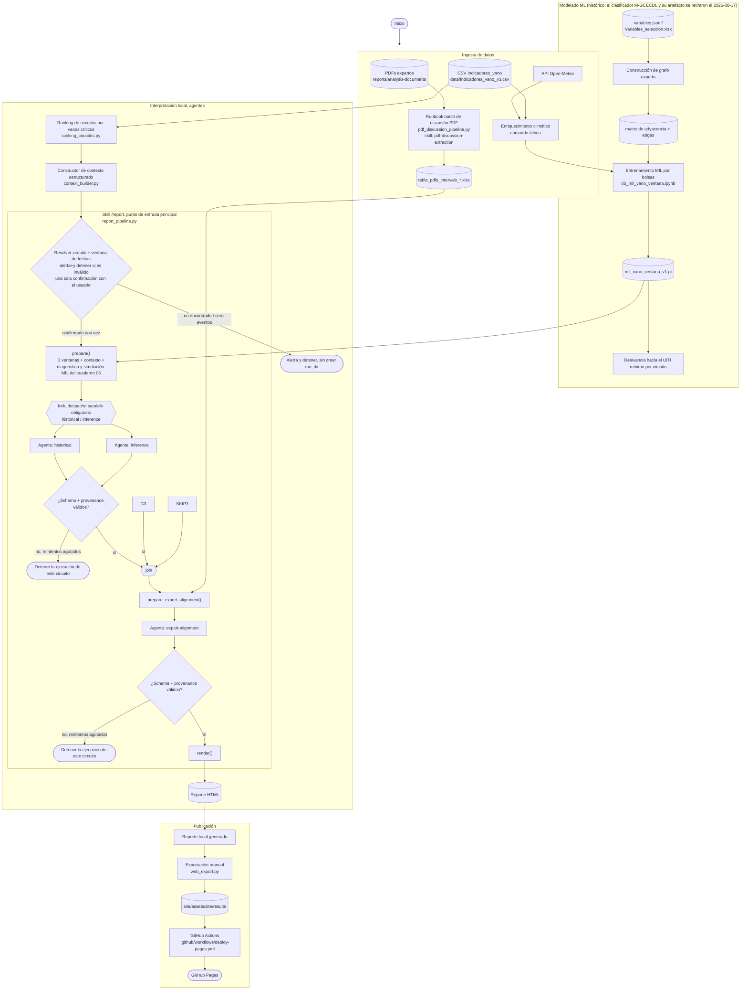
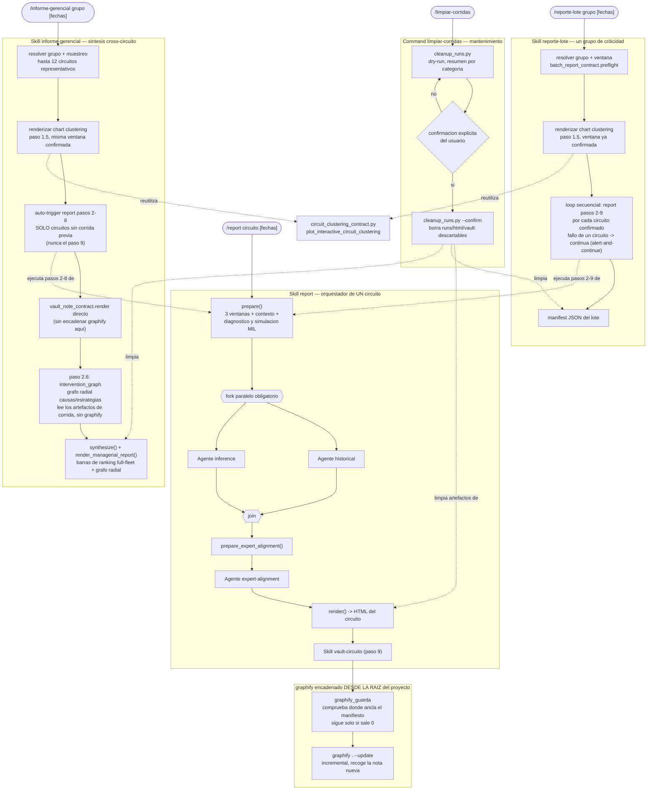

# Intérprete local de UITI_VANO

Intérprete local, nativo para agentes, de `UITI_VANO` sobre el dataset amplio de CHEC.

Este proyecto carga un dataset estructurado ancho, filtra por circuitos y fechas, detecta puntos relevantes en la serie diaria de `UITI_VANO`, construye un paquete de contexto estructurado y usa roles LLM nativos del runtime para explicar el comportamiento en español y compararlo contra reportes PDF expertos.

**Restricción clave:** **no existe ninguna llamada a APIs externas de LLM desde Python**. El razonamiento lo hace el runtime del agente invocador: Claude Code, OpenCode o VS Code Copilot. Python se mantiene determinista, local y controlado.

## Ruta rápida

1. Crear el entorno.
2. Colocar el dataset en `data/` o configurar `DATA_PATH`.
3. Ejecutar el comando nativo del runtime que estés usando.
4. Revisar el HTML local generado en `reports/reportescircuitos/html/`.
5. Publicar por separado solo si querés llevar el resultado a GitHub Pages.

## Qué hace este proyecto

El repositorio cubre el flujo completo de interpretabilidad local para el análisis de circuitos CHEC:

- resolución determinista de circuito y ventana de fechas;
- selección determinista de las tres ventanas que el informe estudia (la última con
  eventos del circuito más las dos de mayor influencia);
- construcción de contexto estructurado para razonamiento nativo de agentes;
- diagnóstico descriptivo histórico sobre la serie por ventana (`historical`);
- interpretación del modelo MIL por bolsas del cuaderno 05 (`inference`), con las
  variables separadas en intervención y escenario;
- alineación contra reportes PDF expertos (`expert-alignment`);
- extracción de tabla base de discusiones desde PDFs (`pdf-discussion-extraction`);
- render del reporte HTML local completo;
- exportación manual opcional al sitio estático.

## Alcance y no objetivos

### En alcance

- procesamiento determinista y funciones puras en `src/chec_local_interpreter`;
- generación local de reportes;
- razonamiento nativo de agentes mediante adaptadores por runtime;
- contratos compartidos y validadores del flujo;
- publicación del sitio como paso explícito e independiente.

### Explícitamente fuera de alcance

- Dash
- FastAPI
- RAG
- bases vectoriales
- llamadas Python a Gemini, OpenAI u otros proveedores LLM hospedados
- publicación automática como efecto colateral de generar un reporte
- Databricks **dentro de** `src/chec_local_interpreter` o de los 5 roles LLM (`historical`,
  `inference`, `expert-alignment`, `pdf-discussion-extraction`) — nunca se
  agrega lógica de negocio ahí

**Excepción sancionada — despliegue a Databricks:** el proyecto sí incluye una migración manual,
bajo demanda, de los activos locales hacia un workspace Databricks, vía 3 comandos de Claude Code
(`/subir-a-databricks`, el único que habla con Databricks desde el 2026-08-17: las tres
etapas —datos, aplicaciones y cuaderno— viven dentro de él, cada una verificando antes de
subir). Se apoya en
[`_contrato-despliegue-databricks.md`](.claude/commands/_contrato-despliegue-databricks.md).
Es un árbol de comandos aislado, sin equivalente en Pi, que nunca modifica `report_pipeline.py`
ni los roles LLM. Solo viajan los datos que consumen los cuadernos `01`-`06` y el comando
`/report`: **no se crea ninguna tabla Delta, vista ni dashboard**. Detalle completo en [`docs/flujo-detallado.md`](docs/flujo-detallado.md#6-la-subida-a-databricks).

## Estructura del repositorio

| Área | Propósito |
|---|---|
| `src/chec_local_interpreter/` | Pipeline determinista del reporte, contratos, validadores, render, context builders |
| `src/chec_impacto/` | Código de modelado relacionado con MGCECDL y lógica de soporte |
| `.claude/skills/` | Contratos canónicos de workflow y skills |
| `.claude/agents/` | Definiciones canónicas de roles para Claude |
| `.opencode/` | Espejos generados de comandos y roles para OpenCode |
| `.github/prompts/`, `.github/agents/` | Espejos generados de comandos y roles para VS Code Copilot |
| `docs/` | Arquitectura, workflow, contrato de runtime, BPMN y documentación de soporte |
| `.claude/commands/` | Comandos de mantenimiento y despliegue a Databricks (fuera de la familia de skills de reporte) |
| `reports/` | Artefactos locales de ejecución, reportes generados, insumos PDF, notas de `reports/vault/` |
| `tests/` | Tests automatizados de contratos, pipelines y render |
| `notebooks/` | `05`, más `base_apps/` con los cinco tableros `01`-`04` y `06` que alimentan las aplicaciones |
| `aplicaciones/` | Las cinco aplicaciones locales de escritorio (macOS/Windows) construidas desde los cuadernos `01`, `02`, `03`, `04` y `06`, más `CriticidadCHEC`, el menú que las gobierna |

> **Para abrir las aplicaciones de escritorio:** entra en
> `aplicaciones/00_criticidad_chec/` y haz doble clic en **`Iniciar.app`** (macOS) o en
> **`iniciar.bat`** (Windows; la primera vez, `instalar.bat`). Eso levanta el menú
> CriticidadCHEC, desde donde se abren y se cierran los cinco tableros. El detalle está
> en [`aplicaciones/README.md`](aplicaciones/README.md).

## Instalación

**Empezá por el diagnóstico.** Corre con el Python del sistema, antes de que exista
ningún entorno, y dice qué le falta a *esta* máquina para cada una de las tres cosas que
el proyecto hace en local —el cuaderno `mil_vano`, las aplicaciones y la subida a
Databricks— con el comando exacto para arreglarlo en el sistema en el que estés:

```bash
python3 scripts/diagnostico_local.py     # macOS
py -3 scripts/diagnostico_local.py       # Windows
```

Desde un agente, `/instalar-local` lo corre e instala lo que falte, en orden y
preguntando una sola vez.

A mano, el entorno de la raíz —el que corre el cuaderno 05 y el que construye los
paneles que suben a Databricks— es:

```bash
# macOS
python3 -m venv .venv && .venv/bin/pip install -r requirements.txt

# Windows
py -3 -m venv .venv && .venv\Scripts\pip install -r requirements.txt
```

Los seis entornos de `aplicaciones/` son aparte y se instalan con el lanzador de cada
una (`instalar-en-terminal.command` en macOS, `instalar.bat` en Windows): cada
aplicación instala **sólo** sus dependencias, porque el visor de tableros no necesita
`torch` y el simulador no necesita `scikit-learn` en tiempo de ejecución.

Requiere **Python 3.11 o superior**, y es un piso real: `pandas>=3.0`, `numpy>=2.4` y
`scikit-learn>=1.9` no publican rueda por debajo. Qué máquina hace falta —RAM, CPU,
disco y las diferencias entre macOS y Windows, desglosado por aplicaciones,
reentrenamiento del cuaderno `mil_vano` y generación de informes— está medido en
[`docs/REQUISITOS-MINIMOS.md`](docs/REQUISITOS-MINIMOS.md).

Y antes de nada, `git lfs pull`: sin él, el CSV de 566 MB y las bolsas de 199 MB llegan
como punteros de 134 bytes que **existen** y no sirven. El diagnóstico lo comprueba por
contenido, no por presencia.

## Configuración

```bash
cp .env.example .env
```

Colocá un dataset CSV, Parquet o Excel bajo `data/`, o configurá `DATA_PATH`.
El valor por defecto es `data/Indicadores_vano_v3.csv`, resuelto desde la raíz del proyecto.

### Columnas requeridas

- `CIRCUITO`
- `FECHA`
- `UITI_VANO`

Las columnas opcionales se usan cuando existen y se registran como no disponibles cuando faltan.

## Equivalencia de comandos por runtime

El proyecto usa **puntos de entrada nativos del runtime** sobre contratos locales compartidos.
La lógica de negocio **no** vive en los adaptadores. Vive en los contratos Python y en los skills canónicos de Claude.

### Punto de entrada principal del reporte

| Runtime | Comando |
|---|---|
| Claude Code | `/report <circuito> [fecha_inicio fecha_fin]` |
| OpenCode | `/report <circuito> [fecha_inicio fecha_fin]` |
| VS Code Copilot | `/report <circuito> [fecha_inicio fecha_fin]` |

Ejemplos:

```text
/report C1
/report C1 2026-01-01 2026-02-01
```

### Equivalencia de capacidades compatibles

Se teclean igual en los tres editores. Lo que cambia es dónde busca cada uno el archivo,
no cómo se invoca:

| Capacidad | Invocación | Claude Code | OpenCode | VS Code Copilot |
|---|---|---|---|---|
| Reporte completo | `/report <circuito> [fecha_inicio fecha_fin]` | `.claude/skills/report/SKILL.md` | `.opencode/command/report.md` | `.github/prompts/report.prompt.md` |
| Reporte por lote | `/reporte-lote <grupo> [fecha_inicio fecha_fin]` | `.claude/skills/reporte-lote/SKILL.md` | `.opencode/command/reporte-lote.md` | `.github/prompts/reporte-lote.prompt.md` |
| Informe gerencial | `/informe-gerencial <grupo> [fecha_inicio fecha_fin]` | `.claude/skills/informe-gerencial/SKILL.md` | `.opencode/command/informe-gerencial.md` | `.github/prompts/informe-gerencial.prompt.md` |
| Análisis histórico | rol `historical` | `.claude/agents/historical.md` | `.opencode/agent/historical.md` | `.github/agents/historical.agent.md` |
| Análisis de inferencia | rol `inference` | `.claude/agents/inference.md` | `.opencode/agent/inference.md` | `.github/agents/inference.agent.md` |
| Alineación experta | rol `expert-alignment` | `.claude/agents/expert-alignment.md` | `.opencode/agent/expert-alignment.md` | `.github/agents/expert-alignment.agent.md` |
| Extracción de discusiones PDF | rol `pdf-discussion-extraction` | `.claude/agents/pdf-discussion-extraction.md` | `.opencode/agent/pdf-discussion-extraction.md` | `.github/agents/pdf-discussion-extraction.agent.md` |
| Mantenimiento de runs locales | `/limpiar-corridas` | `.claude/commands/limpiar-corridas.md` | `.opencode/command/limpiar-corridas.md` | `.github/prompts/limpiar-corridas.prompt.md` |

Los comandos `/clima`, `/redaccion-es`, `/subir-a-databricks` y `/app-local-criticidadCHEC`
tienen espejo en los tres editores por el mismo mecanismo.

### Comandos de despliegue a Databricks

Es **un solo comando**, `/subir-a-databricks`, con tres etapas. Cada etapa le pregunta primero
a Databricks qué hay ya, y solo sube lo que falta:

| Etapa | Qué verifica | Qué sube si falta |
|---|---|---|
| 3 | El Volume, el CSV con su tamaño real y el juego completo de shapefiles | `data/` entero + `site/data/variables.json` |
| 4 | Que las dos apps existan, estén `ACTIVE`/`RUNNING`/`SUCCEEDED` y sirvan contenido al día | `criticidad-chec` (4 tableros en 4 rutas) y `simulador-vano` (Voila, kernel vivo) |
| 5 | Que el cuaderno esté en el Workspace y no sea más viejo que su generador | `notebooks/05_mil_vano_ventana.ipynb`, como cuaderno y sin app |

Eran ocho comandos hasta agosto de 2026. Cuatro (`/app-vano-clima`,
`/app-agrupamiento-vanos-circuitos`, `/app-trayectorias-circuitos`, `/app-trayectorias-vanos`)
publicaban un tablero cada uno parcheando un `.ipynb` que ya no existe. Los otros cuatro
(`/subir-datos-databricks`, `/subir-notebooks-databricks`, `/app-criticidad-chec`,
`/app-simulador-vano`) seguían siendo correctos y se absorbieron el 2026-08-17: repartidos en
cuatro invocaciones dejaban cuatro reportes parciales y obligaban a recordar el orden.

Cada corrida deja una bitácora en `reports/despliegues/` con los pasos, los errores y las
restricciones encontradas; una restricción de permisos no aborta la corrida, se registra y
el comando sigue para que el reporte quede completo.

Ver [`docs/flujo-detallado.md`](docs/flujo-detallado.md#6-la-subida-a-databricks) para el flujo completo, objetos de datos y limitaciones conocidas.

### Modelo de portabilidad

La compatibilidad con los otros dos editores es deliberadamente delgada:

- los espejos de `.opencode/` y `.github/` los **genera** `scripts/portabilidad_agentes.py`
  a partir del frontmatter canónico; cada uno dice cómo se teclea, qué archivo canónico hay
  que leer y qué límites no se cruzan;
- ningún espejo redefine lógica de dominio;
- `tests/test_portabilidad_agentes.py` falla cuando un espejo falta, quedó viejo o sobró,
  así que un skill nuevo sin espejo pone la suite en rojo;
- la fuente de verdad sigue siendo:
  - `.claude/skills/*`
  - `.claude/agents/*`
  - `.claude/commands/*`
  - `src/chec_local_interpreter/*`

Ver [`docs/portabilidad-agentes.md`](docs/portabilidad-agentes.md) para el detalle, incluido
por qué el intento anterior (`.pi/`, espejos a mano) se murió sin que nadie lo notara.

## Reglas de argumentos para comandos tipo reporte

Para la familia de comandos de reporte, `report`, `reporte-lote`, `informe-gerencial` y clustering cuando aplique:

- `circuito` o `grupo` es obligatorio, según el comando;
- `fecha_inicio` y `fecha_fin` son opcionales **como par**;
- si omitís ambas, el workflow usa su resolvedor por defecto;
- si enviás exactamente una fecha, eso es un error de uso;
- el runtime debe resolver primero la ventana, mostrarla una vez y pedir confirmación antes de continuar.

## Arquitectura end-to-end

La arquitectura está separada entre Python determinista y razonamiento nativo del runtime.

### 1. Pipeline local determinista

Lo controlan módulos Python como:

- `src/chec_local_interpreter/report_pipeline.py`
- `src/chec_local_interpreter/report_contract.py`
- `src/chec_local_interpreter/circuit_clustering_contract.py`
- `src/chec_local_interpreter/batch_report_contract.py`
- `src/chec_local_interpreter/informe_gerencial_contract.py`

Esta capa:

- resuelve solicitudes;
- valida entradas;
- selecciona las ventanas del estudio;
- construye envelopes de contexto;
- ejecuta simulaciones locales;
- valida respuestas de agentes;
- renderiza el HTML final.

### 2. Contratos canónicos de agentes

Los controlan los artefactos nativos de Claude:

- `.claude/skills/*`
- `.claude/agents/*`

Estos archivos definen:

- la persona del rol;
- los límites de herramientas permitidas;
- el loop de validación;
- el contrato de salida;
- la semántica de orquestación del runtime.

### 3. Adaptadores por runtime

Los controlan espejos específicos del runtime, todos generados:

- `.opencode/command/*`, `.opencode/agent/*`
- `.github/prompts/*.prompt.md`, `.github/agents/*.agent.md`

Estos adaptadores traducen la sintaxis del runtime al contrato local compartido sin duplicar comportamiento de negocio.

## Los cinco roles principales nativos de agente

1. **`pdf-discussion-extraction`**
   - Proceso por lotes sobre PDFs expertos.
   - Decide qué secciones candidatas se convierten en filas estructuradas de discusión.

2. **`historical`**
   - Produce el diagnóstico descriptivo/base del comportamiento de `UITI_VANO`.

3. **`inference`**
   - Interpreta con cautela el modelo MIL por bolsas del cuaderno 05: la relevancia hacia
     UITI mínimo de cada ventana, separada en variables de intervención y de escenario, el
     diagnóstico de hasta 15 vanos y la simulación de intervención con su grafo diferencia.

4. **`expert-alignment`**
   - Compara los resultados de histórico + inferencia contra la evidencia de discusión de PDFs expertos.

## Resumen del workflow del reporte

`/report` y sus equivalentes por runtime siguen la misma secuencia conceptual:

1. Resolver argumentos y preflight.
2. Confirmar una sola vez la ventana final circuito/fechas.
3. Ejecutar `prepare()`.
4. Despachar `historical` e `inference`.
5. Validar salidas.
6. Ejecutar `prepare_expert_alignment()`.
7. Ejecutar `expert-alignment`.
8. Renderizar un único reporte HTML local.
9. Exportar o publicar después, solo como acción explícita y separada.

### Detalle del workflow del reporte

- `historical` e `inference` son independientes.
- cuando el runtime lo soporta, esas dos etapas deben correr en paralelo;
- `expert-alignment` depende de salidas validadas de `historical` e `inference`;
- `render()` fusiona todas las salidas validadas en un único artefacto HTML;
- la generación del reporte es local por diseño;
- la publicación siempre es explícita y separada.

## Diagramas del workflow

### Guías de flujo (punto de entrada recomendado)

Antes de los diagramas fuente de abajo, dos documentos narrativos actualizados 2026-07-24 —
ambos cubren el pipeline local de reportes **y** el despliegue a Databricks:

- **[`docs/flujo-detallado.md`](docs/flujo-detallado.md)** (o su versión HTML,
  [`docs/flujo-detallado.html`](docs/flujo-detallado.html)) — flujo técnico completo: el modelo MIL,
  los agentes, la familia `/report`, las seis aplicaciones locales, la subida a Databricks con sus
  restricciones conocidas y los cuadernos.
- **[`docs/flujo-resumen.md`](docs/flujo-resumen.md)** (o su versión visual,
  [`docs/flujo-resumen.html`](docs/flujo-resumen.html)) — misma historia sin jerga técnica, para
  perfiles no técnicos.

### Diagrama Mermaid

Diagrama actual end-to-end:


```mermaid
%% Workflow actual del proyecto
flowchart TD
    START([Inicio]) --> LANE1

    subgraph LANE1[Ingesta de datos]
        PDF[(PDFs expertos<br/>reports/analysis-documents)] --> P0[Runbook batch de discusión PDF<br/>pdf_discussion_pipeline.py<br/>skill: pdf-discussion-extraction]
        P0 --> XLSX[(tabla_pdfs_intervalo_*.xlsx)]
        CSV[(CSV Indicadores_vano<br/>data/Indicadores_vano_v3.csv)]
        MET[API Open-Meteo] --> P1[Enriquecimiento climático<br/>comando /clima]
        CSV --> P1
    end

    subgraph LANE2["Modelado ML (histórico: el clasificador M-GCECDL y su artefacto se retiraron el 2026-08-17)"]
        VARS[(variables.json /<br/>Variables_seleccion.xlsx)] --> P7[Construcción de grafo experto]
        P7 --> ADJ[(matriz de adyacencia + edges)]
        P1 --> P3["Entrenamiento MIL por bolsas<br/>05_mil_vano_ventana.ipynb"]
        ADJ --> P3
        P3 --> MODEL[(mil_vano_ventana_v1.pt)]
        MODEL --> P5[Relevancia hacia el UITI mínimo por circuito]
    end

    subgraph LANE3[Interpretación local, agentes]
        CSV --> D1[Ranking de circuitos por vanos críticos<br/>ranking_circuitos.py]
        D1 --> D2[Constructor de contexto estructurado<br/>context_builder.py]
        D2 --> CHK{"Resolver circuito + ventana de fechas<br/>alerta+y detener si es inválido<br/>una sola confirmación con el usuario"}
        CHK -- "no encontrado / cero eventos" --> STOP0([Alerta y detener, sin crear run_dir])

        subgraph REPORTE["Skill /report, punto de entrada principal<br/>report_pipeline.py"]
            direction TB
            CHK -- "confirmado una vez" --> RP0["prepare()<br/>3 ventanas + contexto +<br/>diagnóstico y simulación MIL del cuaderno 06"]
            MODEL --> RP0
            RP0 --> FORK{{"fork, despacho paralelo obligatorio<br/>historical / inference"}}
            FORK --> A1[Agente: historical]
            FORK --> A2[Agente: inference]
            A1 --> G1{"¿Schema + provenance válidos?"}
            A2 --> G1
            G1 -- "no, reintentos agotados" --> STOP1([Detener la ejecución de este circuito])
            G1 -- sí --> JOIN{{join}}
            G3 -- sí --> JOIN
            SKIP3 --> JOIN
            JOIN --> RP1["prepare_expert_alignment()"]
            XLSX --> RP1
            RP1 --> A3[Agente: expert-alignment]
            A3 --> G2{"¿Schema + provenance válidos?"}
            G2 -- "no, reintentos agotados" --> STOP2([Detener la ejecución de este circuito])
            G2 -- sí --> RP2["render()"]
        end
        RP2 --> HTML1[(Reporte HTML)]
    end

    subgraph LANE4[Publicación]
        PAGESRC[Reporte local generado] --> WE[Exportación manual<br/>web_export.py]
        WE --> SITE[(site/assets/site/results)]
        SITE --> CI[GitHub Actions<br/>.github/workflows/deploy-pages.yml]
        CI --> PAGES([GitHub Pages])
    end

    HTML1 -.-> PAGESRC
```

El diagrama vive acá, en el README, y no en un `.mmd` y un `.svg` aparte: las copias
sueltas de `docs/` se quedaban atrás del flujo cada vez que este cambiaba, y un diagrama
desactualizado engaña más que la ausencia de diagrama.

**La calle de publicación es presentación, no flujo del proyecto.** El sitio de Astro
(`astro.config.mjs` con `srcDir: ./site`, publicado por `.github/workflows/deploy-pages.yml`
en GitHub Pages) muestra hacia afuera reportes que ya existen; no produce ninguno, y nada
del pipeline lo lee de vuelta. Por eso su flecha entra punteada. Si el sitio no se despliega
nunca, el proyecto funciona igual: se pierde la vitrina, no un paso. La única excepción es
`site/data/variables.json`, que sí es un insumo — temático y opcional — del cuaderno 05, y
que vive bajo `site/` por historia, no porque el sitio lo produzca.

### Diagrama de la familia de comandos de reporte

Los cuatro comandos que operan sobre el pipeline de reportes — `/report`, `/reporte-lote`,
`/informe-gerencial` y `/limpiar-corridas` — se reparten el trabajo así:
`report` es el único orquestador de un circuito; `reporte-lote` e `informe-gerencial` lo invocan
**por referencia** (nunca copian su lógica) y además llaman directamente al contrato de clustering,
que tuvo su propio comando `/agrupamiento-circuitos` hasta el 2026-08-17 y sobrevivió a su retiro
porque estos dos siempre invocaron el módulo, nunca el skill; `limpiar-corridas` es el único que no
invoca ningún agente ni skill — solo hace mantenimiento sobre los artefactos que los otros producen.

| Comando | Tipo | Invoca | Contrato L1 |
|---|---|---|---|
| `/report` | Skill orquestador | Agentes `historical`, `inference`, `expert-alignment`; skill `vault-circuito` (paso 9) → `graphify` incremental | `report_pipeline.py` |
| `/reporte-lote` | Skill de lote | `report` (pasos 2-9 completos, por circuito); `circuit_clustering_contract` (paso 1.5) | `batch_report_contract.py` |
| `/informe-gerencial` | Skill de síntesis | `report` (solo pasos 2-8, circuitos faltantes); `circuit_clustering_contract`; `vault_note_contract` directo (sin encadenar `graphify`) | `informe_gerencial_contract.py`, `intervention_graph.py` |
| `/limpiar-corridas` | Command de mantenimiento | Ninguno — dry-run + confirmación explícita antes de borrar | `cleanup_runs.py` |


```mermaid
%% Familia de comandos de reporte — agentes, skills e interacciones
%% Verificado contra .claude/skills/*/SKILL.md y .claude/commands/limpiar-corridas.md (2026-07-22)
flowchart TB
    CMD_REPORT(["/report circuito [fechas]"])
    CMD_LOTE(["/reporte-lote grupo [fechas]"])
    CMD_GER(["/informe-gerencial grupo [fechas]"])
    CMD_LIMPIAR(["/limpiar-corridas"])

    CCC["circuit_clustering_contract.py<br/>plot_interactive_circuit_clustering"]

    subgraph REPORT["Skill report — orquestador de UN circuito"]
        direction TB
        RP_PREPARE["prepare()<br/>3 ventanas + contexto +<br/>diagnostico y simulacion MIL"]
        RP_FORK{{"fork paralelo obligatorio"}}
        AG_HIST["Agente historical"]
        AG_INF["Agente inference"]
        RP_JOIN{{join}}
        RP_PEA["prepare_expert_alignment()"]
        AG_EXP["Agente expert-alignment"]
        RP_RENDER["render() -> HTML del circuito"]
        VAULT["Skill vault-circuito (paso 9)"]
        RP_PREPARE --> RP_FORK
        RP_FORK --> AG_HIST --> RP_JOIN
        RP_FORK --> AG_INF --> RP_JOIN
        RP_JOIN --> RP_PEA --> AG_EXP --> RP_RENDER --> VAULT
    end
    CMD_REPORT --> RP_PREPARE

    subgraph GRAPHV["graphify encadenado DESDE LA RAIZ del proyecto"]
        GV_GUARDA["graphify_guarda<br/>comprueba donde ancla el manifiesto<br/>sigue solo si sale 0"]
        GV_INC["graphify . --update<br/>incremental, recoge la nota nueva"]
        GV_GUARDA --> GV_INC
    end
    VAULT --> GV_GUARDA

    subgraph LOTE["Skill reporte-lote — un grupo de criticidad"]
        direction TB
        LOTE_RESOLVE["resolver grupo + ventana<br/>batch_report_contract.preflight"]
        LOTE_CHART["renderizar chart clustering<br/>paso 1.5, ventana ya confirmada"]
        LOTE_LOOP["loop secuencial: report pasos 2-9<br/>por cada circuito confirmado<br/>fallo de un circuito -> continua (alert-and-continue)"]
        LOTE_MANIFEST["manifest JSON del lote"]
        LOTE_RESOLVE --> LOTE_CHART --> LOTE_LOOP --> LOTE_MANIFEST
    end
    CMD_LOTE --> LOTE_RESOLVE
    LOTE_CHART -.reutiliza.-> CCC
    LOTE_LOOP -.ejecuta pasos 2-9 de.-> RP_PREPARE

    subgraph GER["Skill informe-gerencial — sintesis cross-circuito"]
        direction TB
        GER_RESOLVE["resolver grupo + muestreo<br/>hasta 12 circuitos representativos"]
        GER_CHART["renderizar chart clustering<br/>paso 1.5, misma ventana confirmada"]
        GER_MISSING["auto-trigger report pasos 2-8<br/>SOLO circuitos sin corrida previa<br/>(nunca el paso 9)"]
        GER_VAULT2["vault_note_contract.render directo<br/>(sin encadenar graphify aqui)"]
        GER_GRAPH["paso 2.6: intervention_graph<br/>grafo radial causas/estrategias<br/>lee los artefactos de corrida, sin graphify"]
        GER_SYNTH["synthesize() + render_managerial_report()<br/>barras de ranking full-fleet + grafo radial"]
        GER_RESOLVE --> GER_CHART --> GER_MISSING --> GER_VAULT2 --> GER_GRAPH --> GER_SYNTH
    end
    CMD_GER --> GER_RESOLVE
    GER_CHART -.reutiliza.-> CCC
    GER_MISSING -.ejecuta pasos 2-8 de.-> RP_PREPARE

    subgraph LIMPIAR["Command limpiar-corridas — mantenimiento"]
        direction TB
        LIMPIAR_DRY["cleanup_runs.py<br/>dry-run, resumen por categoria"]
        LIMPIAR_CONFIRM{"confirmacion explicita<br/>del usuario"}
        LIMPIAR_DELETE["cleanup_runs.py --confirm<br/>borra runs/html/vault descartables"]
        LIMPIAR_DRY --> LIMPIAR_CONFIRM
        LIMPIAR_CONFIRM -- si --> LIMPIAR_DELETE
        LIMPIAR_CONFIRM -- no --> LIMPIAR_DRY
    end
    CMD_LIMPIAR --> LIMPIAR_DRY
    LIMPIAR_DELETE -.limpia artefactos de.-> RP_RENDER
    LIMPIAR_DELETE -.limpia.-> LOTE_MANIFEST
    LIMPIAR_DELETE -.limpia.-> GER_SYNTH
```

## GitHub y modelo de publicación

### Repositorio y ramas

- repositorio público: `amalvarezme/chec-local-uiti-vano-interpreter`
- sitio público: https://amalvarezme.github.io/chec-local-uiti-vano-interpreter/
- `main` es la única rama del proyecto: rama por defecto, publicada para el sitio y de desarrollo activo
  (consolidada 2026-07-25; la antigua rama de trabajo `sdd-claude-agents` se fusionó a `main` y se eliminó)

### Comportamiento de GitHub Pages

- generar un reporte local **no** publica automáticamente;
- `/report` y sus equivalentes solo generan artefactos HTML locales;
- publicar al sitio es un paso separado y deliberado mediante el flujo de exportación web;
- el despliegue del sitio lo hace GitHub Actions después de actualizar el contenido publicable.

### Estado de GitHub Actions

Actualmente este repositorio usa GitHub Actions principalmente para el despliegue de Pages:

- workflow: `.github/workflows/deploy-pages.yml`

Eso implica que:

- el deploy de Pages se automatiza una vez que el contenido del sitio está listo;
- `pytest -q` y `python evals/run_llm_eval.py` siguen siendo validaciones locales requeridas antes de considerar un cambio como completo.

## Workflow de la tabla de discusiones PDF

La tabla base de discusiones expertas se genera mediante el runbook batch nativo para agentes:

- pipeline Python determinista: `chec_local_interpreter.pdf_discussion_pipeline`
- skill/rol agente: `pdf-discussion-extraction`

Carpeta de entrada por defecto:

- `reports/analysis-documents/`

Salida esperada:

- `tabla_pdfs_intervalo_*.xlsx`

Debe regenerarse cada vez que se agreguen, eliminen o modifiquen PDFs en esa carpeta.

El Excel resultante contiene exactamente:

- `Circuito`
- `Fecha inicio`
- `Fecha fin`
- `Análisis`
- `Evidencia`

## Salidas del sistema

Las salidas estructuradas del intérprete local se guardan en:

- `reports/reportescircuitos/artifacts/`

Artefactos típicos:

- `structured_context_<timestamp>.json`
- `llm_prompt_<timestamp>.md`
- `uiti_vano_timeseries_<timestamp>.png`
- `llm_analysis_<timestamp>.json` opcional
- `inference_llm_analysis_<timestamp>.json` opcional
- `expert_alignment_context_<timestamp>.json` opcional
- `expert_alignment_analysis_<timestamp>.json` opcional
- `expert_alignment_pdf_matches_<timestamp>.xlsx` opcional

Los reportes HTML generados por `render()` se guardan en:

- `reports/reportescircuitos/html/`

Las salidas LLM inválidas se guardan por separado con sus errores de validación y nunca se presentan como análisis final.

## Notebooks

La carpeta se reorganizó el 2026-08-13: `project_flow/` desapareció y su contenido subió a
`notebooks/`. Ninguno de los dos grupos es el punto de entrada canónico del flujo de reporte.

**En `notebooks/`** — lo que se ejecuta como cuaderno:

| Cuaderno | Qué hace |
|---|---|
| `05_mil_vano_ventana.ipynb` | Aprendizaje de instancias múltiples sobre bolsas vano × ventana |

**En `src/chec_tableros/`** — los cinco tableros de las aplicaciones de escritorio. Vivían
dentro de un `.ipynb` que cada aplicación ejecutaba con `exec()`; desde agosto de 2026 son
módulos que se **importan**. `notebooks/base_apps/` se vació y ya no existe, y con ella el
ejecutor `aplicaciones/_comun/cuaderno.py`. `notebooks/05_mil_vano_ventana.ipynb` es el
único cuaderno del proyecto, y se ejecuta **como cuaderno**: entrena el modelo MIL.

| Módulo | Qué hace | Lo consume |
|---|---|---|
| `chec_tableros.clima` | Panel climático: violines por variable y nube de rezagos horarios, 208 circuitos | `aplicaciones/01_clima` |
| `chec_tableros.agrupamiento` | Agrupamiento de circuitos y de vanos por UITI acumulado y número de eventos | `aplicaciones/02_agrupamiento_vanos` |
| `chec_tableros.trayectorias_circuitos` | Trayectorias de circuito por ventanas deslizantes, con mapa geográfico | `aplicaciones/03_trayectorias_circuitos` |
| `chec_tableros.trayectorias_vanos` | Lo mismo a nivel de vano; ajusta la misma geometría KMeans que 05 y 06 usan | `aplicaciones/04_trayectorias_vanos` |
| `chec_tableros.simulador.derivacion` | El arranque caro del simulador: CSV, shapefiles y bolsas → un `Derivado` que se congela | `aplicaciones/06_simulador` |
| `chec_tableros.simulador.tablero` | El tablero vivo de `ipywidgets` que ese `Derivado` alimenta (requiere kernel) | `aplicaciones/06_simulador` |

La geometría KMeans **dejó de ser una dependencia entre cuadernos** el 2026-08-15. Antes `05` y
`06` la extraían de la salida guardada de `04`, lo que ataba tres cuadernos entre sí y hacía que
un checkout limpio no pudiera asignar clases. Ahora vive en `data/geometria_kmeans_014_v1.json`,
versionada en git y reproducible con `scripts/exportar_geometria.py`, que la reajusta desde el
CSV. `chec_local_interpreter.ventanas_015.cargar_clases_criticidad` la lee de ahí y verifica su
sha1, de modo que un cambio de centroides falla ruidosamente en vez de derivar en silencio.

**El pipeline MGCECDL original se borró del árbol el 2026-08-14** (`07_relevancia_lote_por_vano`
y los ocho `base_apps/0{2,3,4,5,6,7,8,9}_*`). Ninguno se ejecutaba ni se importaba: solo los
nombraban este README, `docs/`, `site/` y algunos comandos. Su rastro vivo son los artefactos que
dejaron, no su código: el modelo que `06` y el agente `inference` siguen cargando desde
`data/models/` y el grafo experto bajo `data/graphs/`.

Eso tiene un precio que conviene decir: **esos artefactos ya no se pueden regenerar desde el
árbol de trabajo.** El código que los produjo sigue en el historial de git — `git log --diff-filter=D
--follow -- 'notebooks/old_version/*mgcecdl*'` lo encuentra — así que recuperarlo es un `git
checkout` de ese commit, no un trabajo de arqueología.

Con ellos desapareció también la colisión de numeración: `02`-`06` ya significan una sola cosa,
el grupo `uiti_vano`.

El enriquecimiento climático que hacía el viejo `01_climate.ipynb` ya no vive en un cuaderno: lo hace
el comando `/clima`, y `01_uiti_vano_clima.ipynb` solo lo visualiza.

El detalle celda por celda de los archivados ya no se documenta: cada cuaderno MGCECDL lleva
sus propios comentarios y sus salidas guardadas, que es la única descripción que no se
desactualiza sola.

Sobre `02_uiti_vano_kmeans.ipynb`, que tampoco alimenta `/report`: agrupa vanos por UITI
acumulado y número de eventos con KMeans en espacio log (4 grupos, preprocesamiento MinMax), con KDE
por variable y un scatter interactivo en Plotly etiquetado por vano/circuito/grupo.

## Pruebas

Ejecutá ambas antes de considerar el trabajo completo:

```bash
pytest -q
python evals/run_llm_eval.py
```

## Referencias clave

- `AGENTS.md`
- `docs/agents-guide.md`
- `docs/report-runtime-contract.md`
- `.claude/skills/report/SKILL.md`
- `src/chec_local_interpreter/report_pipeline.py`
- `src/chec_local_interpreter/report_contract.py`
