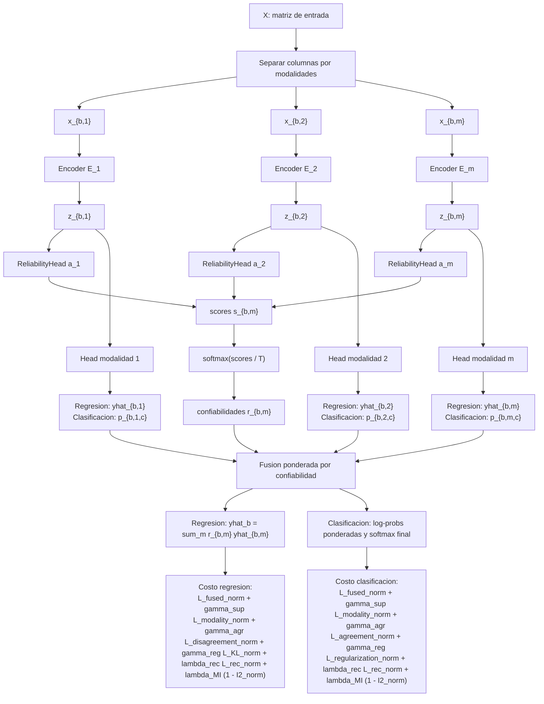

# M-GCECDL: formulacion matematica

Este documento presenta el flujo matematico del modelo M-GCECDL usado para regresion y clasificacion. La formulacion se organiza desde la entrada por modalidades hasta las funciones de costo y la fusion final.

---

## 1. Notacion

Sea una muestra $b$ con vector de entrada:

$$
\mathbf{x}_b \in \mathbb{R}^{d}
$$

El modelo recibe una particion externa de las variables en $M$ modalidades. Para cada modalidad $m$:

$$
I_m \subset \{1, \dots, d\}
$$

donde $I_m$ contiene los indices de columnas que pertenecen a la modalidad $m$.

La entrada de la modalidad $m$ es:

$$
\mathbf{x}_{b,m} = \mathbf{x}_b[I_m]
$$

Importante: las modalidades no se aprenden automaticamente. Se definen antes del modelo como una particion externa de las variables.

---

## 2. Encoder por modalidad

Cada modalidad tiene un encoder propio:

$$
\mathbf{z}_{b,m} = E_m(\mathbf{x}_{b,m})
$$

donde $E_m$ es una red:

$$
\text{Linear}
\rightarrow
\text{ReLU}
\rightarrow
\text{LayerNorm}
\rightarrow
\text{Dropout}
\rightarrow
\text{Linear}
\rightarrow
\text{ReLU}
\rightarrow
\text{LayerNorm}
\rightarrow
\text{Dropout}
\rightarrow
\text{Linear}
\rightarrow
\text{ReLU}
$$

La salida:

$$
\mathbf{z}_{b,m} \in \mathbb{R}^{e}
$$

es el embedding de la modalidad $m$.

---

## 3. Confiabilidad por modalidad

Cada embedding produce un score escalar:

$$
s_{b,m} = a_m(\mathbf{z}_{b,m})
$$

donde $a_m$ es una capa lineal:

$$
a_m: \mathbb{R}^{e} \rightarrow \mathbb{R}
$$

Los scores se convierten en confiabilidades con softmax:

$$
r_{b,m}
=
\frac{
\exp(s_{b,m}/T)
}{
\sum_{j=1}^{M} \exp(s_{b,j}/T)
}
$$

donde $T$ es la temperatura del softmax de confiabilidad.

Por construccion:

$$
\sum_{m=1}^{M} r_{b,m} = 1,
\qquad
r_{b,m} \ge 0
$$

Si se entrega una mascara de modalidades:

$$
s_{b,m} = -10^9
\quad
\text{si}
\quad
mask_{b,m} \le 0
$$

Esto hace que:

$$
r_{b,m} \approx 0
$$

para modalidades apagadas.

En el entrenamiento usado aqui no se consideran mascaras de modalidad, por lo que todas las modalidades permanecen activas.

---

## 4. Variante de regresion

### 4.1 Prediccion por modalidad

Cada modalidad tiene una cabeza lineal de regresion:

$$
\hat{y}_{b,m} = g_m(\mathbf{z}_{b,m})
$$

donde:

$$
g_m: \mathbb{R}^{e} \rightarrow \mathbb{R}
$$

### 4.2 Prediccion fusionada

La prediccion final es una suma ponderada por confiabilidad:

$$
\hat{y}_{b}
=
\sum_{m=1}^{M}
r_{b,m}\hat{y}_{b,m}
$$

La contribucion de cada modalidad es:

$$
C_{b,m}
=
r_{b,m}\hat{y}_{b,m}
$$

---

## 5. Funcion de costo de regresion

La perdida total de regresion es:

$$
\mathcal{L}_{reg}
=
\mathcal{L}_{fused}
+
\gamma_{sup}\mathcal{L}_{modality}
+
\gamma_{agr}\mathcal{L}_{disagreement}
+
\gamma_{reg}\mathcal{L}_{KL}
$$

### 5.1 Perdida fusionada

Se usa una perdida Huber para comparar la prediccion fusionada con el valor real:

$$
\mathcal{L}_{fused}
=
\frac{1}{B}
\sum_{b=1}^{B}
H_{\delta_f}(\hat{y}_b, y_b)
$$

donde $\delta_f$ es el parametro de la Huber fusionada.

### 5.2 Perdida supervisada por modalidad

Primero se calcula el error de cada modalidad frente al valor real:

$$
D_{b,m}
=
H_{\delta_m}(\hat{y}_{b,m}, y_b)
$$

donde $\delta_m$ es el parametro de la Huber por modalidad.

Cuando la perdida por modalidad se pondera por confiabilidad:

$$
\mathcal{L}_{modality}
=
\frac{1}{B}
\sum_{b=1}^{B}
\sum_{m=1}^{M}
r_{b,m}D_{b,m}
$$

Esta parte obliga a que cada modalidad aprenda contra el target real $y_b$, pero pondera su impacto segun la confiabilidad aprendida.

Alternativamente, si no se pondera por confiabilidad, se promedian las modalidades activas:

$$
\mathcal{L}_{modality}
=
\frac{1}{B}
\sum_{b=1}^{B}
\frac{
\sum_{m=1}^{M} A_{b,m}D_{b,m}
}{
\max\left(\sum_{m=1}^{M} A_{b,m}, 1\right)
}
$$

donde:

$$
A_{b,m}
=
\mathbf{1}(r_{b,m} > 0)
$$

### 5.3 Perdida de desacuerdo

Esta perdida compara cada prediccion modal con la prediccion fusionada:

$$
\mathcal{L}_{disagreement}
=
\frac{1}{B}
\sum_{b=1}^{B}
\sum_{m=1}^{M}
r_{b,m}
\left(
\hat{y}_{b,m} - \hat{y}_b
\right)^2
$$

No reemplaza la supervision contra $y_b$. Su funcion es penalizar que las modalidades se alejen demasiado de la fusion.

### 5.4 Regularizacion KL

Se define un prior uniforme:

$$
u_m = \frac{1}{M}
$$

$$
\mathcal{L}_{KL}
=
\frac{1}{B}
\sum_{b=1}^{B}
\sum_{m=1}^{M}
u_m
\left[
\log(u_m)
-
\log(r_{b,m} + \varepsilon)
\right]
\qquad
\varepsilon = 10^{-8}
$$

Esta regularizacion compara las confiabilidades $\mathbf{r}_b$ contra el prior uniforme $\mathbf{u}$.

---

## 6. Variante de clasificacion

Sea $K$ el numero de clases.

### 6.1 Logits por modalidad

Cada modalidad tiene una cabeza lineal:

$$
\boldsymbol{\ell}_{b,m}
=
h_m(\mathbf{z}_{b,m})
$$

donde:

$$
h_m: \mathbb{R}^{e} \rightarrow \mathbb{R}^{K}
$$

### 6.2 Probabilidades por modalidad

Se aplica softmax sobre clases:

$$
p_{b,m,c}
=
\frac{
\exp(\ell_{b,m,c})
}{
\sum_{k=1}^{K}
\exp(\ell_{b,m,k})
}
$$

Por tanto, para cada modalidad:

$$
\sum_{c=1}^{K} p_{b,m,c} = 1
$$

---

## 7. Fusion en clasificacion

La fusion usa log-probabilidades ponderadas:

$$
\tilde{\ell}_{b,c}
=
\sum_{m=1}^{M}
r_{b,m}
\log
\left(
\max(p_{b,m,c}, 10^{-8})
\right)
$$

Luego:

$$
p^{fused}_{b,c}
=
\frac{
\exp(\tilde{\ell}_{b,c})
}{
\sum_{k=1}^{K}
\exp(\tilde{\ell}_{b,k})
}
$$

La clase predicha es:

$$
\hat{c}_b
=
\arg\max_c
p^{fused}_{b,c}
$$

---

## 8. Funcion de costo de clasificacion

La perdida total de clasificacion es:

$$
\mathcal{L}_{cls}
=
\mathcal{L}_{fused}
+
\gamma_{sup}\mathcal{L}_{modality}
+
\gamma_{agr}\mathcal{L}_{agreement}
+
\gamma_{reg}\mathcal{L}_{regularization}
$$

---

## 9. Generalized Cross Entropy

La Generalized Cross Entropy se define como:

$$
GCE(\mathbf{p}, y; q)
=
\frac{
1 - p_y^q
}{q}
$$

donde:

$$
p_y = \mathbf{p}[y]
$$

Para estabilidad numerica, las probabilidades se acotan inferiormente por $\varepsilon = 10^{-8}$ antes de usar el logaritmo o seleccionar la probabilidad de la clase real.

---

## 10. Perdida fusionada de clasificacion

La salida fusionada se compara contra la etiqueta real:

$$
\mathcal{L}_{fused}
=
\frac{1}{B}
\sum_{b=1}^{B}
GCE
\left(
\mathbf{p}^{fused}_b,
y_b;
q
\right)
$$

---

## 11. Perdida por modalidad en clasificacion

Cada modalidad tambien se compara contra la etiqueta real:

$$
D_{b,m}
=
GCE
\left(
\mathbf{p}_{b,m},
y_b;
q_d
\right)
$$

Cuando la perdida por modalidad se pondera por confiabilidad:

$$
\mathcal{L}_{modality}
=
\frac{1}{B}
\sum_{b=1}^{B}
\sum_{m=1}^{M}
r_{b,m}D_{b,m}
$$

Esto busca que cada modalidad aprenda a clasificar con la etiqueta real, pero su contribucion al costo depende de su confiabilidad.

---

## 12. Mezcla de probabilidades y entropias

### 12.1 Distribucion mezclada

Primero se construye una distribucion fusionada entre modalidades:

$$
p^{mix}_{b,c}
=
\sum_{m=1}^{M}
r_{b,m}p_{b,m,c}
$$

Esta es una distribucion valida porque:

$$
\sum_{c=1}^{K}
p^{mix}_{b,c}
=
\sum_{c=1}^{K}
\sum_{m=1}^{M}
r_{b,m}p_{b,m,c}
$$

$$
=
\sum_{m=1}^{M}
r_{b,m}
\sum_{c=1}^{K}
p_{b,m,c}
$$

Como:

$$
\sum_{c=1}^{K}p_{b,m,c} = 1
$$

entonces:

$$
\sum_{c=1}^{K}
p^{mix}_{b,c}
=
\sum_{m=1}^{M}
r_{b,m}
=
1
$$

Por eso si tiene sentido calcular:

$$
H^{mix}_b
=
-
\sum_{c=1}^{K}
p^{mix}_{b,c}
\log
\left(
\max(p^{mix}_{b,c}, 10^{-8})
\right)
$$

### 12.2 Entropia individual por modalidad

Para cada modalidad, la distribucion sobre clases ya esta normalizada:

$$
\sum_{c=1}^{K}p_{b,m,c}=1
$$

Por eso la entropia individual se calcula sin meter $r_{b,m}$ dentro de las probabilidades:

$$
H_{b,m}
=
-
\sum_{c=1}^{K}
p_{b,m,c}
\log
\left(
\max(p_{b,m,c}, 10^{-8})
\right)
$$

Si se pusiera $r_{b,m}$ dentro:

$$
\sum_{c=1}^{K}
r_{b,m}p_{b,m,c}
=
r_{b,m}
$$

lo cual no suma 1 salvo que $r_{b,m}=1$. Por eso eso no representaria la entropia de la distribucion de clases de una modalidad.

### 12.3 Entropia ponderada por confiabilidad

Aunque no se pondera dentro de $H_{b,m}$, si se pondera al combinar entropias:

$$
H^{weighted}_b
=
\sum_{m=1}^{M}
r_{b,m}H_{b,m}
$$

Interpretacion:

- $H_{b,m}$ mide la incertidumbre interna de la modalidad $m$.
- $r_{b,m}H_{b,m}$ mide cuanto importa esa incertidumbre segun la confiabilidad de la modalidad.

### 12.4 Perdida de acuerdo

La perdida de acuerdo se define como:

$$
\mathcal{L}_{agreement}
=
\frac{1}{B}
\sum_{b=1}^{B}
\left(
H^{mix}_b
-
H^{weighted}_b
\right)
$$

Esta cantidad aumenta cuando las modalidades producen distribuciones de clase mas diferentes entre si.

---

## 13. Regularizacion de clasificacion

La regularizacion de clasificacion se define como:

$$
\mathcal{L}_{regularization}
=
\tau\mathcal{L}_{KL}
+
\alpha\mathcal{L}_{entropy}
$$

donde:

$$
\mathcal{L}_{entropy}
=
\sum_{m=1}^{M}
\frac{1}{B}
\sum_{b=1}^{B}
r_{b,m}H_{b,m}
$$

Es decir, se penaliza la incertidumbre de las modalidades, ponderada por la confiabilidad asignada por el modelo.

La regularizacion completa entra en la perdida total como:

$$
\gamma_{reg}\mathcal{L}_{regularization}
$$

---

## 14. Resumen conceptual

En regresion:

$$
\hat{y}_b
=
\sum_m r_{b,m}\hat{y}_{b,m}
$$

En clasificacion:

$$
p^{mix}_{b,c}
=
\sum_m r_{b,m}p_{b,m,c}
$$

Para entropias individuales:

$$
H_{b,m}
=
H(\mathbf{p}_{b,m})
$$

y no:

$$
H(r_{b,m}\mathbf{p}_{b,m})
$$

porque $r_{b,m}\mathbf{p}_{b,m}$ no es una distribucion de clases normalizada.

La ponderacion por confiabilidad aparece al combinar modalidades:

$$
H^{weighted}_b
=
\sum_m r_{b,m}H_{b,m}
$$

Asi se separan dos niveles:

$$
\text{probabilidades por clase: } p_{b,m,c}
$$

$$
\text{confiabilidad por modalidad: } r_{b,m}
$$

---

## 15. Flujo general del modelo

