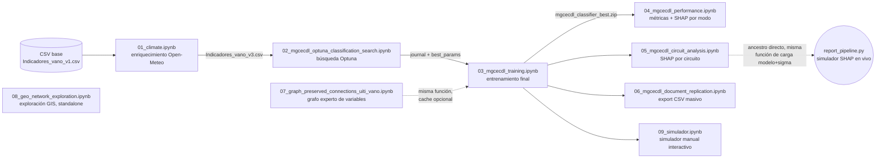

# Flujo de los notebooks de modelado (`notebooks/project_flow/`)

Estos 9 notebooks **no** son el punto de entrada canónico del proyecto — ese es `/report` y el resto
de la familia de comandos documentada en `docs/report-family-workflow.mmd` y `docs/agents-guide.md`.
Son el pipeline de investigación/entrenamiento que produce el modelo predictivo MGCECDL y sus
artefactos de soporte, que el agente `inference` (vía `report_pipeline.py`) carga en modo
solo-lectura en cada corrida de `/report`. Revisados y comentados celda por celda el 2026-07-22;
cada notebook mantiene su código y salidas guardadas intactos — solo se agregaron/mejoraron
comentarios explicativos.

## Orden real de ejecución

El README enumera los notebooks 01-09 en orden lineal, pero **no todas las dependencias son
lineales**. Verificado leyendo el código, no asumido:

**Corrección importante al orden README:** `07_graph_preserved_connections_uiti_vano.ipynb` **no**
es un prerrequisito duro de `03_mgcecdl_training.ipynb` pese a numerarse después. Ambos llaman
directamente a la misma función (`construir_matriz_adyacencia_mgcecdl` de `chec_impacto.data`); `03`
regenera el grafo por sí solo si no encuentra la caché en `data/graphs/`. `07` solo pre-llena esa
caché y produce los grafos interactivos HTML de auditoría — es opcional, no bloqueante.

`08_geo_network_exploration.ipynb` es completamente independiente: solo lee shapefiles crudos +
el CSV base, no lo consume ningún otro notebook ni el flujo de agentes.

## Tabla resumen

| Notebook | Propósito | Entradas clave | Salidas clave |
|---|---|---|---|
| `01_climate.ipynb` | Enriquece el CSV base con 225 columnas climáticas (9 variables × 25 horas) vía Open-Meteo | `data/Indicadores_vano_v1.csv`, API Open-Meteo | `data/Indicadores_vano_v2.csv`, `data/Indicadores_vano_v3.csv` |
| `02_mgcecdl_optuna_classification_search.ipynb` | Búsqueda de hiperparámetros (40 trials, Optuna GPSampler) para el clasificador MGCECDL | `Indicadores_vano_v3.csv`, `Variables_seleccion.xlsx` | `data/optuna/*.journal`, `*.pkl`, `data/graphs/mgcecdl_*` |
| `03_mgcecdl_training.ipynb` | Entrena el clasificador MGCECDL final con los mejores hiperparámetros de `02` | journal de `02`, mismo dataset/grafo | `data/models/mgcecdl_classifier_best.zip` |
| `04_mgcecdl_performance.ipynb` | Evalúa desempeño del modelo (métricas, matriz de confusión, ROC) + SHAP agregado por modo temático | modelo de `03` | PNGs en `reports/mgcecdl-results/` + copia en `src/assets/site/results/` |
| `05_mgcecdl_circuit_analysis.ipynb` | SHAP por circuito/período para un circuito configurado a mano (`DON23L13`) | modelo de `03`, `rbf_sigma` del estudio Optuna de `02` | 4 grafos HTML interactivos en `reports/mgcecdl-results/interactive_graphs/` |
| `06_mgcecdl_document_replication.ipynb` | Replicación en modo producción: SHAP Top-20 sobre **todo** el dataset, agregado a nivel vano/circuito/criticidad | modelo de `03` | 4 CSVs en `reports/mgcecdl-results/` |
| `07_graph_preserved_connections_uiti_vano.ipynb` | Construye y valida el grafo experto de 156 variables que regulariza el entrenamiento de MGCECDL | `site/data/variables.json`, `Variables_seleccion.xlsx` | grafos HTML en `src/assets/site/results/`, `data/graphs/mgcecdl_adjacency_matrix.npy` |
| `08_geo_network_exploration.ipynb` | Exploración GIS de calidad de datos (líneas, transformadores, switches) y mapas de ejemplo | shapefiles en `data/GEO/`, `Indicadores_vano_v3.csv` | `reports/geo/geo_resumen_circuitos.csv`, mapas Folium HTML |
| `09_simulador.ipynb` | Simulador manual interactivo (ipywidgets): barre el valor de UNA variable y grafica el efecto en las probabilidades de clase | modelo de `03`, `variables_a_priorizar.xlsx` (opcional) | Excel + PNG/PDF en `reports/interpretability/artifacts/` |

## Detalle por notebook

### `01_climate.ipynb`
Normaliza `FECHA` a UTC (localizada primero en America/Bogotá), detecta filas/columnas con clima
faltante, y por cada fila pendiente pide una ventana de 25 horas a Open-Meteo — el endpoint correcto
(`archive` vs `forecast`) según una frontera móvil de 5 días — con caché HTTP local, reintentos y
checkpoint cada 100 filas. Al final: rellena con 0 una lista fija de columnas donde "ausente
significa cero", propaga `FECHA_OPERACION_TRF` desde `FECHA_OPERACION_VANO`, y descarta filas sin
`ALTURA` (no hay imputación razonable para una medida física).

**Gotcha:** la detección de rate-limit es un match de subcadena sobre el texto de la excepción
(`"429"`, `"rate limit"`, etc.) — frágil si Open-Meteo cambia el texto de error. El diseño reanudable
(carga `v2.csv` existente y solo completa los NaN restantes) implica que una corrida completa de
~159k filas necesita varias sesiones en la práctica.

### `02_mgcecdl_optuna_classification_search.ipynb`
Resuelve/clona el repo, instala dependencias, verifica que el CSV no sea un puntero Git-LFS sin
resolver; procesa el dataset completo, construye las modalidades (clima/estructural), carga o
construye el grafo de adyacencia, hace split estratificado por cuartiles de `UITI_VANO`, escala
MinMax, y corre el estudio Optuna contra `MGCECDLClassifier`/`MGCECDLClassificationLoss`.

**Gotcha:** está pensado para correr fuera del repo local (Kaggle/Colab), clonando desde un fork
**hardcodeado** (`amalvarezme/...`, rama `sdd-claude-agents`) — puede divergir silenciosamente de la
rama que se esté trabajando localmente.

### `03_mgcecdl_training.ipynb`
Repite el mismo bootstrap/procesamiento/grafo que `02` (con un reset de módulos vía `importlib`,
pensado para un kernel de Colab compartido); recarga `best_params` del journal de `02`, protege
contra journals sin hiperparámetros de grafo más nuevos, instancia el modelo y la función de costo,
entrena y guarda checkpoint según la mejor `valid_accuracy`.

**Nota:** la salida guardada en el notebook solo muestra 10 de las 150 épocas configuradas
(`Epoch 010/010`) — probablemente una corrida de prueba (smoke test) dejada en las salidas, no el
entrenamiento final real. El `mgcecdl_classifier_best_*.zip` visible en esas salidas no debería
asumirse como el modelo de producción sin confirmar por separado.

### `04_mgcecdl_performance.ipynb`
Carga el clasificador más reciente, reconstruye 6 modos temáticos (evento, protección, topología,
activos físicos, activos de soporte/transformador, entorno/clima) a partir de las variables
seleccionadas, calcula métricas + matriz de confusión + ROC multiclase sobre el split de prueba, y
corre Kernel SHAP agregado por modo (radar polar + barras horizontales).

**Gotcha:** `graph_adjacency_matrix` (el grafo experto) se calcula pero nunca se usa en el resto del
notebook — código muerto/informativo, probablemente resto de una versión anterior que también
graficaba el grafo aquí.

### `05_mgcecdl_circuit_analysis.ipynb`
Análisis SHAP por circuito y período para un circuito fijado a mano (`CIRCUITO_INTERES = "DON23L13"`),
sobre 4 escenarios (Top-97 por `UITI_VANO` o por frecuencia, período completo o fechas de interés
concatenadas), usando el mismo patrón de carga modelo+`rbf_sigma` que el simulador SHAP en vivo.

**Confirmado por código:** este notebook es el **ancestro directo** del simulador SHAP que
`report_pipeline.py` (`_load_mgcecdl_model_and_sigma`/`_compute_inference_scenarios`) ejecuta en cada
corrida de `/report` — mismo patrón de carga, mismas referencias cruzadas en los docstrings.

**Gotchas:** `CIRCUITO_INTERES`, el rango de fechas y `FECHAS_INTERES` están hardcodeados — hay que
editarlos a mano por corrida. Una de las salidas guardadas muestra una ruta absoluta de otra máquina
(`/Users/diego/Desktop/...`), evidencia de que la última ejecución guardada fue en otro equipo.

### `06_mgcecdl_document_replication.ipynb`
Réplica en modo producción del análisis SHAP, pero sobre **todo** el dataset (sin filtro de
circuito): Top-20 por evento vía Kernel SHAP por lotes, agregado a Doc 2 (por vano, ponderado Borda,
cuartiles de riesgo), Doc 3 (por circuito) y Doc 4 (por circuito × nivel de criticidad, con
porcentajes), más una celda de validación de esquema. Ya venía bien comentado por su autor; solo se
completaron los comentarios faltantes.

### `07_graph_preserved_connections_uiti_vano.ipynb`
Expande los modos A-F a 156 variables, carga la selección experta desde Excel, construye un listado
de aristas ponderado a mano (`build_edges` — pesos como 0.85/0.90 son conocimiento de dominio, **no**
aprendidos ni estadísticos), y arma 3 grafos (156 completo, 71 seleccionado con reconexión que
preserva caminos, y las 70 features reales post-preprocesamiento de MGCECDL).

### `08_geo_network_exploration.ipynb`
Notebook exploratorio puro sobre shapefiles de CHEC (líneas, transformadores, switches): inventario y
perfilado por capa, validación de longitud contra CRS métrico, resumen por circuito, verificación de
cobertura de llaves (`FID_VANO`→`G3E_FID` ~99.7%, `CIRCUITO`→`CIRCUITO` 100%), un mapa Folium estático
de un circuito de ejemplo coloreado por `UITI_VANO`, y un mapa climático temporal por hora con
control de reproducción en JS/Leaflet embebido a mano (porque el estado de ipywidgets no sobrevive
la exportación a HTML). `CIRCUITO_MAPA = "DON23L13"` es un ejemplo hardcodeado, no un parámetro de
configuración real.

### `09_simulador.ipynb`
Simulador interactivo (ipywidgets): el usuario elige una variable, barre su valor/categorías, y ve
cómo cambian las probabilidades de clase predichas para un subconjunto filtrado (circuito/vano/rango
de fechas), llamando a `simulate_feature_class_transitions`.

**Distinción confirmada por código, no asumida:** este notebook **no** es el notebook retirado que
menciona `.claude/skills/report/SKILL.md` (el que cubría el "simulador automático mínimo/máximo",
fases 9-11, ahora cubierto por el agente `auto-simulator`). Ese notebook retirado llamaba a
`simulate_automatic_minmax_sensitivity` (todas las variables, escenario base vs. mín/máx); `09` llama
a una función distinta, `simulate_feature_class_transitions` (barrido manual de una sola variable), y
no tiene sección de mínimo/máximo automático. Ambas funciones conviven en
`src/chec_local_interpreter/simulator.py` — son dos herramientas genuinamente distintas que comparten
módulo. `09_simulador.ipynb` sigue vigente como herramienta exploratoria manual, no reemplazada por
el agente `auto-simulator`.

## Hallazgos consolidados (riesgos a tener en cuenta)

- **Fork/rama hardcodeados** en `02` y notebooks que clonan el repo para correr en Kaggle/Colab
  (`amalvarezme/...`, rama `sdd-claude-agents`) — pueden divergir silenciosamente de la rama de
  trabajo real.
- **Detección de rate-limit por substring** en `01` — frágil ante cambios de wording en la API de
  Open-Meteo.
- **Parámetros hardcodeados** por diseño en `05`, `08`, `09` (circuito de interés, rango de fechas,
  circuito de ejemplo del mapa) — notebooks de análisis puntual, no de batch; hay que editarlos a
  mano por corrida.
- **Salidas guardadas que no reflejan una corrida final real**: `03` muestra solo 10/150 épocas; `05`
  tiene una ruta absoluta de otra máquina en sus salidas guardadas.
- **Código muerto en `04`**: el cálculo del grafo de adyacencia no se usa en ese notebook.
- Los 3 notebooks de modelado por lotes (`04`, `06`, `09` además de `02`/`03`) repiten el mismo
  bloque de bootstrap (`resolve_project_root`/`install_project_requirements`/`ensure_lfs_data`) —
  duplicación consistente, no un bug, pero candidata a extraer a un módulo compartido si se vuelve a
  tocar este pipeline.

## Dónde caen los artefactos

- `data/` — datasets intermedios (`Indicadores_vano_v2/v3.csv`), modelos (`data/models/`), estudios
  Optuna (`data/optuna/`), grafos (`data/graphs/`).
- `reports/mgcecdl-results/` — figuras de desempeño, grafos interactivos SHAP, CSVs de replicación.
- `reports/geo/` — resumen y mapas del análisis GIS.
- `reports/interpretability/artifacts/` — salidas del simulador manual (`09`).
- `src/assets/site/results/` — copias de figuras que sí se publican en el sitio estático.

## Referencias

- `README.md` — sección "Notebooks" (enlaza aquí)
- `docs/agents-guide.md` — arquitectura del framework de agentes que consume el modelo entrenado
- `src/chec_local_interpreter/report_pipeline.py` — carga en vivo del modelo/estudio para `/report`
- `src/chec_impacto/` — paquete de modelado MGCECDL importado por todos estos notebooks
