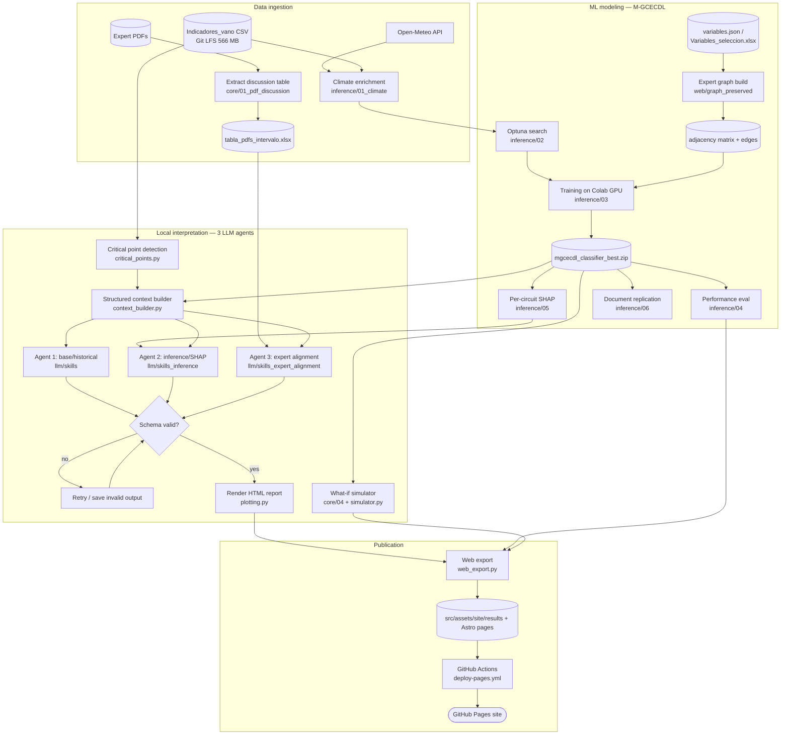

# Project Workflow Analysis — Phases, Redundancies, Inconsistencies, Risks

> Branch: `sdd_agentes` · Baseline commit: `fdd67fc` · Date: 2026-07-08
> Scope: full-repo functional analysis to seed the SDD (Spec-Driven Development) work on agent orchestration.

## 1. Purpose

Notebook-first data-science + LLM-interpretability project for CHEC that analyzes `UITI_VANO` (per-span weighted fault severity) on level-2 distribution circuits. Deterministic Python detects critical points and builds a structured context; an M-GCECDL classifier (replacing the removed TabNet regressor) adds impact-class prediction with Kernel-SHAP interpretability; three LLM agents (base/historical, inference/SHAP, expert-alignment) generate explanations that are published as a static Astro site on GitHub Pages.

## 2. Phase summary table

| # | Phase | Actor | Inputs | Outputs | Risks / problems found |
|---|-------|-------|--------|---------|------------------------|
| 0 | Expert-PDF discussion extraction | `notebooks/core/01_pdf_discussion_table_from_pdfs.ipynb` + `llm/skills_pdf_discussion_extraction/` | `reports/analysis-documents/*.pdf` | `tabla_pdfs_intervalo_*.xlsx` | README cites wrong notebook number (`03_...`) |
| 1 | Climate enrichment | `notebooks/inference/01_climate.ipynb` | vano CSV + Open-Meteo API | climate-filled CSV | External API, no retry/caching contract documented |
| 2 | Hyperparameter search | `notebooks/inference/02_mgcecdl_optuna_classification_search.ipynb` + `src/chec_impacto/training/mgcecdl.py` | processed data | `data/optuna/*.pkl`, `.journal` | Notebook internal title says "01"; `chec_impacto` has zero tests |
| 3 | Model training | `notebooks/inference/03_mgcecdl_training.ipynb` (Colab GPU) | optuna journal, features, expert graph | `data/models/mgcecdl_classifier_best.zip` | GPU step assumes Colab; model zip in plain git (no LFS) |
| 4 | Performance evaluation | `notebooks/inference/04_mgcecdl_performance.ipynb` + `interpretability/mgcecdl.py` | best model | confusion matrix / ROC / importance PNGs → `src/assets/site/results/` | Untested; outputs committed manually |
| 5 | Per-circuit SHAP analysis | `notebooks/inference/05_mgcecdl_circuit_analysis.ipynb` + `interpretability/circuit_analysis.py` | model + filtered dataset | bar/radar/graph HTML | Docs reference `reports/mgcecdl-results/interactive_graphs/`, which does not exist → code always falls to fallback branch |
| 6 | Document replication | `notebooks/inference/06_mgcecdl_document_replication.ipynb` | full dataset + model | 4 CSVs in `reports/mgcecdl-results/` | Directory gitignored except `.gitkeep`; outputs ephemeral |
| 7 | Graph/adjacency generation | `notebooks/web/graph_preserved_connections_uiti_vano.ipynb` + `chec_impacto/data/graph.py` | `variables.json`, `Variables_seleccion.xlsx` | `data/graphs/mgcecdl_*` + grafo HTMLs | Untested |
| 8 | GEO exploration | `notebooks/core/03_geo_network_exploration.ipynb` | `data/GEO/*.shp` + vano CSV | `reports/geo/geo_resumen_circuitos.csv`, circuit map HTML | Notebook internal title says "04" |
| 9 | Local interpreter — 3 LLM agents | `notebooks/core/02_local_uiti_vano_interpretability_v3.ipynb` + `src/chec_local_interpreter/*` | vano CSV, expert Excel, model outputs, `llm/skills*` | structured context, prompts, critical points, LLM analyses, final HTML report | `llm_client.py`, `graph_extractor.py` untested; `graph_extractor` swallows subprocess failures silently |
| 10 | What-if simulator | `notebooks/core/04_simulador.ipynb` + `simulator.py` | model + prioritized variables | interactive sensitivity | Covered by `test_simulator.py` |
| 11 | Web export | `src/chec_local_interpreter/web_export.py` | artifacts/report HTML | copies into `src/assets/site/results/` + `interpretabilidad.json` | Duplicates the ~9 MB report into git a second time; untested |
| 12 | Publish | `.github/workflows/deploy-pages.yml` | `src/pages/*`, site assets | GitHub Pages site | Only CI in the repo — Python tests and LLM evals never run in CI |

## 3. Redundancies

1. **Interpretability HTML committed twice (~9 MB each, plain git):** `reports/interpretability/html/DON23L13_*.html` and `src/assets/site/results/latest_interpretability_report.html` are the same 48,852-line content, differing only by link rewriting in `web_export._copy_report_graphs_and_rewrite_links`.
2. **Architecture/context docs in three diverging copies each:** `docs/arquitecturayflujo.md` (current: classification/SHAP) vs `docs/reference/architecture/architecture-flow.md` (stale: regression/masks) vs `llm/prompts/arquitecturayflujo.md` (third variant). Same triplication for `ContextoProyectoSimuladorCHEC.md` / `project-context.md`.
3. **Same-named skill files across profiles:** `01_structured_context_builder.md`, `03_uiti_vano_behavior_explainer.md`, `05_llm_output_validator.md` exist in both `llm/skills/` and `llm/skills_inference/` with different content (intentional profiles, but identical filenames invite drift).
4. **Stale TabNet leftovers (local-only):** `__pycache__/tabnet.*.pyc` files and a `graphify-out/` knowledge graph still documenting the removed TabNet flow (built 2026-06-17, pre-migration, 0 edges).

## 4. Inconsistencies

1. **Scope docs contradict the code:** `README.md:14-17` and `AGENTS.md:11-20` claim the project covers "only steps 1–3, no predictive models/simulations", yet M-GCECDL, SHAP, the simulator, and the inference agent all exist.
2. **README points to nonexistent notebooks:** `notebooks/core/01_local_uiti_vano_interpretability.ipynb` (actual: `02_..._v3.ipynb`) and `03_pdf_discussion_table_from_pdfs.ipynb` (actual: `01_...`).
3. **`.env.example` referenced in setup (`README.md:30`) but the file does not exist.**
4. **Notebook titles vs filenames:** `core/03_geo...` titled "04", `inference/02_mgcecdl_optuna...` titled "01".
5. **`web_export.py:85` and docs reference `reports/mgcecdl-results/interactive_graphs/`, which never exists** — the copy step always hits the fallback.
6. **`docs/reference/architecture/*` describe the removed regression + relevance-masks design**, while top-level `docs/` describe classification + SHAP/Borda with `UITI_VANO` excluded from features.
7. **Naming/language mixing:** misspelled asset names (`metodolgia.png`, `hisoticoOutput.jpeg`); Spanish/English mixed identifiers (`procesar_dataset_completo` vs `build_graphify_context`).
8. **`requirements.txt:63` lists `graphifyy` while `graph_extractor.py:41` shells out to a `graphify` binary** — verify intended package.

## 5. Risks

| Risk | Evidence | Severity |
|------|----------|----------|
| Repo bloat: giant generated files in plain git | 2× ~9 MB HTML reports, 6.3 MB PNG, 5.1 MB notebook with embedded outputs | High |
| LFS gaps | `.gitattributes` covers only `Indicadores_vano_v3.csv` + `data/GEO/**`; model zip, optuna pkl, PDFs, big HTMLs are plain objects | High |
| No Python CI | only `deploy-pages.yml`; `pytest` + `llm/evals/run_llm_eval.py` are manual | High |
| No pipeline orchestration | 11 notebooks with implicit ordering and hand-managed intermediates; no Makefile/DAG | Medium |
| Silent subprocess failure | `graph_extractor.py` broad `except Exception` → invisible fallback to PyVis | Medium |
| Untested I/O modules | `llm_client.py`, `web_export.py`, `graph_extractor.py`, `domain_context.py`, all of `src/chec_impacto/` | Medium |
| Onboarding secrets | `.env` keys (`GOOGLE_API_KEY`, etc.) undocumented, no `.env.example` | Low |

## 6. Test coverage

15 test files, all targeting `src/chec_local_interpreter/`. Well covered: `critical_points`, `expert_alignment`, `simulator`, `llm_validation`, `llm_contracts`, `llm_skills`, `costs`, `event_counts`, `data_loader`, `context_builder`. Zero coverage: `llm_client`, `web_export`, `graph_extractor`, `domain_context`, and the entire `src/chec_impacto/` ML package (exercised only through notebooks).

## 7. Workflow diagram (BPMN-style)

Pre-rendered version: [project-workflow-diagram.svg](./project-workflow-diagram.svg) (for viewers without Mermaid support).

## 8. Suggested next steps (input for SDD proposal)

1. Reconcile scope docs (README/AGENTS) with the actual system; collapse the three doc copies into one source of truth.
2. Add Python CI (pytest + LLM evals) alongside the Pages deploy.
3. Move large generated artifacts (HTML reports, model zip, optuna pkl, PDFs) to LFS or out of git; stop committing the report twice.
4. Introduce a thin orchestration layer (Makefile or DAG) over the notebook pipeline.
5. Add tests for `llm_client`, `web_export`, `graph_extractor`, and smoke tests for `chec_impacto`.
6. Fix silent failure in `graph_extractor.py` (log the subprocess error before falling back).
