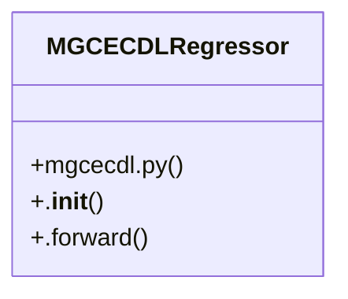

# Community 11

> 13 nodes · cohesion 0.21

## Key Concepts

- [MGCECDLRegressor](file:///Users/andresalvarez/Documents/chec-local-uiti-vano-interpreter/src/chec_impacto/models/mgcecdl.py#L160) (41 connections)
- [buscar_estudio_optuna_mgcecdl()](file:///Users/andresalvarez/Documents/chec-local-uiti-vano-interpreter/src/chec_impacto/training/mgcecdl.py#L1569) (5 connections)
- [cargar_modelo_mgcecdl()](file:///Users/andresalvarez/Documents/chec-local-uiti-vano-interpreter/src/chec_impacto/training/mgcecdl.py#L100) (5 connections)
- [crear_objective_clasificacion_mgcecdl()](file:///Users/andresalvarez/Documents/chec-local-uiti-vano-interpreter/src/chec_impacto/training/mgcecdl.py#L1422) (4 connections)
- [crear_objective_regresion_mgcecdl()](file:///Users/andresalvarez/Documents/chec-local-uiti-vano-interpreter/src/chec_impacto/training/mgcecdl.py#L1321) (4 connections)
- [Restore an M-GCECDL model from a ZIP archive created by this module.](file:///Users/andresalvarez/Documents/chec-local-uiti-vano-interpreter/src/chec_impacto/training/mgcecdl.py#L104) (3 connections)
- [Create the Optuna objective for M-GCECDL regression.](file:///Users/andresalvarez/Documents/chec-local-uiti-vano-interpreter/src/chec_impacto/training/mgcecdl.py#L1337) (3 connections)
- [Create the Optuna objective for M-GCECDL classification.](file:///Users/andresalvarez/Documents/chec-local-uiti-vano-interpreter/src/chec_impacto/training/mgcecdl.py#L1438) (3 connections)
- [Run or resume an Optuna study backed by an Optuna journal file.](file:///Users/andresalvarez/Documents/chec-local-uiti-vano-interpreter/src/chec_impacto/training/mgcecdl.py#L1530) (3 connections)
- [Ejecuta la busqueda Optuna de MGCECDL para regresion o clasificacion.](file:///Users/andresalvarez/Documents/chec-local-uiti-vano-interpreter/src/chec_impacto/training/mgcecdl.py#L1589) (3 connections)
- [run_optuna_study()](file:///Users/andresalvarez/Documents/chec-local-uiti-vano-interpreter/src/chec_impacto/training/mgcecdl.py#L1522) (3 connections)
- [_build_regression_model_from_params()](file:///Users/andresalvarez/Documents/chec-local-uiti-vano-interpreter/src/chec_impacto/training/mgcecdl.py#L1293) (2 connections)
- [Regression adaptation of M-GCECDL using modality-specific encoders and reliabili](file:///Users/andresalvarez/Documents/chec-local-uiti-vano-interpreter/src/chec_impacto/models/mgcecdl.py#L161) (1 connections)

## Class Diagram

## Relationships

- No strong cross-community connections detected

## Source Files

- [/Users/andresalvarez/Documents/chec-local-uiti-vano-interpreter/src/chec_impacto/models/mgcecdl.py](file:///Users/andresalvarez/Documents/chec-local-uiti-vano-interpreter/src/chec_impacto/models/mgcecdl.py)
- [/Users/andresalvarez/Documents/chec-local-uiti-vano-interpreter/src/chec_impacto/training/mgcecdl.py](file:///Users/andresalvarez/Documents/chec-local-uiti-vano-interpreter/src/chec_impacto/training/mgcecdl.py)

## Audit Trail

- EXTRACTED: 31 (39%)
- INFERRED: 49 (61%)
- AMBIGUOUS: 0 (0%)

---

*Part of the graphify knowledge wiki. See [[index]] to navigate.*