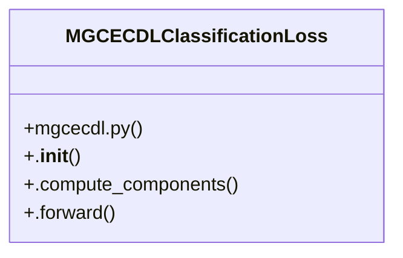

# Community 13

> 11 nodes · cohesion 0.24

## Key Concepts

- [.compute_components()](file:///Users/andresalvarez/Documents/chec-local-uiti-vano-interpreter/src/chec_impacto/training/mgcecdl.py#L635) (12 connections)
- [MGCECDLClassificationLoss](file:///Users/andresalvarez/Documents/chec-local-uiti-vano-interpreter/src/chec_impacto/training/mgcecdl.py#L592) (8 connections)
- [.compute_components()](file:///Users/andresalvarez/Documents/chec-local-uiti-vano-interpreter/src/chec_impacto/training/mgcecdl.py#L479) (5 connections)
- [_reduce_modality_supervision_loss()](file:///Users/andresalvarez/Documents/chec-local-uiti-vano-interpreter/src/chec_impacto/training/mgcecdl.py#L187) (4 connections)
- [_classification_gjs_divergence()](file:///Users/andresalvarez/Documents/chec-local-uiti-vano-interpreter/src/chec_impacto/training/mgcecdl.py#L577) (3 connections)
- [_normalize_unit_interval()](file:///Users/andresalvarez/Documents/chec-local-uiti-vano-interpreter/src/chec_impacto/training/mgcecdl.py#L213) (3 connections)
- [Reduce per-modality supervision losses using reliability weights or an active-mo](file:///Users/andresalvarez/Documents/chec-local-uiti-vano-interpreter/src/chec_impacto/training/mgcecdl.py#L192) (3 connections)
- [Compute a GJS-style consensus penalty over modality class probabilities.](file:///Users/andresalvarez/Documents/chec-local-uiti-vano-interpreter/src/chec_impacto/training/mgcecdl.py#L581) (3 connections)
- [Fused classification loss with independently weighted auxiliary objectives.](file:///Users/andresalvarez/Documents/chec-local-uiti-vano-interpreter/src/chec_impacto/training/mgcecdl.py#L593) (3 connections)
- [_safe_log_count()](file:///Users/andresalvarez/Documents/chec-local-uiti-vano-interpreter/src/chec_impacto/training/mgcecdl.py#L226) (3 connections)
- [.forward()](file:///Users/andresalvarez/Documents/chec-local-uiti-vano-interpreter/src/chec_impacto/training/mgcecdl.py#L712) (2 connections)

## Class Diagram

## Relationships

- No strong cross-community connections detected

## Source Files

- [/Users/andresalvarez/Documents/chec-local-uiti-vano-interpreter/src/chec_impacto/training/mgcecdl.py](file:///Users/andresalvarez/Documents/chec-local-uiti-vano-interpreter/src/chec_impacto/training/mgcecdl.py)

## Audit Trail

- EXTRACTED: 41 (84%)
- INFERRED: 8 (16%)
- AMBIGUOUS: 0 (0%)

---

*Part of the graphify knowledge wiki. See [[index]] to navigate.*