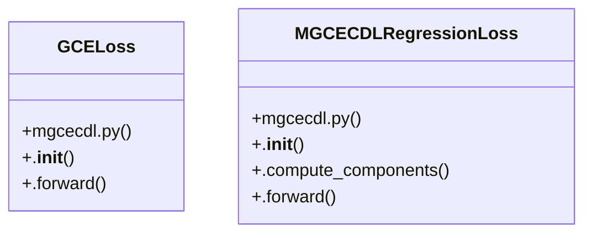

# Community 16

> 9 nodes · cohesion 0.25

## Key Concepts

- [MGCECDLRegressionLoss](file:///Users/andresalvarez/Documents/chec-local-uiti-vano-interpreter/src/chec_impacto/training/mgcecdl.py#L433) (8 connections)
- [GCELoss](file:///Users/andresalvarez/Documents/chec-local-uiti-vano-interpreter/src/chec_impacto/training/mgcecdl.py#L562) (7 connections)
- [.__init__()](file:///Users/andresalvarez/Documents/chec-local-uiti-vano-interpreter/src/chec_impacto/training/mgcecdl.py#L595) (5 connections)
- [Fused regression loss with independently weighted auxiliary objectives.](file:///Users/andresalvarez/Documents/chec-local-uiti-vano-interpreter/src/chec_impacto/training/mgcecdl.py#L434) (3 connections)
- [Generalized cross-entropy loss applied sample-wise to class probabilities.](file:///Users/andresalvarez/Documents/chec-local-uiti-vano-interpreter/src/chec_impacto/training/mgcecdl.py#L563) (3 connections)
- [.__init__()](file:///Users/andresalvarez/Documents/chec-local-uiti-vano-interpreter/src/chec_impacto/training/mgcecdl.py#L565) (2 connections)
- [.forward()](file:///Users/andresalvarez/Documents/chec-local-uiti-vano-interpreter/src/chec_impacto/training/mgcecdl.py#L553) (2 connections)
- [.__init__()](file:///Users/andresalvarez/Documents/chec-local-uiti-vano-interpreter/src/chec_impacto/training/mgcecdl.py#L436) (2 connections)
- [.forward()](file:///Users/andresalvarez/Documents/chec-local-uiti-vano-interpreter/src/chec_impacto/training/mgcecdl.py#L571) (1 connections)

## Class Diagram

## Relationships

- No strong cross-community connections detected

## Source Files

- [/Users/andresalvarez/Documents/chec-local-uiti-vano-interpreter/src/chec_impacto/training/mgcecdl.py](file:///Users/andresalvarez/Documents/chec-local-uiti-vano-interpreter/src/chec_impacto/training/mgcecdl.py)

## Audit Trail

- EXTRACTED: 25 (76%)
- INFERRED: 8 (24%)
- AMBIGUOUS: 0 (0%)

---

*Part of the graphify knowledge wiki. See [[index]] to navigate.*