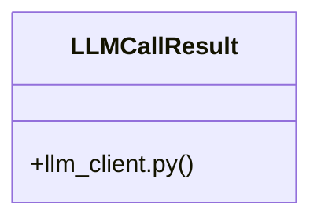

# Community 17

> 4 nodes · cohesion 0.67

## Key Concepts

- [llm_client.py](file:///Users/andresalvarez/Documents/chec-local-uiti-vano-interpreter/src/chec_local_interpreter/llm_client.py#L1) (3 connections)
- [call_llm()](file:///Users/andresalvarez/Documents/chec-local-uiti-vano-interpreter/src/chec_local_interpreter/llm_client.py#L16) (2 connections)
- [LLMCallResult](file:///Users/andresalvarez/Documents/chec-local-uiti-vano-interpreter/src/chec_local_interpreter/llm_client.py#L9) (2 connections)
- [save_cot_html_graph()](file:///Users/andresalvarez/Documents/chec-local-uiti-vano-interpreter/src/chec_local_interpreter/llm_client.py#L161) (1 connections)

## Class Diagram

## Relationships

- No strong cross-community connections detected

## Source Files

- [/Users/andresalvarez/Documents/chec-local-uiti-vano-interpreter/src/chec_local_interpreter/llm_client.py](file:///Users/andresalvarez/Documents/chec-local-uiti-vano-interpreter/src/chec_local_interpreter/llm_client.py)

## Audit Trail

- EXTRACTED: 8 (100%)
- INFERRED: 0 (0%)
- AMBIGUOUS: 0 (0%)

---

*Part of the graphify knowledge wiki. See [[index]] to navigate.*