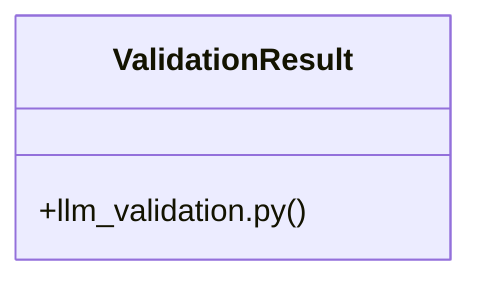

# Community 2

> 37 nodes · cohesion 0.10

## Key Concepts

- [validate_llm_response()](file:///Users/andresalvarez/Documents/chec-local-uiti-vano-interpreter/src/chec_local_interpreter/llm_validation.py#L139) (10 connections)
- [load_output_schema()](file:///Users/andresalvarez/Documents/chec-local-uiti-vano-interpreter/src/chec_local_interpreter/llm_contracts.py#L24) (9 connections)
- [llm_validation.py](file:///Users/andresalvarez/Documents/chec-local-uiti-vano-interpreter/src/chec_local_interpreter/llm_validation.py#L1) (9 connections)
- [main()](file:///Users/andresalvarez/Documents/chec-local-uiti-vano-interpreter/llm/evals/run_llm_eval.py#L99) (7 connections)
- [_guardrail_errors()](file:///Users/andresalvarez/Documents/chec-local-uiti-vano-interpreter/src/chec_local_interpreter/llm_validation.py#L100) (6 connections)
- [llm_contracts.py](file:///Users/andresalvarez/Documents/chec-local-uiti-vano-interpreter/src/chec_local_interpreter/llm_contracts.py#L1) (6 connections)
- [test_llm_validation.py](file:///Users/andresalvarez/Documents/chec-local-uiti-vano-interpreter/tests/test_llm_validation.py#L1) (6 connections)
- [render_prompt()](file:///Users/andresalvarez/Documents/chec-local-uiti-vano-interpreter/src/chec_local_interpreter/llm_contracts.py#L31) (5 connections)
- [_context()](file:///Users/andresalvarez/Documents/chec-local-uiti-vano-interpreter/tests/test_llm_validation.py#L9) (5 connections)
- [test_date_outside_context_fails()](file:///Users/andresalvarez/Documents/chec-local-uiti-vano-interpreter/tests/test_llm_validation.py#L80) (5 connections)
- [test_unavailable_column_referenced_as_present_fails()](file:///Users/andresalvarez/Documents/chec-local-uiti-vano-interpreter/tests/test_llm_validation.py#L88) (5 connections)
- [test_valid_json_passes()](file:///Users/andresalvarez/Documents/chec-local-uiti-vano-interpreter/tests/test_llm_validation.py#L69) (5 connections)
- [llm_root()](file:///Users/andresalvarez/Documents/chec-local-uiti-vano-interpreter/src/chec_local_interpreter/config.py#L51) (4 connections)
- [prompts_dir()](file:///Users/andresalvarez/Documents/chec-local-uiti-vano-interpreter/src/chec_local_interpreter/llm_contracts.py#L13) (4 connections)
- [test_malformed_json_fails()](file:///Users/andresalvarez/Documents/chec-local-uiti-vano-interpreter/tests/test_llm_validation.py#L74) (4 connections)
- [_valid_output()](file:///Users/andresalvarez/Documents/chec-local-uiti-vano-interpreter/tests/test_llm_validation.py#L24) (4 connections)
- [run_llm_eval.py](file:///Users/andresalvarez/Documents/chec-local-uiti-vano-interpreter/llm/evals/run_llm_eval.py#L1) (4 connections)
- [load_prompt_template()](file:///Users/andresalvarez/Documents/chec-local-uiti-vano-interpreter/src/chec_local_interpreter/llm_contracts.py#L17) (3 connections)
- [parse_llm_json()](file:///Users/andresalvarez/Documents/chec-local-uiti-vano-interpreter/src/chec_local_interpreter/llm_validation.py#L23) (3 connections)
- [test_prompt_rendering_includes_context_schema_and_version()](file:///Users/andresalvarez/Documents/chec-local-uiti-vano-interpreter/tests/test_llm_contracts.py#L8) (3 connections)
- [config.py](file:///Users/andresalvarez/Documents/chec-local-uiti-vano-interpreter/src/chec_local_interpreter/config.py#L1) (3 connections)
- [project_root()](file:///Users/andresalvarez/Documents/chec-local-uiti-vano-interpreter/src/chec_local_interpreter/config.py#L47) (2 connections)
- [build_llm_prompt()](file:///Users/andresalvarez/Documents/chec-local-uiti-vano-interpreter/src/chec_local_interpreter/llm_prompt.py#L9) (2 connections)
- [_context_dates()](file:///Users/andresalvarez/Documents/chec-local-uiti-vano-interpreter/src/chec_local_interpreter/llm_validation.py#L52) (2 connections)
- [_critical_point_ids()](file:///Users/andresalvarez/Documents/chec-local-uiti-vano-interpreter/src/chec_local_interpreter/llm_validation.py#L85) (2 connections)
- *... and 12 more nodes in this community*

## Class Diagram

## Relationships

- No strong cross-community connections detected

## Source Files

- [/Users/andresalvarez/Documents/chec-local-uiti-vano-interpreter/llm/evals/run_llm_eval.py](file:///Users/andresalvarez/Documents/chec-local-uiti-vano-interpreter/llm/evals/run_llm_eval.py)
- [/Users/andresalvarez/Documents/chec-local-uiti-vano-interpreter/src/chec_impacto/interpretability/tabnet.py](file:///Users/andresalvarez/Documents/chec-local-uiti-vano-interpreter/src/chec_impacto/interpretability/tabnet.py)
- [/Users/andresalvarez/Documents/chec-local-uiti-vano-interpreter/src/chec_local_interpreter/config.py](file:///Users/andresalvarez/Documents/chec-local-uiti-vano-interpreter/src/chec_local_interpreter/config.py)
- [/Users/andresalvarez/Documents/chec-local-uiti-vano-interpreter/src/chec_local_interpreter/llm_contracts.py](file:///Users/andresalvarez/Documents/chec-local-uiti-vano-interpreter/src/chec_local_interpreter/llm_contracts.py)
- [/Users/andresalvarez/Documents/chec-local-uiti-vano-interpreter/src/chec_local_interpreter/llm_prompt.py](file:///Users/andresalvarez/Documents/chec-local-uiti-vano-interpreter/src/chec_local_interpreter/llm_prompt.py)
- [/Users/andresalvarez/Documents/chec-local-uiti-vano-interpreter/src/chec_local_interpreter/llm_validation.py](file:///Users/andresalvarez/Documents/chec-local-uiti-vano-interpreter/src/chec_local_interpreter/llm_validation.py)
- [/Users/andresalvarez/Documents/chec-local-uiti-vano-interpreter/tests/test_llm_contracts.py](file:///Users/andresalvarez/Documents/chec-local-uiti-vano-interpreter/tests/test_llm_contracts.py)
- [/Users/andresalvarez/Documents/chec-local-uiti-vano-interpreter/tests/test_llm_validation.py](file:///Users/andresalvarez/Documents/chec-local-uiti-vano-interpreter/tests/test_llm_validation.py)

## Audit Trail

- EXTRACTED: 102 (74%)
- INFERRED: 35 (26%)
- AMBIGUOUS: 0 (0%)

---

*Part of the graphify knowledge wiki. See [[index]] to navigate.*