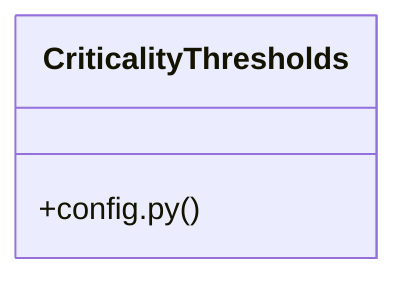

# Community 4

> 21 nodes · cohesion 0.20

## Key Concepts

- [critical_points.py](file:///Users/andresalvarez/Documents/chec-local-uiti-vano-interpreter/src/chec_local_interpreter/critical_points.py#L1) (10 connections)
- [detect_point_reasons()](file:///Users/andresalvarez/Documents/chec-local-uiti-vano-interpreter/src/chec_local_interpreter/critical_points.py#L137) (7 connections)
- [test_context_package_includes_core_sections_and_missing_optional_columns()](file:///Users/andresalvarez/Documents/chec-local-uiti-vano-interpreter/tests/test_context_builder.py#L10) (7 connections)
- [build_daily_series()](file:///Users/andresalvarez/Documents/chec-local-uiti-vano-interpreter/src/chec_local_interpreter/critical_points.py#L40) (6 connections)
- [compute_daily_features()](file:///Users/andresalvarez/Documents/chec-local-uiti-vano-interpreter/src/chec_local_interpreter/critical_points.py#L103) (6 connections)
- [rank_critical_points()](file:///Users/andresalvarez/Documents/chec-local-uiti-vano-interpreter/src/chec_local_interpreter/critical_points.py#L230) (6 connections)
- [detect_critical_periods()](file:///Users/andresalvarez/Documents/chec-local-uiti-vano-interpreter/src/chec_local_interpreter/critical_points.py#L283) (5 connections)
- [test_critical_points.py](file:///Users/andresalvarez/Documents/chec-local-uiti-vano-interpreter/tests/test_critical_points.py#L1) (5 connections)
- [CriticalityThresholds](file:///Users/andresalvarez/Documents/chec-local-uiti-vano-interpreter/src/chec_local_interpreter/config.py#L37) (4 connections)
- [_round_float()](file:///Users/andresalvarez/Documents/chec-local-uiti-vano-interpreter/src/chec_local_interpreter/critical_points.py#L19) (4 connections)
- [test_detect_critical_periods_with_custom_min_days()](file:///Users/andresalvarez/Documents/chec-local-uiti-vano-interpreter/tests/test_critical_points.py#L51) (4 connections)
- [test_high_spike_day_is_detected()](file:///Users/andresalvarez/Documents/chec-local-uiti-vano-interpreter/tests/test_critical_points.py#L21) (4 connections)
- [test_sharp_increase_day_is_detected()](file:///Users/andresalvarez/Documents/chec-local-uiti-vano-interpreter/tests/test_critical_points.py#L36) (4 connections)
- [_date_text()](file:///Users/andresalvarez/Documents/chec-local-uiti-vano-interpreter/src/chec_local_interpreter/critical_points.py#L12) (3 connections)
- [_reason()](file:///Users/andresalvarez/Documents/chec-local-uiti-vano-interpreter/src/chec_local_interpreter/critical_points.py#L127) (3 connections)
- [robust_z()](file:///Users/andresalvarez/Documents/chec-local-uiti-vano-interpreter/src/chec_local_interpreter/critical_points.py#L26) (3 connections)
- [test_missing_optional_columns_do_not_crash_context_generation()](file:///Users/andresalvarez/Documents/chec-local-uiti-vano-interpreter/tests/test_context_builder.py#L38) (3 connections)
- [_selection_reason_text()](file:///Users/andresalvarez/Documents/chec-local-uiti-vano-interpreter/src/chec_local_interpreter/critical_points.py#L224) (2 connections)
- [test_build_daily_series_fills_missing_dates_without_quality_error()](file:///Users/andresalvarez/Documents/chec-local-uiti-vano-interpreter/tests/test_critical_points.py#L64) (2 connections)
- [test_robust_z_constant_series_returns_zeroes()](file:///Users/andresalvarez/Documents/chec-local-uiti-vano-interpreter/tests/test_critical_points.py#L16) (2 connections)
- [test_context_builder.py](file:///Users/andresalvarez/Documents/chec-local-uiti-vano-interpreter/tests/test_context_builder.py#L1) (2 connections)

## Class Diagram

## Relationships

- No strong cross-community connections detected

## Source Files

- [/Users/andresalvarez/Documents/chec-local-uiti-vano-interpreter/src/chec_local_interpreter/config.py](file:///Users/andresalvarez/Documents/chec-local-uiti-vano-interpreter/src/chec_local_interpreter/config.py)
- [/Users/andresalvarez/Documents/chec-local-uiti-vano-interpreter/src/chec_local_interpreter/critical_points.py](file:///Users/andresalvarez/Documents/chec-local-uiti-vano-interpreter/src/chec_local_interpreter/critical_points.py)
- [/Users/andresalvarez/Documents/chec-local-uiti-vano-interpreter/tests/test_context_builder.py](file:///Users/andresalvarez/Documents/chec-local-uiti-vano-interpreter/tests/test_context_builder.py)
- [/Users/andresalvarez/Documents/chec-local-uiti-vano-interpreter/tests/test_critical_points.py](file:///Users/andresalvarez/Documents/chec-local-uiti-vano-interpreter/tests/test_critical_points.py)

## Audit Trail

- EXTRACTED: 51 (55%)
- INFERRED: 41 (45%)
- AMBIGUOUS: 0 (0%)

---

*Part of the graphify knowledge wiki. See [[index]] to navigate.*