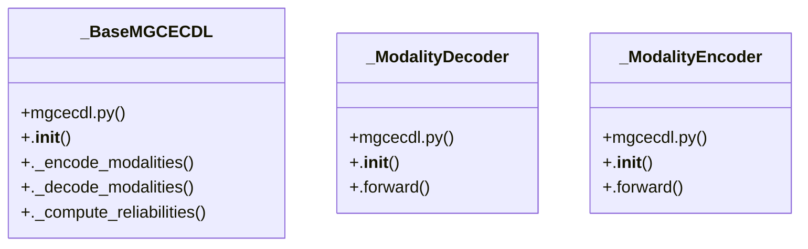

# Community 5

> 19 nodes · cohesion 0.15

## Key Concepts

- [mgcecdl.py](file:///Users/andresalvarez/Documents/chec-local-uiti-vano-interpreter/src/chec_impacto/models/mgcecdl.py#L1) (8 connections)
- [_BaseMGCECDL](file:///Users/andresalvarez/Documents/chec-local-uiti-vano-interpreter/src/chec_impacto/models/mgcecdl.py#L58) (7 connections)
- [.__init__()](file:///Users/andresalvarez/Documents/chec-local-uiti-vano-interpreter/src/chec_impacto/models/mgcecdl.py#L219) (5 connections)
- [.__init__()](file:///Users/andresalvarez/Documents/chec-local-uiti-vano-interpreter/src/chec_impacto/models/mgcecdl.py#L59) (4 connections)
- [.forward()](file:///Users/andresalvarez/Documents/chec-local-uiti-vano-interpreter/src/chec_impacto/models/mgcecdl.py#L242) (4 connections)
- [.forward()](file:///Users/andresalvarez/Documents/chec-local-uiti-vano-interpreter/src/chec_impacto/models/mgcecdl.py#L182) (4 connections)
- [_ModalityDecoder](file:///Users/andresalvarez/Documents/chec-local-uiti-vano-interpreter/src/chec_impacto/models/mgcecdl.py#L39) (4 connections)
- [_ModalityEncoder](file:///Users/andresalvarez/Documents/chec-local-uiti-vano-interpreter/src/chec_impacto/models/mgcecdl.py#L13) (4 connections)
- [Modality-aware M-GCECDL models for CHEC impact modeling.](file:///Users/andresalvarez/Documents/chec-local-uiti-vano-interpreter/src/chec_impacto/models/mgcecdl.py#L1) (4 connections)
- [._compute_reliabilities()](file:///Users/andresalvarez/Documents/chec-local-uiti-vano-interpreter/src/chec_impacto/models/mgcecdl.py#L142) (3 connections)
- [._decode_modalities()](file:///Users/andresalvarez/Documents/chec-local-uiti-vano-interpreter/src/chec_impacto/models/mgcecdl.py#L124) (3 connections)
- [._encode_modalities()](file:///Users/andresalvarez/Documents/chec-local-uiti-vano-interpreter/src/chec_impacto/models/mgcecdl.py#L105) (3 connections)
- [.__init__()](file:///Users/andresalvarez/Documents/chec-local-uiti-vano-interpreter/src/chec_impacto/models/mgcecdl.py#L163) (2 connections)
- [.__init__()](file:///Users/andresalvarez/Documents/chec-local-uiti-vano-interpreter/src/chec_impacto/models/mgcecdl.py#L40) (2 connections)
- [.__init__()](file:///Users/andresalvarez/Documents/chec-local-uiti-vano-interpreter/src/chec_impacto/models/mgcecdl.py#L14) (2 connections)
- [__init__.py](file:///Users/andresalvarez/Documents/chec-local-uiti-vano-interpreter/src/chec_impacto/models/__init__.py#L1) (2 connections)
- [.forward()](file:///Users/andresalvarez/Documents/chec-local-uiti-vano-interpreter/src/chec_impacto/models/mgcecdl.py#L54) (1 connections)
- [.forward()](file:///Users/andresalvarez/Documents/chec-local-uiti-vano-interpreter/src/chec_impacto/models/mgcecdl.py#L35) (1 connections)
- [n_modalities()](file:///Users/andresalvarez/Documents/chec-local-uiti-vano-interpreter/src/chec_impacto/models/mgcecdl.py#L102) (1 connections)

## Class Diagram

## Relationships

- No strong cross-community connections detected

## Source Files

- [/Users/andresalvarez/Documents/chec-local-uiti-vano-interpreter/src/chec_impacto/models/__init__.py](file:///Users/andresalvarez/Documents/chec-local-uiti-vano-interpreter/src/chec_impacto/models/__init__.py)
- [/Users/andresalvarez/Documents/chec-local-uiti-vano-interpreter/src/chec_impacto/models/mgcecdl.py](file:///Users/andresalvarez/Documents/chec-local-uiti-vano-interpreter/src/chec_impacto/models/mgcecdl.py)

## Audit Trail

- EXTRACTED: 62 (97%)
- INFERRED: 2 (3%)
- AMBIGUOUS: 0 (0%)

---

*Part of the graphify knowledge wiki. See [[index]] to navigate.*