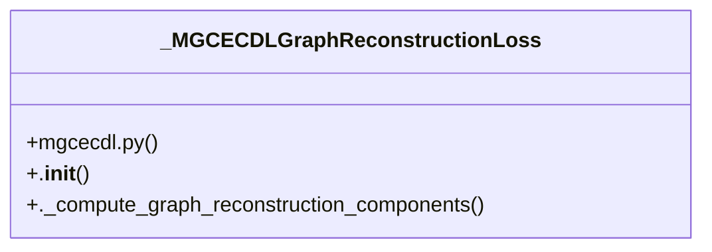

# Community 6

> 18 nodes · cohesion 0.16

## Key Concepts

- [mgcecdl.py](file:///Users/andresalvarez/Documents/chec-local-uiti-vano-interpreter/src/chec_impacto/training/mgcecdl.py#L1) (47 connections)
- [_MGCECDLGraphReconstructionLoss](file:///Users/andresalvarez/Documents/chec-local-uiti-vano-interpreter/src/chec_impacto/training/mgcecdl.py#L319) (7 connections)
- [._compute_graph_reconstruction_components()](file:///Users/andresalvarez/Documents/chec-local-uiti-vano-interpreter/src/chec_impacto/training/mgcecdl.py#L356) (5 connections)
- [.__init__()](file:///Users/andresalvarez/Documents/chec-local-uiti-vano-interpreter/src/chec_impacto/training/mgcecdl.py#L320) (4 connections)
- [_build_dataset()](file:///Users/andresalvarez/Documents/chec-local-uiti-vano-interpreter/src/chec_impacto/training/mgcecdl.py#L767) (3 connections)
- [calcular_escalas_regresion_mgcecdl()](file:///Users/andresalvarez/Documents/chec-local-uiti-vano-interpreter/src/chec_impacto/training/mgcecdl.py#L244) (3 connections)
- [create_classification_dataloaders()](file:///Users/andresalvarez/Documents/chec-local-uiti-vano-interpreter/src/chec_impacto/training/mgcecdl.py#L809) (3 connections)
- [create_regression_dataloaders()](file:///Users/andresalvarez/Documents/chec-local-uiti-vano-interpreter/src/chec_impacto/training/mgcecdl.py#L782) (3 connections)
- [Calculate training-only scales for bounded M-GCECDL regression losses.](file:///Users/andresalvarez/Documents/chec-local-uiti-vano-interpreter/src/chec_impacto/training/mgcecdl.py#L250) (3 connections)
- [Create train and validation dataloaders for regression arrays.](file:///Users/andresalvarez/Documents/chec-local-uiti-vano-interpreter/src/chec_impacto/training/mgcecdl.py#L791) (3 connections)
- [Create train and validation dataloaders for classification arrays.](file:///Users/andresalvarez/Documents/chec-local-uiti-vano-interpreter/src/chec_impacto/training/mgcecdl.py#L818) (3 connections)
- [_rbf_kernel_from_variable_profiles()](file:///Users/andresalvarez/Documents/chec-local-uiti-vano-interpreter/src/chec_impacto/training/mgcecdl.py#L270) (3 connections)
- [_renyi_mutual_information()](file:///Users/andresalvarez/Documents/chec-local-uiti-vano-interpreter/src/chec_impacto/training/mgcecdl.py#L306) (3 connections)
- [_huber_loss_numpy()](file:///Users/andresalvarez/Documents/chec-local-uiti-vano-interpreter/src/chec_impacto/training/mgcecdl.py#L234) (2 connections)
- [_median_graph_sigma()](file:///Users/andresalvarez/Documents/chec-local-uiti-vano-interpreter/src/chec_impacto/training/mgcecdl.py#L292) (2 connections)
- [_renyi_quadratic_entropy()](file:///Users/andresalvarez/Documents/chec-local-uiti-vano-interpreter/src/chec_impacto/training/mgcecdl.py#L300) (2 connections)
- [__init__.py](file:///Users/andresalvarez/Documents/chec-local-uiti-vano-interpreter/src/chec_impacto/training/__init__.py#L1) (2 connections)
- [_build_mgcecdl_optimizer()](file:///Users/andresalvarez/Documents/chec-local-uiti-vano-interpreter/src/chec_impacto/training/mgcecdl.py#L396) (1 connections)

## Class Diagram

## Relationships

- No strong cross-community connections detected

## Source Files

- [/Users/andresalvarez/Documents/chec-local-uiti-vano-interpreter/src/chec_impacto/training/__init__.py](file:///Users/andresalvarez/Documents/chec-local-uiti-vano-interpreter/src/chec_impacto/training/__init__.py)
- [/Users/andresalvarez/Documents/chec-local-uiti-vano-interpreter/src/chec_impacto/training/mgcecdl.py](file:///Users/andresalvarez/Documents/chec-local-uiti-vano-interpreter/src/chec_impacto/training/mgcecdl.py)

## Audit Trail

- EXTRACTED: 91 (92%)
- INFERRED: 8 (8%)
- AMBIGUOUS: 0 (0%)

---

*Part of the graphify knowledge wiki. See [[index]] to navigate.*