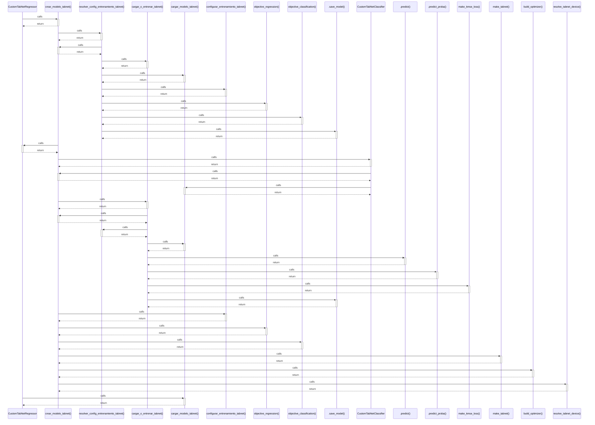

# CustomTabNetRegressor

> God node · 9 connections · [/Users/andresalvarez/Documents/chec-local-uiti-vano-interpreter/src/chec_impacto/models/tabnet.py](file:///Users/andresalvarez/Documents/chec-local-uiti-vano-interpreter/src/chec_impacto/models/tabnet.py#L128)

## Call Trace Diagram

## Connections by Relation

### calls
- [[crear_modelo_tabnet()]] `EXTRACTED`
- [[cargar_modelo_tabnet()]] `EXTRACTED`

### contains
- [[tabnet.py]] `EXTRACTED`

### inherits
- [[_PortableBatchNormPredictionMixin]] `EXTRACTED`
- [[TabNetRegressor]] `EXTRACTED`

### method
- [[.predict()]] `EXTRACTED`
- [[.compute_loss()]] `EXTRACTED`
- [[._predict_batch()]] `EXTRACTED`

### rationale_for
- [[TabNetRegressor con salida no negativa e inferencia portable.]] `EXTRACTED`

---

*Part of the graphify knowledge wiki. See [[index]] to navigate.*