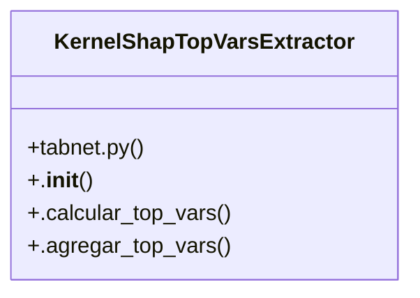

# Graph Explainers

> 53 nodes · cohesion 0.06

## Key Concepts

- [tabnet.py](file:///Users/andresalvarez/Documents/chec-local-uiti-vano-interpreter/src/chec_impacto/interpretability/tabnet.py#L1) (29 connections)
- [construir_contexto_escenario_tabnet()](file:///Users/andresalvarez/Documents/chec-local-uiti-vano-interpreter/src/chec_impacto/interpretability/tabnet.py#L546) (6 connections)
- [graficar_barras_y_radar()](file:///Users/andresalvarez/Documents/chec-local-uiti-vano-interpreter/src/chec_impacto/interpretability/tabnet.py#L415) (6 connections)
- [KernelShapTopVarsExtractor](file:///Users/andresalvarez/Documents/chec-local-uiti-vano-interpreter/src/chec_impacto/interpretability/tabnet.py#L117) (6 connections)
- [graph.py](file:///Users/andresalvarez/Documents/chec-local-uiti-vano-interpreter/src/chec_impacto/data/graph.py#L1) (6 connections)
- [Local UITI_VANO interpretability toolkit.](file:///Users/andresalvarez/Documents/chec-local-uiti-vano-interpreter/src/chec_local_interpreter/__init__.py#L1) (5 connections)
- [construir_aristas_grafo_chec()](file:///Users/andresalvarez/Documents/chec-local-uiti-vano-interpreter/src/chec_impacto/data/graph.py#L24) (4 connections)
- [construir_aristas_preservadas()](file:///Users/andresalvarez/Documents/chec-local-uiti-vano-interpreter/src/chec_impacto/data/graph.py#L119) (4 connections)
- [construir_matriz_adyacencia_mgcecdl()](file:///Users/andresalvarez/Documents/chec-local-uiti-vano-interpreter/src/chec_impacto/data/graph.py#L170) (4 connections)
- [comparar_radar_kernel_shap_modelos()](file:///Users/andresalvarez/Documents/chec-local-uiti-vano-interpreter/src/chec_impacto/interpretability/tabnet.py#L981) (4 connections)
- [_dibujar_radar()](file:///Users/andresalvarez/Documents/chec-local-uiti-vano-interpreter/src/chec_impacto/interpretability/tabnet.py#L754) (4 connections)
- [radar_atribucion_degradado_modelos()](file:///Users/andresalvarez/Documents/chec-local-uiti-vano-interpreter/src/chec_impacto/interpretability/tabnet.py#L825) (4 connections)
- [agregar_borda()](file:///Users/andresalvarez/Documents/chec-local-uiti-vano-interpreter/src/chec_impacto/interpretability/tabnet.py#L188) (3 connections)
- [agrupar_por_vano()](file:///Users/andresalvarez/Documents/chec-local-uiti-vano-interpreter/src/chec_impacto/interpretability/tabnet.py#L228) (3 connections)
- [_buscar_ruta_experta()](file:///Users/andresalvarez/Documents/chec-local-uiti-vano-interpreter/src/chec_impacto/interpretability/tabnet.py#L513) (3 connections)
- [_calcular_kernel_shap_modelo()](file:///Users/andresalvarez/Documents/chec-local-uiti-vano-interpreter/src/chec_impacto/interpretability/tabnet.py#L916) (3 connections)
- [_calcular_radar_tabnet()](file:///Users/andresalvarez/Documents/chec-local-uiti-vano-interpreter/src/chec_impacto/interpretability/tabnet.py#L711) (3 connections)
- [.agregar_top_vars()](file:///Users/andresalvarez/Documents/chec-local-uiti-vano-interpreter/src/chec_impacto/interpretability/tabnet.py#L182) (3 connections)
- [.calcular_top_vars()](file:///Users/andresalvarez/Documents/chec-local-uiti-vano-interpreter/src/chec_impacto/interpretability/tabnet.py#L151) (3 connections)
- [predict_proba_positiva_tabnet()](file:///Users/andresalvarez/Documents/chec-local-uiti-vano-interpreter/src/chec_impacto/interpretability/tabnet.py#L88) (3 connections)
- [radar_atribucion_degradado()](file:///Users/andresalvarez/Documents/chec-local-uiti-vano-interpreter/src/chec_impacto/interpretability/tabnet.py#L796) (3 connections)
- [_series_to_records()](file:///Users/andresalvarez/Documents/chec-local-uiti-vano-interpreter/src/chec_impacto/interpretability/tabnet.py#L314) (3 connections)
- [__init__.py](file:///Users/andresalvarez/Documents/chec-local-uiti-vano-interpreter/src/chec_impacto/data/__init__.py#L1) (3 connections)
- [_registrar_arista_preservada()](file:///Users/andresalvarez/Documents/chec-local-uiti-vano-interpreter/src/chec_impacto/data/graph.py#L89) (2 connections)
- [comparar_radar_kernel_shap_4_clases()](file:///Users/andresalvarez/Documents/chec-local-uiti-vano-interpreter/src/chec_impacto/interpretability/tabnet.py#L1079) (2 connections)
- *... and 28 more nodes in this community*

## Class Diagram

## Relationships

- No strong cross-community connections detected

## Source Files

- [/Users/andresalvarez/Documents/chec-local-uiti-vano-interpreter/src/chec_impacto/__init__.py](file:///Users/andresalvarez/Documents/chec-local-uiti-vano-interpreter/src/chec_impacto/__init__.py)
- [/Users/andresalvarez/Documents/chec-local-uiti-vano-interpreter/src/chec_impacto/data/__init__.py](file:///Users/andresalvarez/Documents/chec-local-uiti-vano-interpreter/src/chec_impacto/data/__init__.py)
- [/Users/andresalvarez/Documents/chec-local-uiti-vano-interpreter/src/chec_impacto/data/graph.py](file:///Users/andresalvarez/Documents/chec-local-uiti-vano-interpreter/src/chec_impacto/data/graph.py)
- [/Users/andresalvarez/Documents/chec-local-uiti-vano-interpreter/src/chec_impacto/interpretability/__init__.py](file:///Users/andresalvarez/Documents/chec-local-uiti-vano-interpreter/src/chec_impacto/interpretability/__init__.py)
- [/Users/andresalvarez/Documents/chec-local-uiti-vano-interpreter/src/chec_impacto/interpretability/tabnet.py](file:///Users/andresalvarez/Documents/chec-local-uiti-vano-interpreter/src/chec_impacto/interpretability/tabnet.py)
- [/Users/andresalvarez/Documents/chec-local-uiti-vano-interpreter/src/chec_local_interpreter/__init__.py](file:///Users/andresalvarez/Documents/chec-local-uiti-vano-interpreter/src/chec_local_interpreter/__init__.py)

## Audit Trail

- EXTRACTED: 152 (96%)
- INFERRED: 6 (4%)
- AMBIGUOUS: 0 (0%)

---

*Part of the graphify knowledge wiki. See [[index]] to navigate.*