# MGCECDLRegressor

> God node · 41 connections · [/Users/andresalvarez/Documents/chec-local-uiti-vano-interpreter/src/chec_impacto/models/mgcecdl.py](file:///Users/andresalvarez/Documents/chec-local-uiti-vano-interpreter/src/chec_impacto/models/mgcecdl.py#L160)

## Call Trace Diagram

```mermaid
sequenceDiagram
    participant P0 as MGCECDLRegressor
    participant P1 as MGCECDLRegressionLoss
    participant P2 as MGCECDLClassifier
    participant P3 as MGCECDLClassificationLoss
    participant P4 as _MGCECDLGraphReconstructionLoss
    participant P5 as GCELoss
    participant P6 as cargar_modelo_mgcecdl()
    participant P7 as Modality-aware M-GCECDL models for CHEC impact modeling.
    participant P8 as Save an M-GCECDL model and its architecture metadata in a ZIP archive.
    participant P9 as Restore an M-GCECDL model from a ZIP archive created by this module.
    participant P10 as Resolve CUDA, MPS, or CPU and fall back when CUDA cannot execute kernels.
    participant P11 as Reduce per-modality supervision losses using reliability weights or an active-mo
    participant P12 as Calculate feature standardization statistics using training data only.
    participant P13 as Calculate training-only scales for bounded M-GCECDL regression losses.
    participant P14 as Fused regression loss with independently weighted auxiliary objectives.
    participant P15 as Generalized cross-entropy loss applied sample-wise to class probabilities.
    participant P16 as Compute a GJS-style consensus penalty over modality class probabilities.
    participant P17 as Fused classification loss with independently weighted auxiliary objectives.
    participant P18 as Compute MAE, RMSE, and R2 on numpy arrays.
    participant P19 as Compute multiclass classification metrics on numpy arrays.
    participant P20 as Create train and validation dataloaders for regression arrays.
    participant P21 as Create train and validation dataloaders for classification arrays.
    participant P22 as Train the regression model for one epoch and report mean loss components.
    participant P23 as Train the classification model for one epoch and report mean loss components.
    participant P24 as Evaluate the regression model and report loss plus regression metrics.
    participant P25 as Evaluate the classification model and report metrics plus modality outputs.
    participant P26 as Predict fused outputs, modality predictions, and reliabilities for numpy inputs.
    participant P27 as Predict class probabilities, classes, and modality outputs for numpy inputs.
    participant P28 as Train the regression model with early stopping on validation MAE.
    participant P29 as Train the classification model with early stopping on validation accuracy.
    participant P30 as Create the Optuna objective for M-GCECDL regression.
    participant P31 as Create the Optuna objective for M-GCECDL classification.
    participant P32 as Run or resume an Optuna study backed by an Optuna journal file.
    participant P33 as Load an M-GCECDL study from its portable journal file.
    participant P34 as Ejecuta la busqueda Optuna de MGCECDL para regresion o clasificacion.
    participant P35 as Save best hyperparameters as JSON.
    participant P36 as Load saved best hyperparameters from JSON.
    participant P37 as _build_classification_model_from_params()
    participant P38 as _build_regression_model_from_params()
    P0->>+ P1: uses
    P1-->>- P0: return
    P1->>+ P2: uses
    P2-->>- P1: return
    P2->>+ P1: uses
    P1-->>- P2: return
    P2->>+ P3: uses
    P3-->>- P2: return
    P2->>+ P4: uses
    P4-->>- P2: return
    P2->>+ P5: uses
    P5-->>- P2: return
    P2->>+ P6: calls
    P6-->>- P2: return
    P2->>+ P7: uses
    P7-->>- P2: return
    P2->>+ P8: uses
    P8-->>- P2: return
    P2->>+ P9: uses
    P9-->>- P2: return
    P2->>+ P10: uses
    P10-->>- P2: return
    P2->>+ P11: uses
    P11-->>- P2: return
    P2->>+ P12: uses
    P12-->>- P2: return
    P2->>+ P13: uses
    P13-->>- P2: return
    P2->>+ P14: uses
    P14-->>- P2: return
    P2->>+ P15: uses
    P15-->>- P2: return
    P2->>+ P16: uses
    P16-->>- P2: return
    P2->>+ P17: uses
    P17-->>- P2: return
    P2->>+ P18: uses
    P18-->>- P2: return
    P2->>+ P19: uses
    P19-->>- P2: return
    P2->>+ P20: uses
    P20-->>- P2: return
    P2->>+ P21: uses
    P21-->>- P2: return
    P2->>+ P22: uses
    P22-->>- P2: return
    P2->>+ P23: uses
    P23-->>- P2: return
    P2->>+ P24: uses
    P24-->>- P2: return
    P2->>+ P25: uses
    P25-->>- P2: return
    P2->>+ P26: uses
    P26-->>- P2: return
    P2->>+ P27: uses
    P27-->>- P2: return
    P2->>+ P28: uses
    P28-->>- P2: return
    P2->>+ P29: uses
    P29-->>- P2: return
    P2->>+ P30: uses
    P30-->>- P2: return
    P2->>+ P31: uses
    P31-->>- P2: return
    P2->>+ P32: uses
    P32-->>- P2: return
    P2->>+ P33: uses
    P33-->>- P2: return
    P2->>+ P34: uses
    P34-->>- P2: return
    P2->>+ P35: uses
    P35-->>- P2: return
    P2->>+ P36: uses
    P36-->>- P2: return
    P2->>+ P37: calls
    P37-->>- P2: return
    P1->>+ P0: uses
    P0-->>- P1: return
    P0->>+ P3: uses
    P3-->>- P0: return
    P0->>+ P4: uses
    P4-->>- P0: return
    P0->>+ P5: uses
    P5-->>- P0: return
    P0->>+ P6: calls
    P6-->>- P0: return
    P0->>+ P7: uses
    P7-->>- P0: return
    P0->>+ P8: uses
    P8-->>- P0: return
    P0->>+ P9: uses
    P9-->>- P0: return
    P0->>+ P10: uses
    P10-->>- P0: return
    P0->>+ P11: uses
    P11-->>- P0: return
    P0->>+ P12: uses
    P12-->>- P0: return
    P0->>+ P13: uses
    P13-->>- P0: return
    P0->>+ P14: uses
    P14-->>- P0: return
    P0->>+ P15: uses
    P15-->>- P0: return
    P0->>+ P16: uses
    P16-->>- P0: return
    P0->>+ P17: uses
    P17-->>- P0: return
    P0->>+ P18: uses
    P18-->>- P0: return
    P0->>+ P19: uses
    P19-->>- P0: return
    P0->>+ P20: uses
    P20-->>- P0: return
    P0->>+ P21: uses
    P21-->>- P0: return
    P0->>+ P22: uses
    P22-->>- P0: return
    P0->>+ P23: uses
    P23-->>- P0: return
    P0->>+ P24: uses
    P24-->>- P0: return
    P0->>+ P25: uses
    P25-->>- P0: return
    P0->>+ P26: uses
    P26-->>- P0: return
    P0->>+ P27: uses
    P27-->>- P0: return
    P0->>+ P28: uses
    P28-->>- P0: return
    P0->>+ P29: uses
    P29-->>- P0: return
    P0->>+ P30: uses
    P30-->>- P0: return
    P0->>+ P31: uses
    P31-->>- P0: return
    P0->>+ P32: uses
    P32-->>- P0: return
    P0->>+ P33: uses
    P33-->>- P0: return
    P0->>+ P34: uses
    P34-->>- P0: return
    P0->>+ P35: uses
    P35-->>- P0: return
    P0->>+ P36: uses
    P36-->>- P0: return
    P0->>+ P38: calls
    P38-->>- P0: return
```

## Connections by Relation

### calls
- [[cargar_modelo_mgcecdl()]] `INFERRED`
- [[_build_regression_model_from_params()]] `INFERRED`

### contains
- [[mgcecdl.py]] `EXTRACTED`

### inherits
- [[_BaseMGCECDL]] `EXTRACTED`

### method
- [[.forward()]] `EXTRACTED`
- [[.__init__()]] `EXTRACTED`

### rationale_for
- [[Regression adaptation of M-GCECDL using modality-specific encoders and reliabili]] `EXTRACTED`

### uses
- [[MGCECDLRegressionLoss]] `INFERRED`
- [[MGCECDLClassificationLoss]] `INFERRED`
- [[_MGCECDLGraphReconstructionLoss]] `INFERRED`
- [[GCELoss]] `INFERRED`
- [[Modality-aware M-GCECDL models for CHEC impact modeling.]] `INFERRED`
- [[Save an M-GCECDL model and its architecture metadata in a ZIP archive.]] `INFERRED`
- [[Restore an M-GCECDL model from a ZIP archive created by this module.]] `INFERRED`
- [[Resolve CUDA, MPS, or CPU and fall back when CUDA cannot execute kernels.]] `INFERRED`
- [[Reduce per-modality supervision losses using reliability weights or an active-mo]] `INFERRED`
- [[Calculate feature standardization statistics using training data only.]] `INFERRED`
- [[Calculate training-only scales for bounded M-GCECDL regression losses.]] `INFERRED`
- [[Fused regression loss with independently weighted auxiliary objectives.]] `INFERRED`
- [[Generalized cross-entropy loss applied sample-wise to class probabilities.]] `INFERRED`
- [[Compute a GJS-style consensus penalty over modality class probabilities.]] `INFERRED`
- [[Fused classification loss with independently weighted auxiliary objectives.]] `INFERRED`
- [[Compute MAE, RMSE, and R2 on numpy arrays.]] `INFERRED`
- [[Compute multiclass classification metrics on numpy arrays.]] `INFERRED`
- [[Create train and validation dataloaders for regression arrays.]] `INFERRED`
- [[Create train and validation dataloaders for classification arrays.]] `INFERRED`
- [[Train the regression model for one epoch and report mean loss components.]] `INFERRED`

---

*Part of the graphify knowledge wiki. See [[index]] to navigate.*