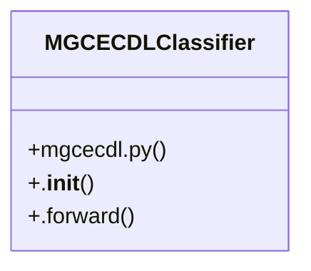

# Model Training

> 11 nodes · cohesion 0.18

## Key Concepts

- [MGCECDLClassifier](file:///Users/andresalvarez/Documents/chec-local-uiti-vano-interpreter/src/chec_impacto/models/mgcecdl.py#L216) (41 connections)
- [Load an M-GCECDL study from its portable journal file.](file:///Users/andresalvarez/Documents/chec-local-uiti-vano-interpreter/src/chec_impacto/training/mgcecdl.py#L1551) (3 connections)
- [Save best hyperparameters as JSON.](file:///Users/andresalvarez/Documents/chec-local-uiti-vano-interpreter/src/chec_impacto/training/mgcecdl.py#L1647) (3 connections)
- [Load saved best hyperparameters from JSON.](file:///Users/andresalvarez/Documents/chec-local-uiti-vano-interpreter/src/chec_impacto/training/mgcecdl.py#L1655) (3 connections)
- [Calculate feature standardization statistics using training data only.](file:///Users/andresalvarez/Documents/chec-local-uiti-vano-interpreter/src/chec_impacto/training/mgcecdl.py#L205) (3 connections)
- [_build_classification_model_from_params()](file:///Users/andresalvarez/Documents/chec-local-uiti-vano-interpreter/src/chec_impacto/training/mgcecdl.py#L1306) (2 connections)
- [calcular_estadisticas_reconstruccion_mgcecdl()](file:///Users/andresalvarez/Documents/chec-local-uiti-vano-interpreter/src/chec_impacto/training/mgcecdl.py#L201) (2 connections)
- [cargar_estudio_optuna_mgcecdl()](file:///Users/andresalvarez/Documents/chec-local-uiti-vano-interpreter/src/chec_impacto/training/mgcecdl.py#L1547) (2 connections)
- [load_best_params()](file:///Users/andresalvarez/Documents/chec-local-uiti-vano-interpreter/src/chec_impacto/training/mgcecdl.py#L1654) (2 connections)
- [save_best_params()](file:///Users/andresalvarez/Documents/chec-local-uiti-vano-interpreter/src/chec_impacto/training/mgcecdl.py#L1646) (2 connections)
- [Classification adaptation of M-GCECDL using modality-specific class heads and re](file:///Users/andresalvarez/Documents/chec-local-uiti-vano-interpreter/src/chec_impacto/models/mgcecdl.py#L217) (1 connections)

## Class Diagram

## Relationships

- No strong cross-community connections detected

## Source Files

- [/Users/andresalvarez/Documents/chec-local-uiti-vano-interpreter/src/chec_impacto/models/mgcecdl.py](file:///Users/andresalvarez/Documents/chec-local-uiti-vano-interpreter/src/chec_impacto/models/mgcecdl.py)
- [/Users/andresalvarez/Documents/chec-local-uiti-vano-interpreter/src/chec_impacto/training/mgcecdl.py](file:///Users/andresalvarez/Documents/chec-local-uiti-vano-interpreter/src/chec_impacto/training/mgcecdl.py)

## Audit Trail

- EXTRACTED: 19 (30%)
- INFERRED: 45 (70%)
- AMBIGUOUS: 0 (0%)

---

*Part of the graphify knowledge wiki. See [[index]] to navigate.*