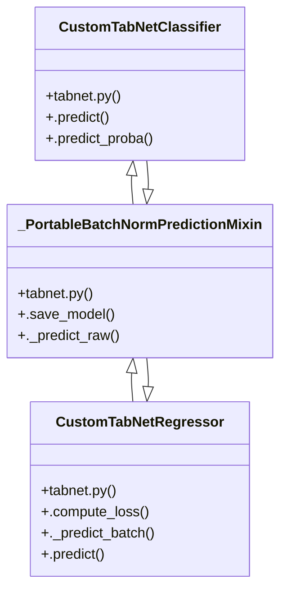

# TabNet Model Management

> 44 nodes · cohesion 0.09

## Key Concepts

- [tabnet.py](file:///Users/andresalvarez/Documents/chec-local-uiti-vano-interpreter/src/chec_impacto/training/tabnet.py#L1) (16 connections)
- [tabnet.py](file:///Users/andresalvarez/Documents/chec-local-uiti-vano-interpreter/src/chec_impacto/models/tabnet.py#L1) (13 connections)
- [crear_modelo_tabnet()](file:///Users/andresalvarez/Documents/chec-local-uiti-vano-interpreter/src/chec_impacto/models/tabnet.py#L216) (11 connections)
- [CustomTabNetRegressor](file:///Users/andresalvarez/Documents/chec-local-uiti-vano-interpreter/src/chec_impacto/models/tabnet.py#L128) (9 connections)
- [resolver_config_entrenamiento_tabnet()](file:///Users/andresalvarez/Documents/chec-local-uiti-vano-interpreter/src/chec_impacto/models/tabnet.py#L18) (9 connections)
- [cargar_o_entrenar_tabnet()](file:///Users/andresalvarez/Documents/chec-local-uiti-vano-interpreter/src/chec_impacto/training/tabnet.py#L338) (8 connections)
- [CustomTabNetClassifier](file:///Users/andresalvarez/Documents/chec-local-uiti-vano-interpreter/src/chec_impacto/models/tabnet.py#L116) (8 connections)
- [cargar_modelo_tabnet()](file:///Users/andresalvarez/Documents/chec-local-uiti-vano-interpreter/src/chec_impacto/models/tabnet.py#L272) (7 connections)
- [.predict()](file:///Users/andresalvarez/Documents/chec-local-uiti-vano-interpreter/src/chec_impacto/models/tabnet.py#L137) (7 connections)
- [configurar_entrenamiento_tabnet()](file:///Users/andresalvarez/Documents/chec-local-uiti-vano-interpreter/src/chec_impacto/models/tabnet.py#L35) (5 connections)
- [.predict_proba()](file:///Users/andresalvarez/Documents/chec-local-uiti-vano-interpreter/src/chec_impacto/models/tabnet.py#L122) (5 connections)
- [objective_regression()](file:///Users/andresalvarez/Documents/chec-local-uiti-vano-interpreter/src/chec_impacto/training/tabnet.py#L128) (5 connections)
- [_PortableBatchNormPredictionMixin](file:///Users/andresalvarez/Documents/chec-local-uiti-vano-interpreter/src/chec_impacto/models/tabnet.py#L86) (5 connections)
- [._predict_raw()](file:///Users/andresalvarez/Documents/chec-local-uiti-vano-interpreter/src/chec_impacto/models/tabnet.py#L102) (5 connections)
- [buscar_estudio_optuna_tabnet()](file:///Users/andresalvarez/Documents/chec-local-uiti-vano-interpreter/src/chec_impacto/training/tabnet.py#L267) (4 connections)
- [evaluar_clasificacion()](file:///Users/andresalvarez/Documents/chec-local-uiti-vano-interpreter/src/chec_impacto/training/tabnet.py#L454) (4 connections)
- [evaluar_modelos_disponibles()](file:///Users/andresalvarez/Documents/chec-local-uiti-vano-interpreter/src/chec_impacto/training/tabnet.py#L649) (4 connections)
- [get_model_paths()](file:///Users/andresalvarez/Documents/chec-local-uiti-vano-interpreter/src/chec_impacto/training/tabnet.py#L74) (4 connections)
- [objective_classification()](file:///Users/andresalvarez/Documents/chec-local-uiti-vano-interpreter/src/chec_impacto/training/tabnet.py#L86) (4 connections)
- [_batch_norm_inference()](file:///Users/andresalvarez/Documents/chec-local-uiti-vano-interpreter/src/chec_impacto/models/tabnet.py#L49) (3 connections)
- [buscar_parametros_tabnet()](file:///Users/andresalvarez/Documents/chec-local-uiti-vano-interpreter/src/chec_impacto/training/tabnet.py#L200) (3 connections)
- [cargar_modelos_disponibles()](file:///Users/andresalvarez/Documents/chec-local-uiti-vano-interpreter/src/chec_impacto/training/tabnet.py#L432) (3 connections)
- [crear_objective_tabnet()](file:///Users/andresalvarez/Documents/chec-local-uiti-vano-interpreter/src/chec_impacto/training/tabnet.py#L168) (3 connections)
- [evaluar_regresion()](file:///Users/andresalvarez/Documents/chec-local-uiti-vano-interpreter/src/chec_impacto/training/tabnet.py#L578) (3 connections)
- [make_kmse_loss()](file:///Users/andresalvarez/Documents/chec-local-uiti-vano-interpreter/src/chec_impacto/training/tabnet.py#L61) (3 connections)
- *... and 19 more nodes in this community*

## Class Diagram

## Relationships

- No strong cross-community connections detected

## Source Files

- [/Users/andresalvarez/Documents/chec-local-uiti-vano-interpreter/src/chec_impacto/models/tabnet.py](file:///Users/andresalvarez/Documents/chec-local-uiti-vano-interpreter/src/chec_impacto/models/tabnet.py)
- [/Users/andresalvarez/Documents/chec-local-uiti-vano-interpreter/src/chec_impacto/training/tabnet.py](file:///Users/andresalvarez/Documents/chec-local-uiti-vano-interpreter/src/chec_impacto/training/tabnet.py)

## Audit Trail

- EXTRACTED: 144 (80%)
- INFERRED: 36 (20%)
- AMBIGUOUS: 0 (0%)

---

*Part of the graphify knowledge wiki. See [[index]] to navigate.*