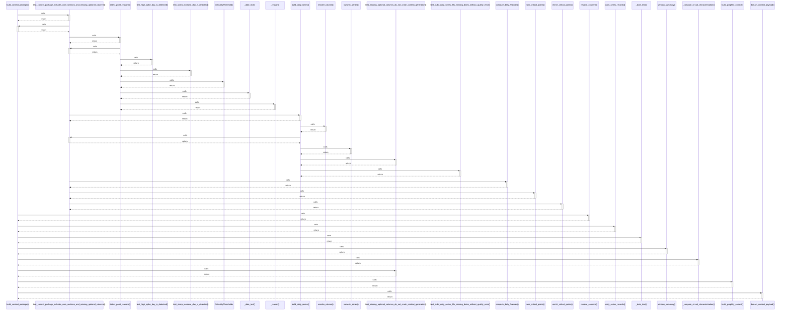

# build_context_package()

> God node · 10 connections · [/Users/andresalvarez/Documents/chec-local-uiti-vano-interpreter/src/chec_local_interpreter/context_builder.py](file:///Users/andresalvarez/Documents/chec-local-uiti-vano-interpreter/src/chec_local_interpreter/context_builder.py#L74)

## Call Trace Diagram

## Connections by Relation

### calls
- [[test_context_package_includes_core_sections_and_missing_optional_columns()]] `INFERRED`
- [[resolve_columns()]] `INFERRED`
- [[daily_series_records()]] `EXTRACTED`
- [[_date_text()]] `EXTRACTED`
- [[window_summary()]] `EXTRACTED`
- [[_compute_circuit_characterization()]] `EXTRACTED`
- [[test_missing_optional_columns_do_not_crash_context_generation()]] `INFERRED`
- [[build_graphify_context()]] `INFERRED`
- [[domain_context_payload()]] `INFERRED`

### contains
- [[context_builder.py]] `EXTRACTED`

---

*Part of the graphify knowledge wiki. See [[index]] to navigate.*