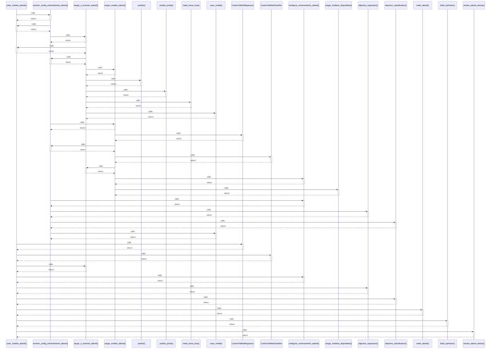

# crear_modelo_tabnet()

> God node · 11 connections · [/Users/andresalvarez/Documents/chec-local-uiti-vano-interpreter/src/chec_impacto/models/tabnet.py](file:///Users/andresalvarez/Documents/chec-local-uiti-vano-interpreter/src/chec_impacto/models/tabnet.py#L216)

## Call Trace Diagram

## Connections by Relation

### calls
- [[resolver_config_entrenamiento_tabnet()]] `EXTRACTED`
- [[CustomTabNetRegressor]] `EXTRACTED`
- [[CustomTabNetClassifier]] `EXTRACTED`
- [[cargar_o_entrenar_tabnet()]] `INFERRED`
- [[configurar_entrenamiento_tabnet()]] `EXTRACTED`
- [[objective_regression()]] `INFERRED`
- [[objective_classification()]] `INFERRED`
- [[make_tabnet()]] `EXTRACTED`
- [[build_optimizer()]] `EXTRACTED`
- [[resolve_tabnet_device()]] `EXTRACTED`

### contains
- [[tabnet.py]] `EXTRACTED`

---

*Part of the graphify knowledge wiki. See [[index]] to navigate.*