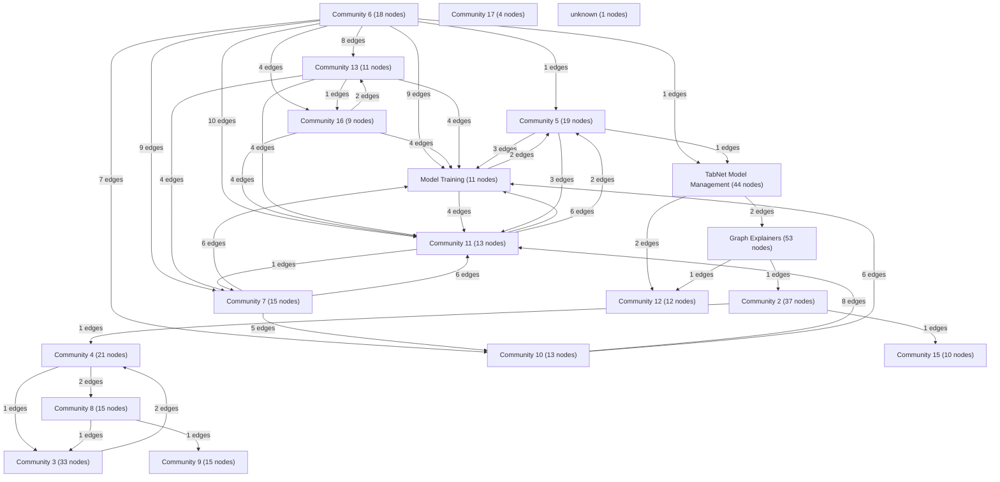

# Knowledge Graph Index

> Auto-generated by graphify. Start here — read community articles for context, then drill into god nodes for detail.

**354 nodes · 690 edges · 19 communities**

---

## System Architecture Flowchart

## Communities
(sorted by size, largest first)

- [[Graph Explainers]] — 53 nodes
- [[TabNet Model Management]] — 44 nodes
- [[Community 2]] — 37 nodes
- [[Community 3]] — 33 nodes
- [[Community 4]] — 21 nodes
- [[Community 5]] — 19 nodes
- [[Community 6]] — 18 nodes
- [[Community 7]] — 15 nodes
- [[Community 8]] — 15 nodes
- [[Community 9]] — 15 nodes
- [[Community 10]] — 13 nodes
- [[Community 11]] — 13 nodes
- [[Community 12]] — 12 nodes
- [[Community 13]] — 11 nodes
- [[Model Training]] — 11 nodes
- [[Community 15]] — 10 nodes
- [[Community 16]] — 9 nodes
- [[Community 17]] — 4 nodes
- [[unknown]] — 1 nodes

## God Nodes
(most connected concepts — the load-bearing abstractions)

- [[MGCECDLRegressor]] — 41 connections
- [[MGCECDLClassifier]] — 41 connections
- [[resolve_column()]] — 12 connections
- [[crear_modelo_tabnet()]] — 11 connections
- [[resolve_training_device()]] — 10 connections
- [[build_context_package()]] — 10 connections
- [[validate_llm_response()]] — 10 connections
- [[resolver_config_entrenamiento_tabnet()]] — 9 connections
- [[CustomTabNetRegressor]] — 9 connections
- [[load_output_schema()]] — 9 connections

---

*Generated by [graphify](https://github.com/safishamsi/graphify)*