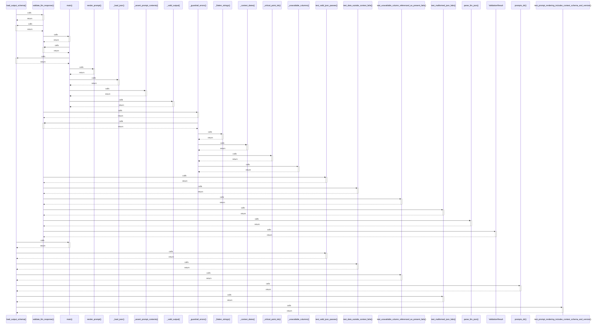

# load_output_schema()

> God node · 9 connections · [/Users/andresalvarez/Documents/chec-local-uiti-vano-interpreter/src/chec_local_interpreter/llm_contracts.py](file:///Users/andresalvarez/Documents/chec-local-uiti-vano-interpreter/src/chec_local_interpreter/llm_contracts.py#L24)

## Call Trace Diagram

## Connections by Relation

### calls
- [[validate_llm_response()]] `INFERRED`
- [[main()]] `INFERRED`
- [[test_valid_json_passes()]] `INFERRED`
- [[test_date_outside_context_fails()]] `INFERRED`
- [[test_unavailable_column_referenced_as_present_fails()]] `INFERRED`
- [[prompts_dir()]] `EXTRACTED`
- [[test_malformed_json_fails()]] `INFERRED`
- [[test_prompt_rendering_includes_context_schema_and_version()]] `INFERRED`

### contains
- [[llm_contracts.py]] `EXTRACTED`

---

*Part of the graphify knowledge wiki. See [[index]] to navigate.*