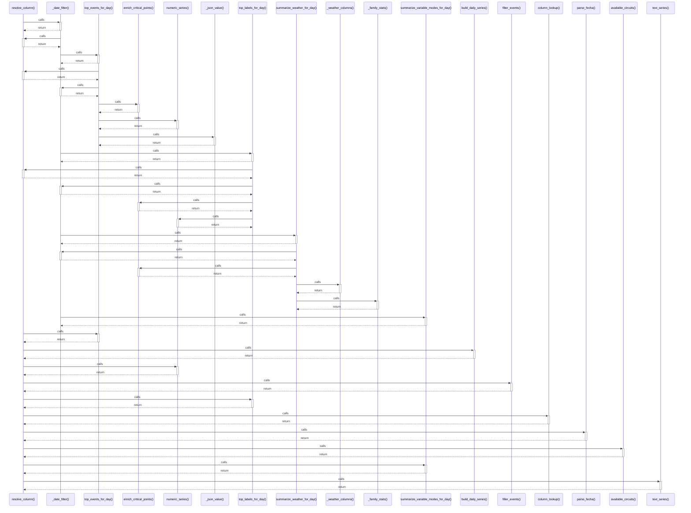

# resolve_column()

> God node · 12 connections · [/Users/andresalvarez/Documents/chec-local-uiti-vano-interpreter/src/chec_local_interpreter/data_loader.py](file:///Users/andresalvarez/Documents/chec-local-uiti-vano-interpreter/src/chec_local_interpreter/data_loader.py#L16)

## Call Trace Diagram

## Connections by Relation

### calls
- [[_date_filter()]] `INFERRED`
- [[top_events_for_day()]] `INFERRED`
- [[build_daily_series()]] `INFERRED`
- [[numeric_series()]] `EXTRACTED`
- [[filter_events()]] `EXTRACTED`
- [[top_labels_for_day()]] `INFERRED`
- [[column_lookup()]] `EXTRACTED`
- [[parse_fecha()]] `EXTRACTED`
- [[available_circuits()]] `EXTRACTED`
- [[summarize_variable_modes_for_day()]] `INFERRED`
- [[text_series()]] `EXTRACTED`

### contains
- [[data_loader.py]] `EXTRACTED`

---

*Part of the graphify knowledge wiki. See [[index]] to navigate.*