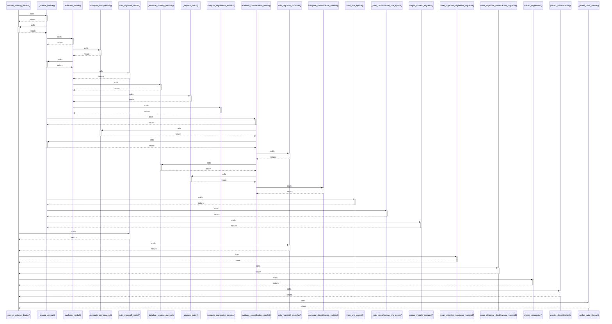

# resolve_training_device()

> God node · 10 connections · [/Users/andresalvarez/Documents/chec-local-uiti-vano-interpreter/src/chec_impacto/training/mgcecdl.py](file:///Users/andresalvarez/Documents/chec-local-uiti-vano-interpreter/src/chec_impacto/training/mgcecdl.py#L154)

## Call Trace Diagram

## Connections by Relation

### calls
- [[_coerce_device()]] `EXTRACTED`
- [[train_mgcecdl_model()]] `EXTRACTED`
- [[train_mgcecdl_classifier()]] `EXTRACTED`
- [[crear_objective_regresion_mgcecdl()]] `EXTRACTED`
- [[crear_objective_clasificacion_mgcecdl()]] `EXTRACTED`
- [[predict_regression()]] `EXTRACTED`
- [[predict_classification()]] `EXTRACTED`
- [[_probe_cuda_device()]] `EXTRACTED`

### contains
- [[mgcecdl.py]] `EXTRACTED`

### rationale_for
- [[Resolve CUDA, MPS, or CPU and fall back when CUDA cannot execute kernels.]] `EXTRACTED`

---

*Part of the graphify knowledge wiki. See [[index]] to navigate.*