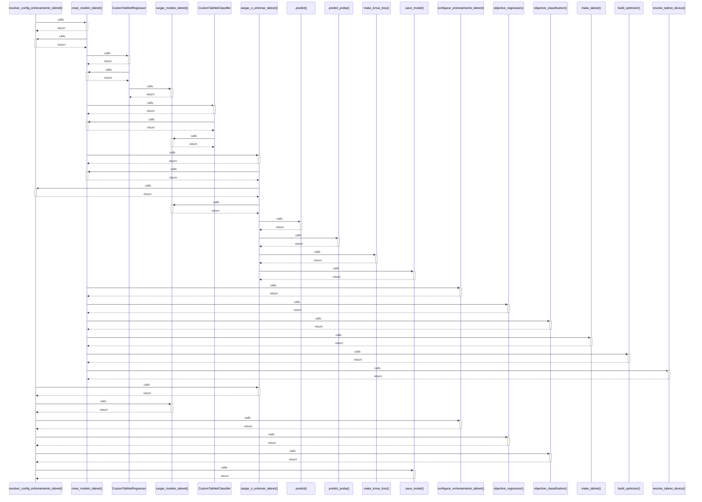

# resolver_config_entrenamiento_tabnet()

> God node · 9 connections · [/Users/andresalvarez/Documents/chec-local-uiti-vano-interpreter/src/chec_impacto/models/tabnet.py](file:///Users/andresalvarez/Documents/chec-local-uiti-vano-interpreter/src/chec_impacto/models/tabnet.py#L18)

## Call Trace Diagram

## Connections by Relation

### calls
- [[crear_modelo_tabnet()]] `EXTRACTED`
- [[cargar_o_entrenar_tabnet()]] `INFERRED`
- [[cargar_modelo_tabnet()]] `EXTRACTED`
- [[configurar_entrenamiento_tabnet()]] `EXTRACTED`
- [[objective_regression()]] `INFERRED`
- [[objective_classification()]] `INFERRED`
- [[.save_model()]] `EXTRACTED`

### contains
- [[tabnet.py]] `EXTRACTED`

### rationale_for
- [[Derive fit-only settings that pytorch-tabnet does not serialize.]] `EXTRACTED`

---

*Part of the graphify knowledge wiki. See [[index]] to navigate.*